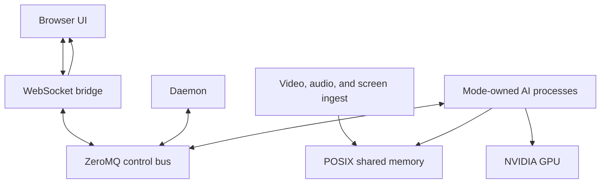
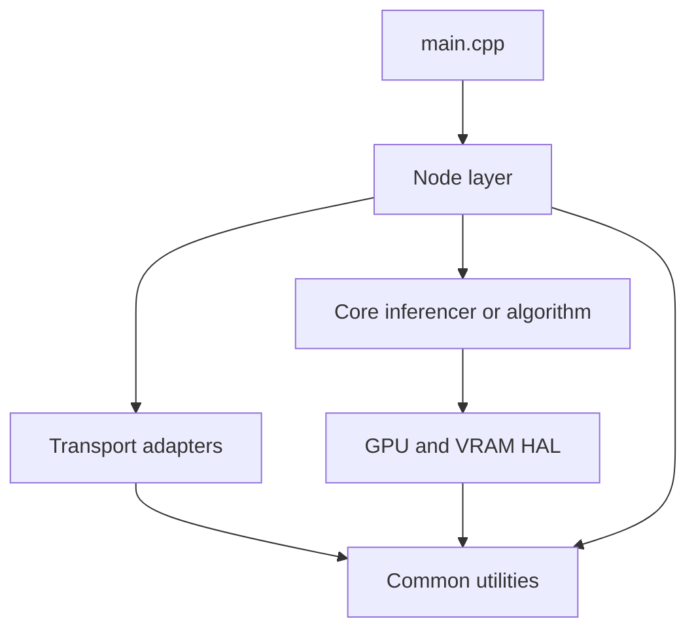

# OmniEdge_AI

OmniEdge_AI is a Docker-first edge AI runtime for one NVIDIA GPU. It runs live
camera, microphone, and optional screen input through mode-specific C++ processes
behind a shared daemon and WebSocket bridge.

The release package is split into three modes:

- `conversation`: camera or screen conversation with text, speech-to-text, image upload, and text-to-speech.
- `security`: live monitoring with detection overlays, recording controls, face recognition, sound filters, and clip analysis.
- `beauty`: live camera enhancement with recording and output-target control.

## Status

This repository is a reference implementation for the OmniEdge_AI runtime.
Frontend behavior, C++ compilation, and the shared inter-process communication
layer are the most stable surfaces. Inference modules, model engines, GStreamer
capture, daemon orchestration, and latency values are hardware dependent until
validated on the target machine.

Reference hardware:

| Component | Reference |
|:---|:---|
| GPU | NVIDIA RTX PRO 3000 Blackwell, 12 GB GDDR6 |
| Minimum GPU | NVIDIA GPU with 4+ GB VRAM |
| Webcam | ROCWARE RC28 USB webcam, 1080p 60 fps |
| Host OS | Windows 10/11 with WSL2, or native Linux |
| Runtime | Docker Engine 24+ with `nvidia-container-toolkit` |
| Container base | NVIDIA NGC TensorRT-LLM image with CUDA, TensorRT, cuDNN, NCCL |


## Release modes

Run only one mode container at a time on a single-camera host. Each mode has its
own image target, service, frontend, and binary set.

| Mode | Compose profile | Service | Docker target | URL | Frontend |
|:---|:---|:---|:---|:---|:---|
| Conversation | `conversation` | `omniedge` | `runtime-conversation` | `http://localhost:9001` | `frontend/conversation` |
| Security | `security` | `omniedge-security` | `runtime-security` | `http://localhost:9002` | `frontend/security` |
| Beauty | `beauty` | `omniedge-beauty` | `runtime-beauty` | `http://localhost:9003` | `frontend/beauty` |

Mode contracts live in `.claude/omniedge.md` and the end-to-end mode registry in
`tests/e2e/mode_contracts.py`.


## Quickstart

Run these commands from the repository root.

### 1. Download model assets

```bash
bash scripts/install_models.sh
```

The default host model directory is `${HOME}/omniedge_models`. Docker mounts it
at `/opt/omniedge/models`.

Conversation mode expects:

- Gemma-4 E2B or Gemma-4 E4B conversation assets
- Whisper Large V3 Turbo speech-to-text assets and TensorRT engines
- XTTS v2 text-to-speech assets

XTTS v2 is the default text-to-speech backend. Kokoro is retained only as an
explicit legacy fallback.

### 2. Build an image

```bash
docker compose --profile conversation build
docker compose --profile security build
docker compose --profile beauty build
```

The image builds C++20/CUDA binaries, installs mode-specific frontend files, and
keeps model weights outside the image.

### 3. Start one mode

Use the wrapper when a USB camera is attached. It stops the other mode
containers before starting the requested one.

```bash
bash scripts/run_mode.sh conversation
bash scripts/run_mode.sh security
bash scripts/run_mode.sh beauty
```

You can also use Compose directly:

```bash
docker compose --profile conversation up -d omniedge
docker compose --profile security up -d omniedge-security
docker compose --profile beauty up -d omniedge-beauty
```

### 4. Watch logs

```bash
docker compose logs -f omniedge
docker compose logs -f omniedge-security
docker compose logs -f omniedge-beauty
```

### 5. Stop

```bash
docker compose down
```


## What each mode does

### Conversation

Conversation mode runs the assistant UI and the speech/text stack. It accepts
typed prompts, push-to-talk audio, browser-uploaded images, camera frames, and
screen frames. The conversation model can use Gemma-4 E2B or Gemma-4 E4B. The
Whisper sidecar handles speech-to-text. The XTTS v2 sidecar produces speech
output.

Primary processes:

- `omniedge_daemon`
- `omniedge_ws_bridge`
- `omniedge_video_ingest`
- `omniedge_audio_ingest`
- `omniedge_screen_ingest`
- `omniedge_conversation`
- `omniedge_stt`
- `omniedge_tts`
- `omniedge_audio_denoise`

### Security

Security mode runs the monitoring UI. It receives the live camera stream,
publishes detection and recording events, supports face recognition, lets the UI
update sound filters, and can request Gemma-4 E2B analysis for security clips.
Security recordings default to 14 days of retention in the release contract.

Primary processes:

- `omniedge_daemon`
- `omniedge_ws_bridge`
- `omniedge_video_ingest`
- `omniedge_audio_ingest`
- `omniedge_security_camera`
- `omniedge_face_recog`
- `omniedge_security_vlm`

### Beauty

Beauty mode runs the camera enhancement UI. It exposes live preview, skin and
lighting controls, manual recording, and output-target state for either the
browser stream or a virtual camera path when the host supports it.

Primary processes:

- `omniedge_daemon`
- `omniedge_ws_bridge`
- `omniedge_video_ingest`
- `omniedge_audio_ingest`
- `omniedge_beauty`


## Architecture

OmniEdge_AI uses OS processes as the isolation boundary. Model lifetimes are
process lifetimes: the daemon starts a module when a mode needs it and terminates
the process when the mode no longer owns the GPU budget.



The design has four practical rules:

- Bulk media moves through POSIX shared memory under `/dev/shm`.
- Commands, events, readiness, and health updates move through ZeroMQ PUB/SUB.
- Browser traffic stays on WebSocket channels served by `omniedge_ws_bridge`.
- GPU memory pressure is handled by mode profiles, per-module budgets, and
  process termination instead of in-process model unloading.

ZeroMQ port numbers are logical identifiers in config and documentation. The
current codegen convention backs them with IPC socket paths such as
`ipc:///tmp/omniedge_5570`.


## Internal process structure

Every runtime process follows the same split between process wiring and domain
logic. The executable owns startup and shutdown. The node layer owns transport
and event flow. The core layer owns the model or algorithm.



Common responsibilities inside a process:

| Layer | Owns |
|:---|:---|
| Executable entry point | Config loading, signal setup, node construction, process exit code |
| Node layer | Runtime state, transport setup, readiness events, poll loop, graceful stop |
| Core layer | Inference, media processing, prompt assembly, detection, synthesis, or recording logic |
| Transport layer | POSIX shared memory mappings, ZeroMQ sockets, WebSocket adapters |
| GPU and VRAM layer | CUDA streams, pinned buffers, VRAM checks, GPU resource wrappers |
| Common layer | Logging, error codes, config helpers, filesystem helpers, shared types |

Most ingest and inference modules use the `ModuleNodeBase` lifecycle:

```text
load config
configure transport
load inferencer or backend resources
publish module_ready
enter router poll loop
receive SIGTERM
stop router and in-flight work
release resources
exit process
```

Process roles differ by what they own:

| Process type | Runtime role |
|:---|:---|
| Daemon | Applies mode profiles, launches child processes, tracks health, handles watchdog recovery, and routes high-level UI commands |
| WebSocket bridge | Serves the browser UI, relays JSON commands, and pushes media frames from shared memory to WebSocket clients |
| Ingest process | Captures camera, audio, or screen input, writes bulk payloads to shared memory, and publishes frame or chunk notifications |
| Inference process | Owns a model backend, CUDA context, input subscriptions, output shared memory, and readiness events |
| Mode-specific worker | Runs security or beauty behavior that only exists in that release mode |

The daemon and WebSocket bridge have custom control loops. Model and ingest
processes follow the common node lifecycle so the daemon can start, monitor,
evict, and restart them consistently. Detailed implementation rules live in
`.github/skills/omniedge-codegen/references/class-patterns.md`.


## WebSocket channels

| Channel | Used by | Payload |
|:---|:---|:---|
| `/chat` | All modes | JSON commands and events |
| `/video` | Conversation, shared camera preview | JPEG frames |
| `/audio` | Conversation | PCM speech output |
| `/screen_video` | Conversation | Screen-share JPEG frames |
| `/security_video` | Security | Annotated JPEG frames |
| `/beauty_video` | Beauty | Enhanced JPEG frames |


## Configuration and storage

Runtime configuration is installed under `/opt/omniedge/etc` inside the
container.

| Path | Purpose |
|:---|:---|
| `/opt/omniedge/etc/omniedge.ini` | ZMQ identifiers, module enablement, mode profiles, inference settings |
| `/opt/omniedge/etc/omniedge_config.yaml` | Launch graph, model paths, GPU tiers, per-module budgets |
| `/opt/omniedge/models` | Host-mounted model assets |
| `/opt/omniedge/engines` | Persisted TensorRT engines |
| `/root/.omniedge` | Persistent runtime state, including conversation history |

Compose volumes:

| Volume or bind mount | Container path | Purpose |
|:---|:---|:---|
| `${OE_MODELS_DIR:-${HOME}/omniedge_models}` | `/opt/omniedge/models` | Model weights and tokenizers |
| `omniedge-engines` | `/opt/omniedge/engines` | Built TensorRT engines |
| `omniedge-state` | `/root/.omniedge` | Session state |
| `/dev` | `/dev` | Camera and host device access |


## Development

For the development container workflow and host setup details, read
`DOCKER_SETUP.md`.

Common commands:

```bash
bash scripts/docker/dev-shell.sh
bash run_conversation.sh
bash run_security_mode.sh
bash run_beauty_mode.sh
```

The top-level mode scripts are intended for the development container. The host
launcher is `scripts/run_mode.sh`.


## Tests

Run mode suites from the repository root:

```bash
bash test.sh conversation
bash test.sh security
bash test.sh beauty
bash test.sh all
```

End-to-end lanes:

```bash
bash test.sh e2e-smoke
bash test.sh e2e-full
bash test.sh e2e-nightly
```

GPU-tagged tests require a working NVIDIA runtime and mounted model assets. CPU
tests do not require model weights unless a test explicitly loads a real engine.


## Operations

Use Docker logs first:

```bash
docker compose logs -f
```

The consolidated runtime log file is `logs/omniedge.log` when file logging is
enabled by the deployment. Log lines use this shape:

```text
YYYY-MM-DD HH:MM:SS.mmm [LEVEL] [module] [function] message
```

The WebSocket bridge exposes the browser UI on port `9001` inside every
container. Compose publishes that port as `9001`, `9002`, or `9003` depending on
the selected mode.


## Troubleshooting

| Symptom | Check |
|:---|:---|
| No GPU inside the container | Run `nvidia-smi` on the host and inside the container. Check `nvidia-container-toolkit`. |
| Camera fails to start | Stop the other mode containers. Only one container can own `/dev/video0` at a time. |
| Models are missing | Run `bash scripts/install_models.sh` and confirm `${OE_MODELS_DIR}` points to the mounted model directory. |
| Conversation starts without speech | Check Whisper assets and XTTS v2 assets under `/opt/omniedge/models`. |
| Screen sharing does not connect | Confirm the Windows DXGI capture agent is running and the host firewall allows the configured TCP port. |
| Browser connects but controls are disabled | Check `module_status` events and Docker logs for module startup failures. |


## Related docs

- `DOCKER_SETUP.md`: Docker setup, model downloads, and host-device notes
- `tools/mcp_server/README.md`: Claude MCP server setup and tool reference
- `.claude/omniedge.md`: release-mode contract used by agents
- `.github/skills/omniedge-codegen/references/conventions.md`: IPC names, topics, and runtime conventions
- `THIRD_PARTY_NOTICES.md`: component inventory and upstream license notes


## License

OmniEdge_AI is commercial software. Copyright (c) 2026 Jiwook Kim. All rights
reserved.

Use is governed by `EULA.md` and `LICENSE`. The current license and EULA files
are marked as drafts that require attorney review before public release.

Third-party components keep their own licenses. See `THIRD_PARTY_NOTICES.md`,
`NOTICE`, and the `licenses/` directory.
