# OmniEdge_AI

A multi-modal, real-time AI assistant that runs on a single NVIDIA GPU inside a Docker container. OmniEdge_AI captures live video from a USB webcam and live audio from its built-in microphones, accepts screen shares from a Windows desktop, and operates in seven mutually exclusive processing profiles: Conversation, Super Resolution, Image Transform, Vision Model, SAM2 Segmentation, Security Camera, and Beauty. A C++ daemon process manages model loading and unloading at runtime.

> **Status:** Reference architecture
> **Target GPU:** Any NVIDIA GPU with 4+ GB VRAM (12 GB recommended)
> **Runtime:** Docker (NVIDIA NGC TensorRT-LLM base), CUDA 12.x, TensorRT 10.x
> **Host:** Windows 10/11 with WSL2, or native Linux
> **Capture:** ROCWARE RC28 USB webcam (1080p 60 fps, dual microphones) or compatible USB camera

---

## Table of contents

- [Key features](#key-features)
- [Architecture overview](#architecture-overview)
- [Data pipelines](#data-pipelines)
- [Processing profiles](#processing-profiles)
- [IPC transport](#ipc-transport)
- [VRAM management](#vram-management)
- [Daemon state machine](#daemon-state-machine)
- [Frontend](#frontend)
- [Prerequisites](#prerequisites)
- [Getting started](#getting-started)
- [Configuration](#configuration)
- [Testing](#testing)
- [Observability](#observability)

---

## Key features

**Process-per-model fault isolation.** Each AI model runs as an independent C++20 binary with its own CUDA context. A crash in one process cannot corrupt another's model state. The CUDA driver reclaims VRAM as contiguous blocks on process exit, so there is zero fragmentation across millions of load/unload cycles.

**Dual-layer IPC.** POSIX shared memory (`shm_open`/`mmap`) carries bulk data (BGR frames, PCM audio) at under 0.3 ms latency, with transparent huge pages (`MADV_HUGEPAGE`) for large segments and `mlock` to prevent swap-out. ZeroMQ PUB/SUB handles JSON control messages at under 0.1 ms latency. No module links to another's library. The video, screen, audio, and text pipelines each write to dedicated SHM segments that downstream nodes read independently. The browser receives final output over WebSocket channels (video frames, audio PCM, JSON control).

**Dynamic VRAM management.** Loading a model means `posix_spawn()`. Unloading means `SIGTERM` + `waitpid()`. A priority-based eviction scheduler (0 = evict first, 5 = evict last) decides what to kill when VRAM runs low. No module is unconditionally pinned; if the GPU cannot fit a model, the system degrades gracefully rather than crashing. Priorities shift on profile switches so the active profile's model gets the highest priority while idle models become evictable. GPU tier auto-detection scales from 4 GB (minimal) to 16+ GB (ultra).

**Three conversation model options.** Qwen2.5-Omni-7B (unified STT+LLM+TTS), Qwen2.5-Omni-3B (smaller variant), and Gemma 4 E4B (audio+vision input, with a separate TTS sidecar). Users switch models at runtime via the browser UI. On GPUs with less than 6 GB VRAM, the system defaults to Qwen2.5-Omni-3B.

**Video conversation.** All three models accept native vision input. Toggle the Camera button in the sidebar to send live camera frames to the conversation model alongside text and audio prompts. The model describes what it sees, answers visual questions, and reasons about the video feed in real time.

**Screen sharing.** A Windows-side DXGI capture agent streams the desktop as JPEG frames over TCP to the container, where ScreenIngestNode decodes them and writes BGR24 pixels to `/oe.screen.ingest` shared memory. The conversation model can reference live screen content alongside camera and audio input. Users toggle between camera and screen in the browser sidebar.

**Default video pipeline.** Live 1080p webcam feed with GPU-accelerated background blur (YOLO instance segmentation), ISP adjustments (brightness, contrast, saturation, sharpness), shape overlays, face recognition, and nvJPEG encoding, all running at 30 fps. Active in most profiles; Vision Model evicts background blur to reclaim VRAM, and Security evicts face recognition.

**Browser-based SPA frontend.** Dark-theme conversational interface with WebSocket channels for video, audio, and control messages. No npm, no bundler, no build step. Vanilla JavaScript served by the C++ WebSocket bridge.

**Docker-first deployment.** Multi-stage Dockerfile based on NVIDIA NGC TensorRT-LLM. The container embeds CUDA 12.x, TensorRT 10.x, cuDNN, NCCL, and all build dependencies. Models are mounted from the host as read-only volumes. TRT engines are built on first run and persisted in a Docker named volume. Runs on any host with `nvidia-container-toolkit`, whether WSL2 or native Linux.

---

## Architecture overview

The system has three layers:

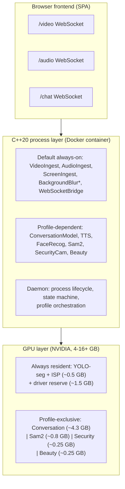

Four architectural invariants govern the design:

| Invariant | Mechanism |
|:---|:---|
| Process-per-model fault isolation | Independent binaries, each with its own `cudaSetDevice(0)` context |
| Dual-layer IPC | POSIX SHM for bulk data (huge pages + mlock), ZeroMQ PUB/SUB for control |
| Process-level VRAM lifecycle | `posix_spawn()` to load, `SIGTERM` to unload, no custom allocator |
| Containerized deployment | Docker with `nvidia-container-toolkit`, `ipc: host` for SHM |

### Layered dependency graph

```text
nodes/ --> core/ + interfaces/ + transport/ + hal/ + common/
core/ --> interfaces/ + hal/ + common/
transport/ --> common/
hal/ --> common/
interfaces/ --> common/
```

Strict direction, no cycles. Core tests link only `core/` + `interfaces/`. Node tests inject mocks via interfaces. Integration tests use real ZMQ and GPU inferencers.

---

## Data pipelines

Four independent data planes feed into the system. Which nodes consume each plane depends on the active processing profile (see [Processing profiles](#processing-profiles)).

### Video pipeline

A USB camera frame enters the system through VideoIngestNode and fans out to whichever CV nodes the active profile spawns:

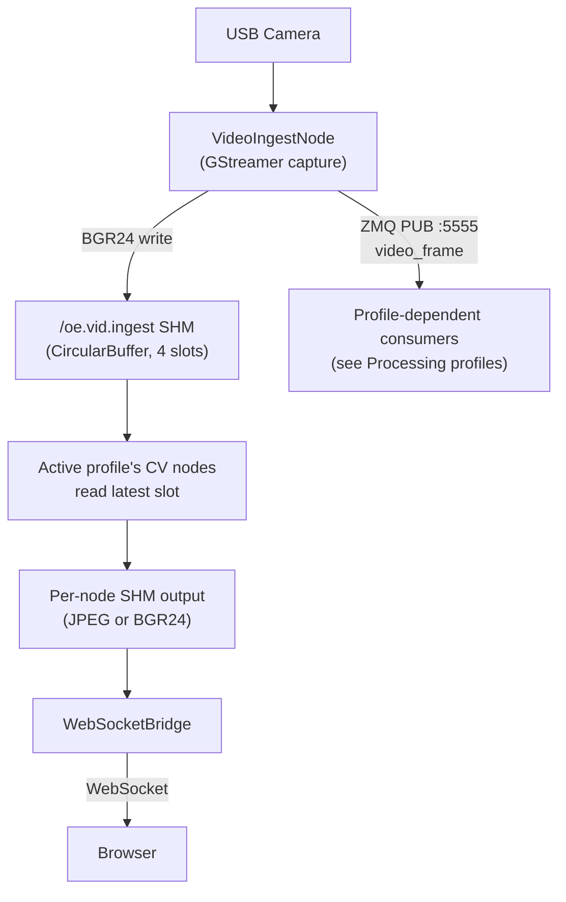

Each CV node subscribes to ZMQ topic `video_frame` on port 5555 with `ZMQ_CONFLATE=1`, reads the latest slot from `/oe.vid.ingest`, runs GPU inference, writes JPEG output to its own SHM double-buffer, and publishes a ZMQ notification. WebSocketBridge polls the JPEG SHM segments and pushes frames to the browser over the binary WebSocket channel.

All video data in shared memory uses BGR24 pixels. OpenCV, GStreamer, and the CUDA preprocessing kernels all work natively in BGR, so there is no color conversion anywhere in the pipeline.

### Screen pipeline

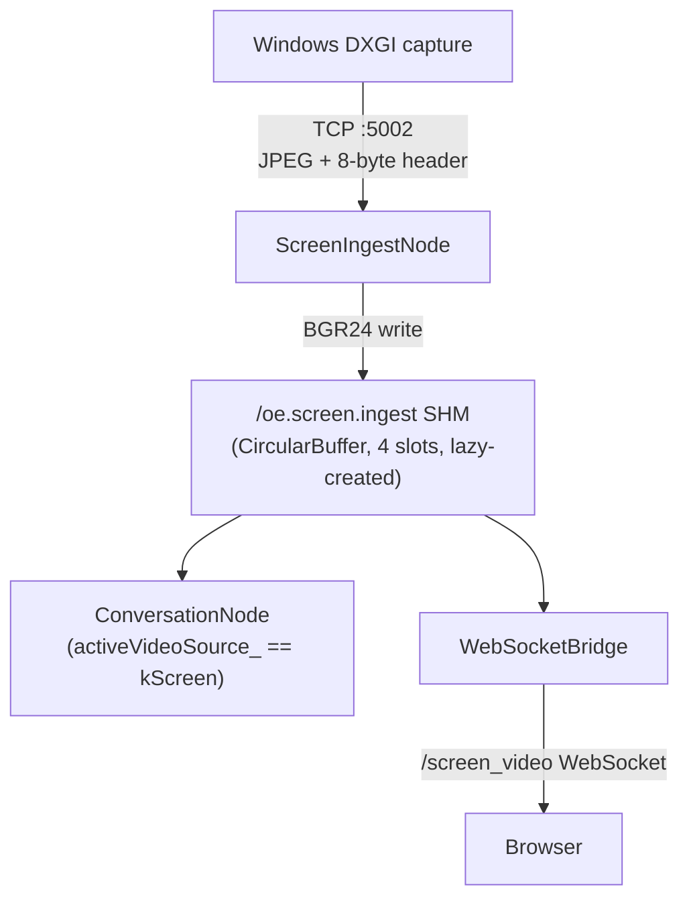

TCP frames arrive with an 8-byte header: `uint32_t jpegLen`, `uint16_t width`, `uint16_t height`, 2 bytes padding. ScreenIngestNode decodes the JPEG, writes BGR24 to SHM via `ensureShmCapacity()` which lazily creates or resizes the segment on first frame or resolution change. Camera/screen switching is controlled by the `activeVideoSource_` enum in ConversationNode. No process spawn/kill required, just a pointer swap.

### Audio pipeline

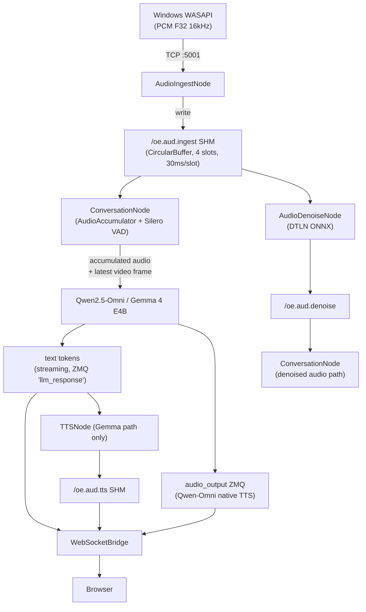

AudioAccumulator inside ConversationNode buffers 30ms PCM chunks, runs VAD scoring, and triggers `VadSilence` when silence exceeds the threshold. The daemon FSM transitions from LISTENING to PROCESSING on this event.

### Text pipeline

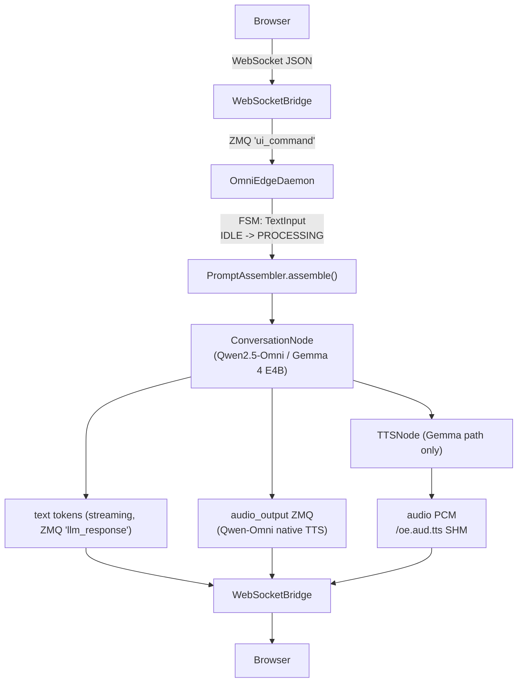

### Pipeline convergence

All four pipelines converge at ConversationNode for unified inference:

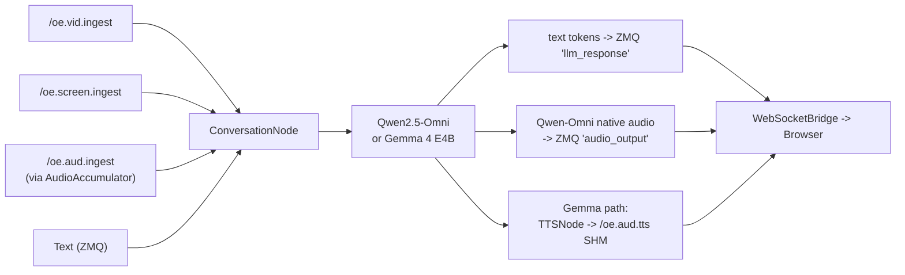

ConversationNode grabs the latest video frame from whichever source is active (`activeVideoSource_`), combines it with accumulated audio and/or text input, and feeds everything to the multi-modal model in a single inference call.

There is no explicit timestamp correlation between video and audio streams. ConversationNode grabs the latest video frame at prompt assembly time, not at audio capture time. The latency between frame capture and prompt assembly is typically under 100 ms. Frame-accurate AV sync is not required; the model processes scene descriptions, not raw media streams.

### BGR24 pipeline chaining

By default each CV node encodes its output as JPEG for browser display. Setting `output_format: bgr24` in a node's YAML config switches the output to a `ShmCircularBuffer<ShmVideoHeader>` carrying raw BGR24 pixels. A downstream node can then read that segment as its input, forming a processing chain without a JPEG encode/decode round-trip (about 3 ms saved at 1080p):

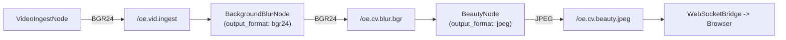

Each node's `input_shm` and `input_topic` YAML fields control where it reads from, so chains are configurable at deploy time without code changes. The `OutputFormat` enum and helpers live in `common/pipeline_types.hpp`.

---

## Processing profiles

Only one profile occupies the GPU at a time. The daemon's `switchToMode()` applies the target profile's priority map from `config/omniedge.ini` `[profile_*]` sections, evicts modules that drop to priority 0, waits for VRAM release, then spawns the new profile's modules.

### Default always-on processes

These binaries run in most profiles:

| Binary | Role | ZMQ PUB port |
|:---|:---|---:|
| `oe_daemon` | Process lifecycle, FSM, profile orchestration | 5571 |
| `oe_ws_bridge` | WebSocket server (port 9001), ZMQ-to-browser relay | 5570 |
| `oe_video_ingest` | Webcam capture via GStreamer | 5555 |
| `oe_audio_ingest` | Microphone capture, Silero VAD gating | 5556 |
| `oe_screen_ingest` | Desktop capture from Windows DXGI agent via TCP | 5577 |
| `oe_bg_blur` | YOLO segmentation, ISP, blur compositing, nvJPEG | 5567 |

Note: `oe_bg_blur` runs in all profiles except Vision Model, which evicts it to reclaim 250 MiB.

### Profile overview

| Profile | Primary module | Binary | VRAM (MiB) | SHM output | ZMQ port |
|:---|:---|:---|---:|:---|:---:|
| Conversation | ConversationModel | `oe_conversation` | 4,000-7,500 (3B vs 7B) | text via ZMQ (audio via `/oe.aud.tts` when TTS enabled) | 5572 |
| Vision Model | ConversationModel (VLM) | `oe_conversation` | 4,000-7,500 (3B vs 7B) | text via ZMQ | 5572 |
| SAM2 Segmentation | Sam2 | `oe_sam2` | 800 | `/oe.cv.sam2.mask` | 5576 |
| Security Camera | SecurityCamera | `oe_security_camera` | 250 | `/oe.cv.security.jpeg` | 5578 |
| Beauty | Beauty | `oe_beauty` | 250 | `/oe.cv.beauty.jpeg` | 5579 |

### VRAM priority matrix

Values from `config/omniedge.ini` `[profile_*]` sections. Priority 0 = evict on switch, 5 = evict last. Bold = primary active module for that profile.

| Module | Conv | VLM | SAM2 | Sec | Beauty |
|:---|:---:|:---:|:---:|:---:|:---:|
| conversation_model | **5** | **5** | 0 | 0 | 0 |
| tts (Kokoro) | 4 | 0 | 0 | 0 | 0 |
| background_blur | 3 | **0** | 5 | 5 | 5 |
| face_recognition | 3 | 5 | 5 | **0** | 5 |
| audio_denoise | 1 | 0 | 0 | 0 | 0 |
| sam2 | 1 | 0 | **5** | 0 | 0 |
| security_camera | - | - | - | **5** | 0 |
| beauty | - | - | - | - | **5** |

Two profiles break the "always-on" convention: **Vision Model** evicts `background_blur` (priority 0) to reclaim 250 MiB for the VLM, and **Security** evicts `face_recognition` (priority 0) since security detection uses its own YOLO model.

### Conversation (default)

Unified speech-to-text, language modeling, and text-to-speech. Three model options selectable at runtime: Qwen2.5-Omni-7B (unified STT+LLM+TTS), Qwen2.5-Omni-3B (same architecture, smaller), or Gemma 4 E4B (audio+vision input, text output, with Kokoro TTS sidecar). On GPUs with less than 6 GB VRAM, the system defaults to Qwen2.5-Omni-3B.

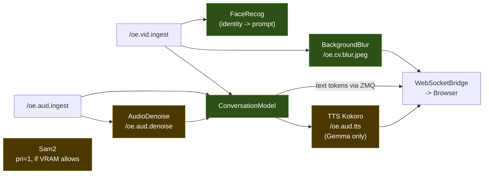

Active SHM segments: `/oe.vid.ingest`, `/oe.cv.blur.jpeg`, `/oe.aud.ingest`, `/oe.aud.tts` (Gemma only), `/oe.aud.denoise` (optional toggle). ConversationNode streams text tokens over ZMQ (`llm_response`); Qwen2.5-Omni emits audio natively over ZMQ (`audio_output`), while the Gemma path routes text to TTSNode which writes PCM into `/oe.aud.tts` SHM. Face recognition publishes identity over ZMQ for prompt injection.

### Vision model

Interactive VLM exploration using Qwen2.5-Omni (vision + audio + text). The VLM Explorer overlay provides point-click identify, box describe, region focus, and free-text visual Q&A against the live camera feed. Uses the same `oe_conversation` binary with `--model qwen_omni_3b` (or `qwen_omni_7b`).

This is the only profile that evicts `background_blur` to reclaim 250 MiB for the VLM. The browser shows raw camera frames without blur compositing.

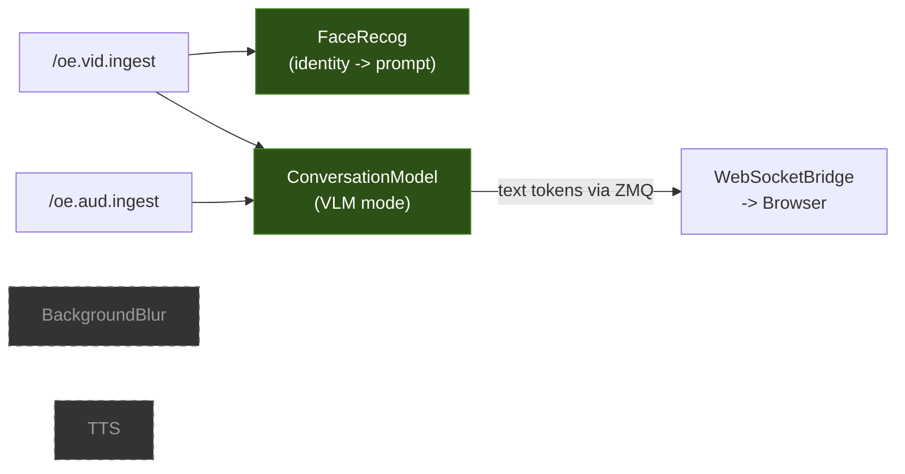

Active SHM segments: `/oe.vid.ingest`, `/oe.aud.ingest`. ConversationModel streams text tokens via ZMQ (Qwen-Omni natively emits text+audio; in this profile the browser renders text only). No blur JPEG produced -- WebSocketBridge sends raw ingest frames to the browser.

### SAM2 segmentation

Interactive pixel-perfect segmentation using SAM2 (~800 MiB). The user clicks or draws on the video feed to select objects; Sam2Node produces segmentation masks. This profile handles video only; there is no audio conversation.

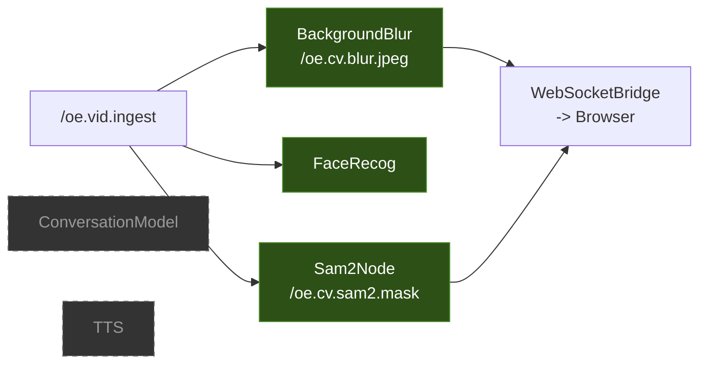

### Security camera

Continuous YOLO object detection (person, backpack, suitcase) with NVENC MP4 recording, JSON Lines event logging, and on-demand VLM clip analysis. This is the only profile that evicts `face_recognition` since security detection uses its own YOLO model.

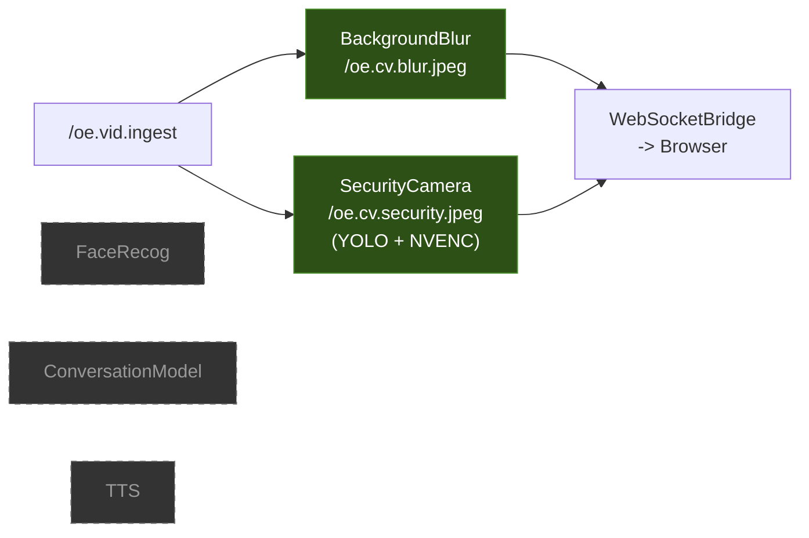

| Component | VRAM |
|:---|---:|
| YOLOv8-seg detection | ~250 MiB |
| VLM on-demand (Qwen Omni 3B) | +4,000 MiB |

Features: user-defined ROI polygon filtering, 7-day auto-purge of old recordings, browser Notification API alerts, recording playback in the frontend. On-demand VLM analysis spawns `oe_conversation --model qwen_omni_3b` via the daemon when the user requests clip analysis.

### Beauty

Real-time face beautification using FaceMesh V2 + bilateral filtering (~250 MiB). BeautyNode reads BackgroundBlur's segmentation mask to separate foreground from background, applies skin smoothing and shape adjustments to detected faces only.

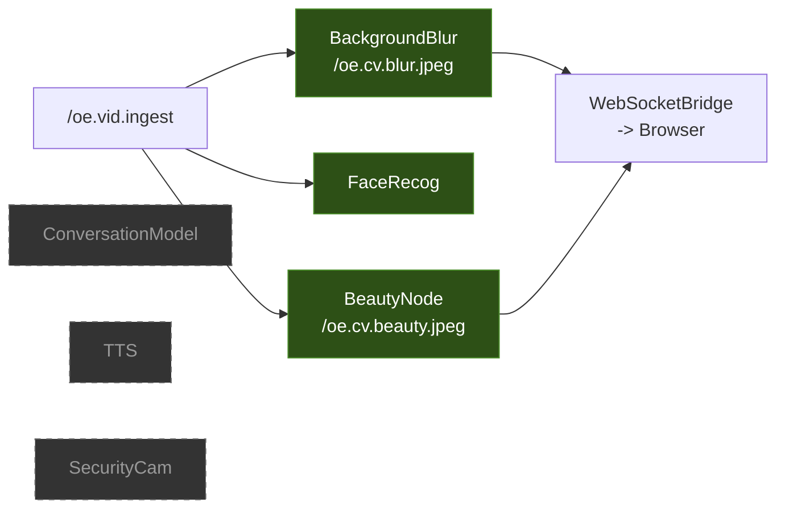

### On-demand CV extension

FaceFilter (FaceMesh V2, ~100 MiB, ZMQ port 5575) applies AR face filters. It is not a separate profile; it coexists with any active profile and uses minimal VRAM. Toggled independently via the browser UI.

---

## IPC transport

### Shared memory inventory

All segments live under `/dev/shm/` and follow the naming convention `/oe.<layer>.<module>[.<qualifier>]`.

| SHM segment | Buffer type | Slots | Producer | Consumer(s) | Data format | Slot size |
|:---|:---|:---:|:---|:---|:---|:---|
| `/oe.vid.ingest` | ShmCircularBuffer | 4 | VideoIngestNode | Active profile's CV nodes + ConversationNode | BGR24 1920x1080 | 6.2 MB |
| `/oe.screen.ingest` | ShmCircularBuffer | 4 | ScreenIngestNode | ConversationNode + WS Bridge | BGR24 dynamic (lazy) | ~6.2 MB |
| `/oe.aud.ingest` | ShmCircularBuffer | 4 | AudioIngestNode | ConversationNode + AudioDenoiseNode | PCM F32 16kHz 30ms | 1.9 KB |
| `/oe.cv.blur.jpeg` | ShmDoubleBuffer | 2 | BackgroundBlurNode | WS Bridge | JPEG | <=1 MB |
| `/oe.cv.beauty.jpeg` | ShmDoubleBuffer | 2 | BeautyNode | WS Bridge | JPEG | <=1 MB |
| `/oe.cv.facefilter.jpeg` | ShmDoubleBuffer | 2 | FaceFilterNode | WS Bridge | JPEG | <=1 MB |
| `/oe.cv.sam2.mask` | ShmDoubleBuffer | 2 | Sam2Node | WS Bridge | JPEG | <=1 MB |
| `/oe.cv.security.jpeg` | Flat mapping | 1 | SecurityCameraNode | WS Bridge | JPEG | 4 MB |
| `/oe.vid.denoise` | ShmDoubleBuffer | 2 | VideoDenoiseNode | WS Bridge | JPEG | <=1 MB |
| `/oe.aud.denoise` | Raw ShmMapping | 1 | AudioDenoiseNode | ConversationNode | PCM F32 16kHz | ~128 KB |
| `/oe.aud.tts` | Raw ShmMapping | 1 | TTSNode (Gemma sidecar) | WS Bridge | PCM F32 24kHz | ~960 KB |
| `/oe.cv.blur.bgr` | ShmCircularBuffer | 4 | BackgroundBlurNode (BGR24 mode) | downstream CV node | BGR24 1920x1080 | 6.2 MB |
| `/oe.cv.beauty.bgr` | ShmCircularBuffer | 4 | BeautyNode (BGR24 mode) | downstream CV node | BGR24 1920x1080 | 6.2 MB |
| `/oe.cv.filter.bgr` | ShmCircularBuffer | 4 | FaceFilterNode (BGR24 mode) | downstream CV node | BGR24 1920x1080 | 6.2 MB |
| `/oe.cv.denoise.bgr` | ShmCircularBuffer | 4 | VideoDenoiseNode (BGR24 mode) | downstream CV node | BGR24 1920x1080 | 6.2 MB |
| `/oe.cv.sam2.bgr` | ShmCircularBuffer | 4 | Sam2Node (BGR24 mode) | downstream CV node | BGR24 1920x1080 | 6.2 MB |

**Buffer semantics:**
- ShmCircularBuffer uses `readLatestSlot()`. Readers always get the most recent complete frame with no locking.
- ShmDoubleBuffer uses an atomic `writeIndex` flip. One slot is always readable while the other is being written.
- Flat mappings (security, audio denoise, TTS) use `seqNumber` stale-read guards.
- `/oe.screen.ingest` is lazy-created on first TCP frame via `ensureShmCapacity()`. If the Windows capture client is not running, the segment does not exist.

### ZMQ notification topology

All ZMQ sockets use `tcp://127.0.0.1:<port>` (loopback inside the container). Each module has a single PUB socket. Subscribers connect to the ports they need.

| Port | Module | Topic(s) | Conflate | Purpose |
|:---:|:---|:---|:---:|:---|
| 5555 | VideoIngestNode | `video_frame` | Yes | Frame notification for CV consumers |
| 5556 | AudioIngestNode | `audio_chunk` | Yes | Audio chunk notification |
| 5561 | LLMNode (legacy) | `llm_response` | No | Deprecated in v4.0; replaced by port 5572 |
| 5563 | STTNode (legacy) | `transcription` | No | Deprecated in v4.0; replaced by port 5572 |
| 5565 | TTSNode | `tts_audio`, `tts_complete` | No | Kokoro TTS output + completion |
| 5566 | FaceRecognitionNode | `identity` | No | Face identity match |
| 5567 | BackgroundBlurNode | `blurred_frame` | Yes | Blur JPEG ready |
| 5568 | VideoDenoiseNode | `denoised_frame` | Yes | Denoised output ready |
| 5569 | AudioDenoiseNode | `denoised_audio` | Yes | Denoised audio ready |
| 5570 | WebSocketBridge | `ui_command` | No | Browser commands relayed |
| 5571 | OmniEdgeDaemon | `module_status`, `fsm_state`, `conversation_prompt`, `tts_sentence`, `security_command`, `boot_mode_changed` | No | Control plane |
| 5572 | ConversationModel | `transcription`, `llm_response`, `audio_output` | No | Unified model output (replaces 5561+5563) |
| 5575 | FaceFilterNode | `face_filter_frame` | Yes | AR face filter JPEG ready |
| 5576 | Sam2Node | `sam2_mask` | Yes | Segmentation mask ready |
| 5577 | ScreenIngestNode | `screen_frame` | Yes | Screen capture frame available |
| 5578 | SecurityCameraNode | `security_detection`, `security_event`, `security_recording_status` | No | Detection + recording status |
| 5579 | BeautyNode | `beauty_frame` | Yes | Beautified frame ready |

Conflate = Yes means subscribers set `ZMQ_CONFLATE=1` (latest-only, drop stale). Used for high-frequency frame notifications where only the latest matters. Conflate = No means subscribers queue all messages. Used for commands, events, and text that must not be dropped. Conflate is a per-socket subscriber option, not a publisher setting.

### Synchronization model

**Video: lock-free fan-out.** Active profile CV consumers read `/oe.vid.ingest` via `readLatestSlot()`. There is no shared mutable state and no locks between consumers. Each consumer independently reads the latest completed slot from the circular buffer's atomic write position. At 30 fps with 4 slots, there is 133ms of buffering before stale reads become inevitable. After inference (10-50ms), each CV node checks `writePos` again as a stale-read guard. If the slot was overwritten during inference, the result is discarded.

**Screen: TCP framed JPEG with lazy SHM.** TCP on port 5002 carries JPEG desktop frames from the Windows capture client. The 8-byte header format is: `jpegLen` (uint32_t, 4 bytes), `width` (uint16_t, 2 bytes), `height` (uint16_t, 2 bytes), followed by N bytes of JPEG data. ScreenIngestNode decodes, calls `ensureShmCapacity()` to handle resolution changes, writes BGR24, and publishes ZMQ `screen_frame` on port 5577.

**Audio: accumulator + VAD gating.** AudioIngestNode writes 30ms PCM F32 chunks (480 samples at 16kHz) to `/oe.aud.ingest`. Consumers use `seqNumber` in the slot header as a stale-read guard. ConversationNode's AudioAccumulator buffers chunks until VAD detects silence exceeding the threshold, then fires `VadSilence` to the daemon FSM.

**Producer/consumer lifecycle.** Producers create SHM segments in `configureTransport()` during initialization. The daemon registers each segment via `ShmRegistry::registerSegment()` so the watchdog can clean up on crash. Consumers open SHM with `create=false` and retry up to 10 times at 100ms intervals. If the producer has not started after 1 second, the consumer logs an error and continues without that input. On module crash, the daemon calls `ShmRegistry::cleanupForModule()` which calls `shm_unlink()` on all segments registered to that module, then restarts the module.

---

## VRAM management

Three layers manage GPU memory:

| Layer | Class | Role |
|:---|:---|:---|
| Scheduling | `PriorityScheduler` | Tracks per-module priority + budget, produces eviction ordering |
| Accounting | `VramTracker` | Tracks allocated vs. free VRAM, module load/unload bookkeeping |
| Gating | `VramGate` | Blocks module launch until sufficient VRAM is free, orchestrates evict-wait-verify cycle |

### Hard cap

```
kVramBudgetMiB = 11,264 MiB   (11 GB usable out of 12 GB physical)
kHeadroomMiB   =    500 MiB   (reserved for OS/WDDM/WSL2 overhead)
```

These values are for the reference 12 GB GPU. On other hardware, `GpuProfiler::probe()` detects actual VRAM and adjusts the budget accordingly.

### Priority scale

Priority 0 through 5. Lower priority means evicted first. The daemon auto-spawns modules at priority >= `kAutoLaunchPriorityThreshold` (3) at boot. No module is unconditionally exempt from eviction. If the GPU cannot fit a requested model even after evicting all lower-priority modules, the launch fails gracefully and the system reports the constraint to the user. See the [VRAM priority matrix](#vram-priority-matrix) for per-profile priority assignments.

### Eviction algorithm

When `VramGate::acquireVramForModule()` detects insufficient free VRAM:

1. `PriorityScheduler::evictionCandidates()` filters to loaded, idle modules below the requesting module's priority, sorted lowest-priority first, with ties broken by largest VRAM budget (frees the most per eviction).
2. For each candidate: `SIGTERM` the process, `waitpid()` with timeout. If the process does not exit in time, `SIGKILL` + `waitpid()` to prevent zombies. `VramTracker::markModuleUnloaded()` updates accounting. `ShmRegistry::cleanupForModule()` unlinks stale SHM.
3. `VramGate` polls `GpuProfiler` for actual free VRAM with exponential backoff (initial 50 ms, doubling to max 500 ms, total timeout 5,000 ms). The poll uses a 100 MiB safety margin on top of the requested budget to account for CUDA context overhead. If the timeout expires, the module launch fails gracefully.
4. On success, the requesting module is spawned.

### Profile switching

When the user switches profiles (e.g., Conversation to Super Resolution):

1. Daemon calls `PriorityScheduler::applyProfile(newProfile, priorityMap)`.
2. All module priorities update according to the new profile's map (loaded from `config/omniedge.ini` `[profile_*]` sections).
3. `PipelineOrchestrator` computes the switch plan's eviction list; modules whose new priority is 0 are evicted in reverse topological order.
4. `VramGate` verifies VRAM is freed (GPU memory release is asynchronous).
5. New profile's modules are spawned via `VramGate::acquireVramForModule()`.

Most profiles keep `background_blur` and `face_recognition` at priority 5. Exceptions: Vision Model evicts `background_blur` to reclaim 250 MiB, and Security evicts `face_recognition` since it uses its own YOLO detector.

### Graph-based orchestration (shadow mode)

A graph-based orchestrator (`core::pipeline_orchestrator::PipelineOrchestrator`) models the pipeline as a directed acyclic graph where vertices are OS processes and edges are IPC connections (SHM, ZMQ, WebSocket). Profile switches are computed as graph diffs:

1. `computeDiff(currentGraph, targetGraph)` produces `GraphDiff`: vertices to evict/spawn/keep, edges to remove/add/keep, SHM paths to unlink.
2. `buildSwitchPlan()` orders evictions in reverse-topological order (leaf nodes first) and spawns in topological order (upstream first).
3. `CrashHandler::analyzeImpact()` uses `topology::descendants()` to identify the full subgraph affected by a vertex crash and transitions all affected edges to disconnected.

`PipelineOrchestrator` is the canonical profile switcher. A `get_graph` ZMQ command returns the live pipeline graph as JSON for debugging.

Source: `modules/core/graph/` (graph library), `modules/core/pipeline_orchestrator/` (orchestrator).

---

## Daemon state machine

### State diagram

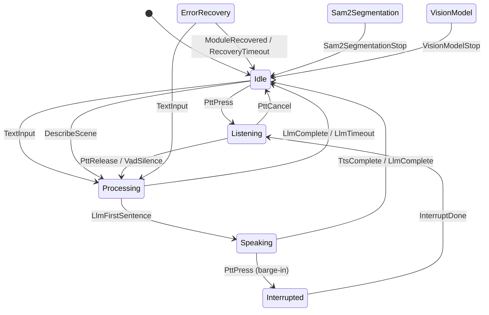

### Transition table

| From | Event | To |
|:---|:---|:---|
| Idle | PttPress | Listening |
| Idle | DescribeScene | Processing |
| Idle | TextInput | Processing |
| Listening | PttRelease | Processing |
| Listening | VadSilence | Processing |
| Listening | PttCancel | Idle |
| Processing | LlmFirstSentence | Speaking |
| Processing | LlmComplete | Idle |
| Processing | LlmTimeout | Idle |
| Speaking | PttPress | Interrupted |
| Speaking | TtsComplete | Idle |
| Interrupted | InterruptDone | Listening |
| ErrorRecovery | ModuleRecovered | Idle |
| ErrorRecovery | RecoveryTimeout | Idle |
| ErrorRecovery | TextInput | Processing |
| Sam2Segmentation | Sam2SegmentationStop | Idle |
| VisionModel | VisionModelStop | Idle |

### Key transitions

**TextInput (text chat from browser).** User types in the browser chat box. WebSocketBridge forwards the message as a `ui_command` ZMQ message. The daemon injects `fsm::TextInput`, transitioning Idle to Processing. The daemon calls `PromptAssembler::assemble()` and publishes `conversation_prompt` to the conversation model.

**VadSilence (voice end-of-utterance).** AudioAccumulator in ConversationNode detects sustained silence after speech. The daemon injects `fsm::VadSilence`, transitioning Listening to Processing. Same prompt assembly path as TextInput but with accumulated audio instead of (or in addition to) text.

### Prompt assembler

`PromptAssembler::assemble()` constructs the full prompt payload by injecting context layers:

```
system prompt (persona, capabilities, constraints)
  + face identity (name + confidence from FaceRecognitionNode)
  + scene description (from last DescribeScene inference)
  + conversation history (sliding window, token-budgeted)
  + current utterance (text and/or audio reference)
```

History eviction uses a token estimator to keep the total under budget. Face identity and scene description are updated asynchronously via ZMQ messages from their respective nodes.

---

## Frontend

Vanilla JavaScript SPA served by `oe_ws_bridge` on port 9001. Dark-theme conversational interface.

### WebSocket channels

| Channel | Data | Direction |
|:---|:---|:---|
| `/video` | Binary JPEG from BackgroundBlur SHM (30 fps; raw ingest frames in Vision Model profile) | Server to client |
| `/audio` | Binary PCM F32 from conversation model or TTS sidecar | Server to client |
| `/chat` | JSON commands/events + binary (image upload, mode results) | Bidirectional |
| `/screen_video` | Binary JPEG from ScreenIngest SHM (screen sharing) | Server to client |
| `/security_video` | Binary JPEG from SecurityCamera SHM (Security profile, 5 fps) | Server to client |
| `/beauty_video` | Binary JPEG from Beauty SHM (Beauty profile, 30 fps) | Server to client |
| `/sam2_video` | Binary mask from Sam2 SHM (SAM2 profile) | Server to client |

### Graceful degradation

The daemon publishes `module_status` events at boot. The frontend disables controls for unavailable modules in real time. On lower GPU tiers, unsupported features are hidden entirely rather than shown as broken controls.

---

## Prerequisites

| Component | Requirement |
|:---|:---|
| Host OS | Windows 10/11 with WSL2, or native Linux |
| Docker | Docker Engine 24+ with `nvidia-container-toolkit` |
| GPU | NVIDIA GPU with 4+ GB VRAM (12 GB recommended) |
| NVIDIA driver | 535+ (host-side only) |
| Webcam | USB webcam (reference: ROCWARE RC28) via `/dev` mount or TCP fallback |

All build dependencies (CUDA 12.x, TensorRT 10.x, cuDNN, NCCL, GStreamer, OpenCV, ONNX Runtime, ZeroMQ, CMake, GCC 13+) are embedded in the Docker image.

---

## Getting started

### 1. Download models (host)

```bash
bash scripts/integration/install.sh --models    # Downloads to ~/omniedge_models/
```

Face recognition uses **SCRFD-10G** (detector) + **AuraFace v1 / `glintr100.onnx`** (recognizer, Apache 2.0 — commercial use permitted). The recognizer is auto-downloaded from [`fal/AuraFace-v1`](https://huggingface.co/fal/AuraFace-v1) on first run via `fetchHfModel()` if it isn't already present in `face_models/scrfd_auraface/`; no manual download step is required when the container has network.

### 2. Build Docker image

```bash
docker compose build                             # Multi-stage build (~25 GB image)
```

### 3. Launch

```bash
docker compose up -d                             # First run builds TRT engines (~30 min)
docker compose logs -f                           # Watch startup progress
```

The entrypoint validates GPU access, checks model mounts, builds missing TRT engines, then spawns all C++ binaries. The frontend is available at `http://localhost:9001`.

### 4. Stop

```bash
docker compose down
```

### Development (compile inside container)

```bash
docker compose -f docker-compose.yaml -f docker-compose.dev.yaml up -d
docker exec -it omniedge-dev bash
# Inside container:
bash run_all.sh                                  # Build + launch from source
bash run_all.sh --verify                         # Verify models, engines, binaries
```

### Other commands

| Command | Context | Purpose |
|:---|:---|:---|
| `docker compose up -d` | Host | Start production container |
| `docker compose logs -f` | Host | Stream container logs |
| `bash run_all.sh` | Dev container | Build and launch from source |
| `bash run_all.sh --install-only` | Dev container | Install dependencies and models |
| `bash run_all.sh --verify` | Dev container | Verify all models, engines, and binaries |
| `bash run_all.sh --model-test` | Dev container | Run headless model pipeline tests |
| `bash run_all.sh --help` | Dev container | Show all options |

---

## Configuration

### `config/omniedge_config.yaml`

Primary configuration file. Defines module launch order, per-module VRAM budgets, conversation model selection, TTS model, and multi-tier GPU profiles (minimal / balanced / standard / ultra). Uses `/opt/omniedge/` paths for Docker deployment.

### `config/omniedge.ini`

INI-format configuration for ZMQ port assignments, module enable/disable flags, per-profile priority maps (`[profile_*]` sections), inference settings, pipeline parameters, and logging levels. Installed to `/opt/omniedge/etc/omniedge.ini` by CMake.

### GPU tier system

Auto-detected via `GpuProfiler::probe()` (NVML). Override with `--profile <tier>`.

| Tier | VRAM | Default conversation model | Available profiles |
|:---|:---|:---|:---|
| Minimal | 4 GB | Qwen2.5-Omni-3B | Conversation only |
| Balanced | 8 GB | Qwen2.5-Omni-3B, Gemma 4 E4B | Conversation, Super Resolution, Beauty |
| Standard | 12 GB | Qwen2.5-Omni-7B (all three available) | All seven |
| Ultra | 16+ GB | Qwen2.5-Omni-7B (all three + expanded context) | All seven + concurrent features |

---

## Testing

Test pyramid with four layers:

| Layer | Directory | Scope |
|:---|:---|:---|
| Core | `tests/core/` | Pure algorithms, no transport or GPU |
| Interface | `tests/interfaces/` | Contract tests with mock inferencers |
| Node | `tests/nodes/` | Wiring verification with mock dependencies |
| Integration | `tests/integration/` | Real ZMQ, real GPU, real inferencers |

End-to-end tests in `tests/integration/pipeline/`. Shared fixtures in `tests/fixtures/`.

CTest labels separate GPU-dependent tests from CPU-only tests so you can run them independently:

```bash
# CPU-only tests (no GPU required)
ctest -LE gpu

# GPU tests (requires NVIDIA GPU inside container)
ctest -L gpu

# Headless model pipeline tests (loads real models, runs inference)
bash run_all.sh --model-test
```

---

## Observability

**Structured logging.** All modules write to `logs/omniedge.log` via spdlog. Format: `YYYY-MM-DD HH:MM:SS.mmm [LEVEL] [module] [function] message`.

**Tracy profiler.** Optional (`cmake -DOE_ENABLE_TRACY=ON`). Zero-overhead no-ops when disabled. TCP port 8086.

**HTTP status endpoint.** `GET http://localhost:9001/status` returns module PIDs, restart counts, and VRAM usage.

### Error codes

Every anomaly log line carries a stable identifier `OE-<MOD>-<SEV><NNN>` so operators can grep `logs/omniedge.log` and match hits to this table without reading source:

- **`<MOD>`** — module prefix: `CONV` conversation, `STT` speech-to-text, `TTS` text-to-speech, `CV` computer vision, `INGEST` video/audio/screen ingest, `WS` websocket bridge, `ZMQ` transport, `SHM` shared memory, `GPU` CUDA / VRAM, `ORCH` orchestrator, `DAEMON` top-level daemon, `COMMON` shared helpers.
- **`<SEV>`** — severity band:
  - `1xxx` notable INFO (lifecycle milestones)
  - `2xxx` INFO with numeric payload (metrics, clamps, completions)
  - `3xxx` WARN (degradation — a graceful fallback was taken)
  - `4xxx` ERROR (this request failed, process continues)
  - `5xxx` CRITICAL (subsystem initialization failed)
- **`<NNN>`** — three-digit ordinal, unique within `(MOD, SEV)`.

Canonical registry: `modules/common/include/common/error_codes.hpp`. When a new code is added at a call site, register it in the header in the same commit — the header is authoritative.

| Code | Band | Meaning |
|:---|:---|:---|
| `OE-COMMON-4001` | ERROR | EventBus subscriber threw during dispatch; the bus logs and keeps fanning out to the remaining subscribers. |
| `OE-DAEMON-4005` | ERROR | `execlp` failed inside a post-fork child spawning `taskkill.exe` for the Windows screen-capture agent. |
| `OE-DAEMON-5001` | CRITICAL | ONNX Runtime execution-provider creation failed; fell back to the next tier. |
| `OE-VAD-4001` | ERROR | Silero VAD ONNX inference threw; the caller receives the error string and must drop the chunk. |
| `OE-STT-3001` | WARN | `added_tokens.json` failed to parse; Whisper continues with the base vocabulary only. |
| `OE-STT-5003` | CRITICAL | Whisper vocabulary was empty after loading — decoding would produce garbage; `loadModel` aborts. |
| `OE-CONV-1004` | INFO | TTS sidecar lifecycle event (spawn / exit). |
| `OE-CONV-2004` | INFO | Generation parameters clamped to allowed range. |
| `OE-CONV-2005` | INFO | Generation completed — includes token count and throughput. |
| `OE-CONV-3002` | WARN | `conversation_prompt` has no text or messages; nothing to generate. |
| `OE-CONV-3003` | WARN | `generation_params` missing from prompt; defaults applied. |
| `OE-CONV-3010` | WARN | Audio SHM reader init failed; native STT disabled. |
| `OE-CONV-3011` | WARN | Video SHM reader init failed; video conversation disabled. |
| `OE-CONV-3012` | WARN | Video frame unavailable at inference time; falling back to text-only. |
| `OE-CONV-3013` | WARN | Video conversation requested but the active inferencer is text-only. |
| `OE-CONV-4003` | ERROR | Inference `generate()` returned an error; request dropped. |
| `OE-CONV-4010` | ERROR | Whisper transcription failed. |

New bands and modules are added to the header and this table in the same pass; there is no separate `docs/error_codes.md`.

### Latency targets (reference values)

These are design targets, not proven benchmarks. Actual latency depends on GPU model, model quantization, and system load.

| Metric | Target |
|:---|:---|
| PTT release to first audio (Qwen Omni) | < 1,300 ms |
| PTT release to first audio (Gemma + TTS) | < 1,100 ms |
| Total user-perceived (including 800 ms VAD) | < 2,100 ms |

---

> **Document version:** 8.0
> **Target hardware:** Any NVIDIA GPU with 4+ GB VRAM (reference: RTX PRO 3000 Blackwell, 12 GB GDDR6)
> **Runtime:** Docker (NGC TensorRT-LLM base) on WSL2 or native Linux
> **Verified modules:** Frontend (JS SPA), IPC layer (ZMQ/SHM), C++ compilation
> **Experimental modules:** All inference inferencers. VRAM sizes and latency targets are reference configurations, not proven benchmarks.
