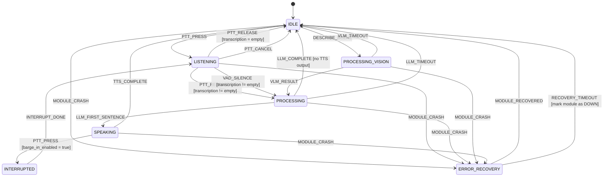
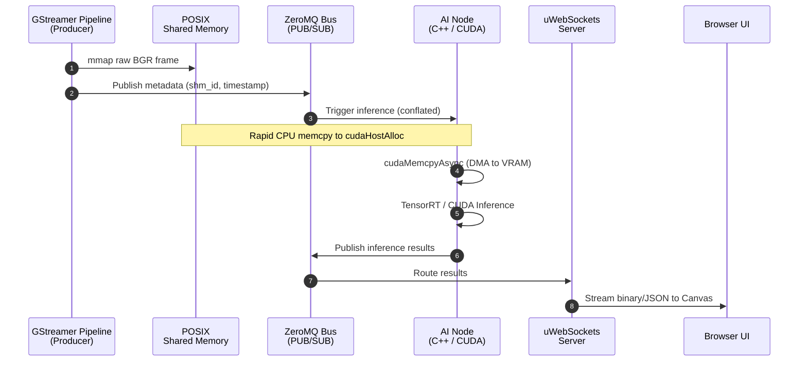
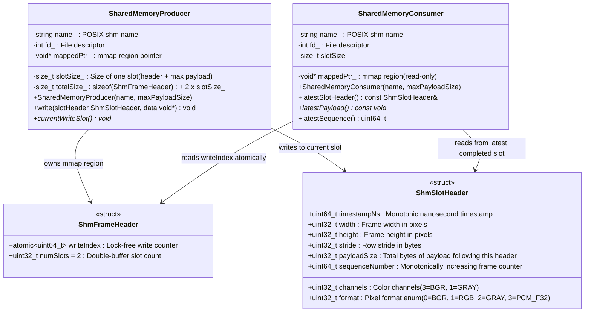

# **OmniEdge_AI: Edge AI Assistant — Architecture Specification**

## **Executive Summary**

OmniEdge_AI is a multi-modal personal assistant designed to run entirely on a single NVIDIA GPU under WSL2. It is designed to handle 1080p video, speech transcription, speech synthesis, face recognition, image generation, and LLM-based conversation — all concurrently, all on-device. The primary hardware target is the **NVIDIA RTX PRO 3000 Blackwell** laptop GPU with **12 GB GDDR6 VRAM**, but the system is designed to scale across different GPU hardware.

The system is optimized for 12 GB (standard tier) but scales from 4 GB (minimal) to 16+ GB (ultra) via automatic GPU profiling at boot. Loading these models at FP16 would require approximately 28 GB. INT4/INT8 quantization (AWQ, SmoothQuant, weight-only INT8) and careful VRAM partitioning are designed to bring the total within the 12 GB budget. See **GPU Scalability: Multi-Tier Profile System** for the four hardware tiers.

The system is a multi-process architecture in C++ and CUDA. Each AI modality — LLM, VLM, STT, TTS, CV — runs as its own binary. This provides fault isolation (one crash does not bring down the pipeline), independent testing, and straightforward GPU stream scheduling.

The IPC design splits into two layers:

-   **Data Plane** — POSIX shared memory for bulk data (video frames, audio buffers). Zero kernel crossings after initial mmap.
-   **Control Plane** — ZeroMQ PUB/SUB for metadata, events, and orchestration messages.

This document is the implementation reference. It covers VRAM budgeting, quantization methodology, IPC topology, process lifecycle management, model conversion steps, C++ class contracts, and build/test infrastructure.

> **Verification Status:** Most OmniEdge_AI modules are **experimental** — the code compiles and structural tests pass, but the modules have NOT been validated with real models on real hardware. Only the **frontend** (JavaScript SPA) and the **common IPC layer** (ZMQ/SHM wrappers) are verified. All inference backends (LLM, STT, TTS, VLM, ImgGen, CV), GStreamer pipelines, and daemon process management are experimental. Model-specific details (VRAM sizes, quantization methods, parameter counts, latency targets) are **reference configurations** — they describe the intended design, not proven facts. This document uses "is designed to" / "intended to" language for unvalidated claims.

> **Full system architecture diagram:** see [`omniedge_architecture.wsd`](omniedge_architecture.wsd) (PlantUML) — covers every module, IPC flow, data plane, control plane, and browser frontend in a single sequence diagram.

---

## **Architecture at a Glance**

For the reader who wants the essential decisions before the details:

| What | Implementation | Why |
|:---|:---|:---|
| 10 independent processes (+ daemon orchestrator) | Each AI modality = separate ELF binary with its own CUDA context | Fault isolation — one CUDA OOM cannot kill another module |
| IPC: data plane | POSIX shared memory (`mmap`) | Zero kernel crossings after initial `mmap`; no ZMQ serialization on BGR frames (see derivation below) |
| IPC: control plane | ZeroMQ PUB/SUB | Sub-microsecond loopback latency for small JSON signals; no shared-memory bookkeeping |
| Model quantization | INT4/INT8 via AWQ + TensorRT-LLM | 28 GB FP16 footprint → 12 GB with < 2% accuracy loss (see derivation below) |
| Inference stack | TensorRT-LLM (LLM/STT) + ONNX Runtime (TTS/face) | Tensor Core utilization on Ampere+ GPUs + flexibility for models that lack a TRT path |
| Backend swapping | C++ interfaces (`ILLMBackend`, `ISTTBackend`, `ITTSBackend`, `IVLMBackend`) | Swap Qwen → Llama 3 with one YAML field change; no other module recompiles |
| Fault recovery | ZMQ heartbeats + `posix_spawn` watchdog | A crashed module is restarted in < 2 s while all other modules continue running |
| GPU scheduling | CUDA stream priorities [−5 … 0], no MPS | LLM/STT at −5 (high), CV at 0 (background); avoids MPS complexity on WSL2 |
| WSL2 DMA path | `cudaHostAlloc` (pinned, not `cudaHostRegister`) | WSL2 WDDM does not expose IOMMU; `cudaHostRegister` on arbitrary `mmap` is unsupported |
| Configuration | 4-layer: `omniedge_config.yaml` → `config/oe_tuning.hpp` → `config/oe_platform.hpp` → `common/oe_defaults.hpp` | No hardcoded numbers in module source; new module = YAML block + one binary |
| GPU profiles | 4 YAML-defined tiers: `minimal` / `balanced` / `standard` / `ultra` | Runs on any 4 GB+ GPU; auto-detected at boot; override with `--profile <tier>` |
| Dynamic VRAM | Process-level model load/unload via `posix_spawn`/`SIGTERM` | Models not in use are fully unloaded; process exit reclaims VRAM as contiguous block — zero fragmentation |

#### Derivation: 28 GB FP16 → 12 GB quantized

FP16 (2 bytes per parameter) memory for every model loaded simultaneously on the standard tier:

```
Qwen 2.5 7B:      7.61 B params × 2 bytes  = 15.22 GB
  + MHA KV cache:  28 layers × 28 heads × 128 dim × 4096 ctx × 2 (K+V) × 2 bytes = 3.22 GB
Whisper V3 Turbo:  809 M params × 2 bytes   =  1.62 GB
Moondream2:        1.86 B params × 2 bytes  =  3.72 GB
YOLOv8n-seg:       3.2 M params × 2 bytes   =  0.006 GB
InspireFace:       ~100 M params × 2 bytes  =  0.20 GB
Kokoro TTS:        82 M params × 2 bytes    =  0.16 GB
CUDA workspace + activations:                  1.50 GB
WSL2 / driver overhead:                        1.50 GB
─────────────────────────────────────────────────────
Total FP16:                                  ~27.2 GB
```

After quantization + GQA:

```
Qwen 2.5 7B INT4-AWQ:  7.61 B × 0.5 bytes + scale/zero overhead = 4.30 GB
  + GQA KV cache (FP8): 28 layers × 4 KV heads × 128 dim × 4096 ctx × 2 × 1 byte = 0.46 GB
                         (+ page table metadata, padding, headroom → 1.15 GB allocated)
Whisper V3 Turbo INT8:  TensorRT engine with INT8 weights        = 1.50 GB
Moondream2 (mixed):     TensorRT vision + decoder engines        = 2.45 GB
YOLOv8n-seg FP16:       TensorRT engine (tiny model)             = 0.50 GB
InspireFace:            TensorRT backend                         = 0.50 GB
Kokoro TTS INT8:        ONNX Runtime INT8                        = 0.10 GB
WSL2 / driver overhead:                                            1.50 GB
───────────────────────────────────────────────────────────────────────────
Total quantized:                                                ~12.0 GB
```

The dominant reduction comes from three techniques: INT4-AWQ weight quantization on the LLM (15.2 → 4.3 GB, 3.5× compression), Grouped Query Attention replacing MHA KV cache (3.22 → 0.46 GB, 7× reduction), and INT8 weight-only quantization on STT/TTS. The < 2% accuracy claim is from the AWQ paper (Lin et al., 2024) and confirmed by the Qwen team's published perplexity benchmarks for their official INT4 checkpoints.

#### Derivation: BGR frame bandwidth and ZMQ message sizes

A 1080p BGR frame:

```
1920 × 1080 pixels × 3 bytes/pixel (BGR24) = 6,220,800 bytes = 5.93 MiB
```

At 30 fps with 3 ZMQ subscribers (BackgroundBlur, FaceRecognition, Moondream2), ZMQ PUB copies each message into every connected subscriber's pipe:

```
6.22 MB/frame × 30 fps = 186.6 MB/s   (raw write rate)
× 3 subscribers        = 559.8 MB/s   (total ZMQ internal throughput)
```

That is before ZMQ's own framing, `zmq_msg_t` allocations, and I/O thread overhead. With POSIX shm the frame is written once and all three consumers read it in-place.

The largest ZMQ message in OmniEdge_AI is an LLM system prompt update (~500 bytes). A typical frame notification:

```json
{"v":1,"type":"video_frame","shm":"/oe.vid.ingest","slot":0,"ts_ns":1711843200000000}
```

That is 85 bytes of JSON plus an 11-byte ZMQ topic prefix — 96 bytes total. Audio chunk, VAD status, identity, and module_status messages are similarly small. Every ZMQ message in the system stays well under 1 KB.

---

## **System Design Principles**

OmniEdge_AI is structured around seven non-negotiable architectural decisions. Understanding these upfront explains every tradeoff in the implementation.

### **1. Process Isolation Over Shared Execution**

Each AI modality runs as an independent OS process with its own CUDA context. A corrupted TensorRT engine, a CUDA OOM, or a runaway inference loop in one module cannot corrupt another module's VRAM or stall another module's CUDA stream. The Python/PyTorch monolith alternative offers convenience at the cost of this guarantee: one OOM kills everything.

The intended consequence: the watchdog is designed to kill and restart a crashed VLM node in under 2 seconds while the LLM continues generating tokens and the video pipeline continues at 30 fps. Process-level fault domains are designed to make graceful degradation tractable. This recovery time has not yet been measured on real hardware.

### **2. Data Plane and Control Plane Are Different Channels**

ZMQ is a signaling bus, not a data bus. Pixel matrices and PCM audio buffers move through POSIX shared memory — zero kernel crossings after the initial `mmap`. ZMQ carries only JSON metadata: *"frame N is ready in slot X of segment `/oe.vid.ingest`."* This separation keeps ZMQ messages in the sub-10 KB range where sub-microsecond loopback latency is achievable, and keeps large data transfers entirely outside ZMQ's serialization and message-queue machinery.

A 1080p BGR frame is 6.2 MB. Publishing that over ZMQ at 30 fps to three subscribers would require 186+ MB/s of ZMQ throughput before factoring in serialization, socket queuing, or topic routing overhead. With POSIX shm the same frame is written once and read in-place. ZMQ overhead becomes negligible because its messages never grow beyond a few hundred bytes.

### **3. Backend Abstraction Enables Model Swapping**

Every inference-heavy module implements a small C++ interface (`ILLMBackend`, `ISTTBackend`, `ITTSBackend`, `IVLMBackend`). Swapping Qwen 2.5 for Llama 3, or Whisper V3 for Parakeet CTC, requires implementing a new class and changing a `backend:` YAML field. No other module compiles differently, no IPC contracts change, no daemon code changes. This is not a future optimization — it is how the system accommodates model upgrades without a full rewrite, and how different hardware targets (server GPU, edge device) can use different backends with the same orchestration layer.

### **4. Declarative Configuration Makes the System Addable**

All port assignments, shm names, engine paths, CUDA stream priorities, and process launch orders live in one YAML file. Naming schemes for ports and shm segments are structured (`/oe.<layer>.<module>[.<qualifier>]`, sequential port allocation) so that any new module can be assigned resources without collisions. Adding hand gesture recognition, for example, requires: claim the next available reserved port (e.g., 5572), assign shm name `/oe.cv.gesture`, write the node binary, add ~12 lines to `omniedge_config.yaml`. No existing module changes. The daemon picks it up automatically on next startup.

### **5. Graceful Degradation Is Architecture, Not Afterthought**

Every module has a documented failure fallback — what the system presents when that module is down. BackgroundBlurNode down → raw video passthrough. WhisperSTTNode down → text input mode. TTSNode down → text-only responses. These fallbacks are defined at design time, encoded in the daemon's state machine, and communicated to the frontend via `module_status` ZMQ events. The system always presents a partially functional UI rather than an error screen. Fault behavior is a first-class architectural property.

### **6. Configuration Layers — No Magic Numbers in Source**

Every tunable parameter lives in exactly one of four layers:

| Layer | Location | When It Changes | Examples |
|:---|:---|:---|:---|
| Runtime config | `omniedge_config.yaml` | Per-deployment, no recompilation | Ports, engine paths, thresholds, timeouts, JPEG quality, VAD sensitivity, LLM temperature |
| Compile-time tuning | `config/oe_tuning.hpp` | Per-hardware-class, requires rebuild | SHM double-buffer slot count, ZMQ HWM, max resolution, CUDA grid dimensions |
| Platform detection | `config/oe_platform.hpp` | Per-OS/driver, requires rebuild | WSL2 vs native Linux, CUDA compute capability gates, WDDM vs TCC driver path |
| Runtime defaults | `common/oe_defaults.hpp` | Fallback values when YAML key is missing | All configurable parameters have `constexpr` defaults |

If a YAML key is missing at runtime, the default from `common/oe_defaults.hpp` (`constexpr`) is used instead. No `.cpp` file contains a bare numeric literal for anything that could change between deployments or hardware targets. Architectural constants like port allocation base and SHM naming patterns are `constexpr` in headers.

Code review rule: any number in a `.cpp` file must trace back to `oe_tuning.hpp`, `oe_defaults.hpp`, or a `Config` field loaded from YAML. Loop indices and booleans are the only exceptions.

### **7. Dynamic VRAM — Models Load and Unload on Demand**

GPU memory is a scarce, shared resource. OmniEdge_AI treats VRAM the way an OS treats physical RAM — it is allocated on demand and reclaimed when no longer needed. The mechanism is **process-level isolation**: each AI module runs in its own OS process with its own CUDA context. When a model is not in use, its process is terminated via `SIGTERM`, and the entire CUDA context — including all VRAM allocations — is reclaimed by the driver. This is fundamentally different from in-process `cudaFree()`, which fragments the CUDA memory pool.

**Why process isolation prevents fragmentation:** When you `cudaMalloc()` 2 GB, use it, then `cudaFree()` it within the same process, CUDA's sub-allocator marks that 2 GB as available in its internal free list — but it is not returned to the OS. A subsequent `cudaMalloc(2.1 GB)` from the same process will fail even though 2 GB is "free" — because the free list is fragmented into non-contiguous chunks. By contrast, when the entire process exits, the CUDA driver reclaims the full context as a single contiguous block. The next `posix_spawn()` gets a fresh, unfragmented address space.

**On lower VRAM tiers** (`balanced`, `minimal`), the daemon spawns modules on-demand:

1.  User triggers `describe_scene` → daemon calls `posix_spawn("omniedge_vlm", ...)`
2.  VLM process loads model, processes one frame, publishes result, then exits
3.  Daemon receives `SIGCHLD`, confirms VRAM is reclaimed, logs `vlm_unloaded`
4.  The freed VRAM is now available for other modules that may need it

**On the standard/ultra tier**, all modules run persistently, but the eviction mechanism still applies — if VRAM pressure is detected (e.g., paged KV cache growing), the lowest-priority module is SIGTERMed first (see the priority-based eviction table in the Dynamic VRAM Management section).

This design means **no model sits idle consuming VRAM**. If a model is loaded, it is serving requests. If it is not serving requests, it is unloaded. The daemon's watchdog tracks which models are loaded, their VRAM consumption (via `currentVramUsageBytes()` on each backend interface), and their last-use timestamp.

---

## **GPU Scalability: Multi-Tier Profile System**

OmniEdge_AI targets 12 GB VRAM but is designed to run on any GPU from 4 GB upward. The single mechanism is **profile tiers**: the daemon probes VRAM at startup, selects the highest tier that fits, and spawns only the modules and model variants within budget. No module code changes between tiers — only which binaries are launched and which engine paths are loaded from YAML.

### Tier Definitions

| Tier | Min VRAM | Active Modules | LLM | STT | CV |
|:---|:---|:---|:---|:---|:---|
| `minimal` | 4 GB | STT + LLM + TTS + Daemon + WS | Qwen 2.5 1.5B INT4 (~1.2 GB) | Whisper Small INT8 (~0.5 GB) | Disabled |
| `balanced` | 8 GB | + Video Ingest + Face Recognition; VLM on-demand | Qwen 2.5 3B INT4 (~2.0 GB) | Whisper V3 Turbo INT8 (1.5 GB) | FR only |
| `standard` | 12 GB | All 9 core modules; ImgGen on-demand | Qwen 2.5 7B INT4-AWQ (4.3 GB) | Whisper V3 Turbo INT8 (1.5 GB) | Full |
| `ultra` | 16 GB | All 10 modules + extended context | Qwen 2.5 7B INT4-AWQ (4.3 GB) | Whisper V3 Turbo INT8 (1.5 GB) | Full + FP16 KV |

### VRAM Budget per Tier

| Component | `minimal` (4 GB) | `balanced` (8 GB) | `standard` (12 GB) | `ultra` (16 GB) |
|:---|---:|---:|---:|---:|
| LLM model weights | ~1.2 GB | ~2.0 GB | 4.30 GB | 4.30 GB |
| LLM KV cache | 0.15 GB | 0.40 GB | 1.15 GB | 2.00 GB |
| STT (Whisper) | ~0.5 GB | 1.50 GB | 1.50 GB | 1.50 GB |
| TTS (Kokoro) | 0.10 GB | 0.10 GB | 0.10 GB | 0.10 GB |
| Face Recognition | — | 0.50 GB | 0.50 GB | 0.50 GB |
| Background Blur | — | — | 0.50 GB | 0.50 GB |
| VLM (Moondream2) | — | on-demand¹ | 2.45 GB | 2.45 GB |
| ImgGen (FLUX.1-schnell) | — | — | on-demand² | on-demand² |
| System / WSL2 | 1.00 GB | 1.00 GB | 1.50 GB | 1.50 GB |
| **Total** | **~3.0 GB** | **~5.5 GB** | **~12.0 GB** | **~12.9 GB** |

> ¹ `balanced` loads Moondream2 only when the user triggers `describe_scene`, processes one frame, then `posix_spawn` exits and frees VRAM.
>
> ² FLUX.1-schnell INT8 requires ~4.50 GB VRAM. On `standard` and `ultra` tiers, the daemon evicts lower-priority modules (BackgroundBlur, FaceRecognition, VLM) before spawning ImgGen, then restores them after generation completes. ImgGen is never resident — it is always on-demand with immediate eviction after use.

### Runtime GPU Probe and Auto-Selection

`OmniEdgeDaemon::initialize()` calls `probeGpu()` before spawning any child. If `gpu.auto_profile: true`, it maps total VRAM → tier. The `--profile <tier>` CLI flag overrides auto-selection.

```cpp
// omniedge/gpu_profile.hpp  —  part of omniedge_common
namespace omniedge {

/** @brief VRAM and SM capability for one CUDA device. */
struct VramInfo {
    size_t      totalBytes;  ///< Device total memory in bytes
    size_t      freeBytes;   ///< Currently free (measured at probe time)
    int         smMajor;     ///< Compute capability major
    int         smMinor;     ///< Compute capability minor
    std::string gpuName;     ///< e.g. "NVIDIA GeForce RTX 4060"

    [[nodiscard]] size_t totalMb() const noexcept { return totalBytes / (1024 * 1024); }
    [[nodiscard]] size_t freeMb()  const noexcept { return freeBytes  / (1024 * 1024); }

    /** @brief Human-readable architecture name from SM version. */
    [[nodiscard]] std::string archName() const {
        if (smMajor >= 10)                return "Blackwell";
        if (smMajor == 9  && smMinor == 0) return "Hopper";
        if (smMajor == 8  && smMinor >= 9) return "Ada Lovelace";
        if (smMajor == 8  && smMinor >= 6) return "Ampere (GA10x)";
        if (smMajor == 8)                  return "Ampere";
        if (smMajor == 7  && smMinor == 5) return "Turing";
        if (smMajor == 7)                  return "Volta";
        return std::format("sm_{}{}", smMajor, smMinor);
    }
};

/** @brief Resource tier selected by available VRAM. */
enum class GpuTier : uint8_t {
    kMinimal  = 0,  ///< 4+ GB:  STT + small LLM + TTS; no CV
    kBalanced = 1,  ///< 8+ GB:  adds face recognition, larger LLM; VLM on-demand
    kStandard = 2,  ///< 12+ GB: all 9 modules, 7B INT4 (primary target)
    kUltra    = 3,  ///< 16+ GB: extended context window, FP16 KV cache
};

/** @brief Probe the GPU and return VRAM + capability info. */
[[nodiscard]] VramInfo probeGpu(int deviceId = 0);

/**
 * @brief Select the highest tier whose budget fits within usable VRAM.
 * @param info       Result from probeGpu().
 * @param headroomMb VRAM to keep free for OS + fragmentation buffer.
 */
[[nodiscard]] GpuTier selectTier(const VramInfo& info, size_t headroomMb = 500);

[[nodiscard]] std::string_view tierName(GpuTier tier);
[[nodiscard]] GpuTier          parseTier(std::string_view name);  // throws on unknown

} // namespace omniedge
```

```cpp
// omniedge/gpu_profile.cpp
VramInfo probeGpu(int deviceId) {
    cudaDeviceProp props{};
    cudaGetDeviceProperties(&props, deviceId);
    cudaSetDevice(deviceId);

    size_t freeBytes{}, totalBytes{};
    cudaMemGetInfo(&freeBytes, &totalBytes);

    return { totalBytes, freeBytes, props.major, props.minor, props.name };
}

GpuTier selectTier(const VramInfo& info, size_t headroomMb) {
    const size_t usable = info.totalMb() - headroomMb;
    if (usable >= omniedge::defaults::kVramThresholdUltraMb)    return GpuTier::kUltra;
    if (usable >= omniedge::defaults::kVramThresholdStandardMb) return GpuTier::kStandard;
    if (usable >= omniedge::defaults::kVramThresholdBalancedMb) return GpuTier::kBalanced;
    return GpuTier::kMinimal;
}

std::string_view tierName(GpuTier tier) {
    switch (tier) {
        case GpuTier::kMinimal:  return "minimal";
        case GpuTier::kBalanced: return "balanced";
        case GpuTier::kStandard: return "standard";
        case GpuTier::kUltra:    return "ultra";
    }
    std::unreachable();
}
```

**Daemon startup integration:**

```cpp
void OmniEdgeDaemon::initialize() {
    auto vram = probeGpu(0);
    logJson("INFO", "gpu_probe", {
        {"name",     vram.gpuName},
        {"arch",     vram.archName()},
        {"total_mb", vram.totalMb()},
        {"free_mb",  vram.freeMb()},
    });

    GpuTier tier = config_.overrideProfile.empty()
        ? selectTier(vram)                       // auto
        : parseTier(config_.overrideProfile);    // --profile flag

    logJson("INFO", "profile_selected", {{"tier", std::string{tierName(tier)}}});
    activeProfile_ = config_.profiles.at(std::string{tierName(tier)});
    // proceed to spawnModules(activeProfile_)
}
```

### Profile YAML Structure

```yaml
gpu:
  auto_profile: true          # true = detect VRAM; false = use override_profile
  override_profile: ""        # "minimal" | "balanced" | "standard" | "ultra"
  headroom_mb: 500            # reserve this much VRAM for OS + fragmentation

profiles:
  minimal:                    # ── 4+ GB ─────────────────────────────────────────
    modules: [audio_ingest, stt, llm, tts, ws_bridge]
    llm:
      engine_dir: "/models/engines/qwen2.5-1.5b-int4"
      max_seq_len: 2048
      kv_cache_fp8: false
    stt:
      engine_dir: "/models/engines/whisper-small-int8"
    cv: { background_blur: false, face_recognition: false, vlm: false }

  balanced:                   # ── 8+ GB ─────────────────────────────────────────
    modules: [video_ingest, audio_ingest, face_recognition, stt, llm, tts, ws_bridge]
    llm:
      engine_dir: "/models/engines/qwen2.5-3b-int4"
      max_seq_len: 3072
      kv_cache_fp8: false
    stt:
      engine_dir: "/models/engines/whisper-v3-turbo-int8"
    cv: { background_blur: false, face_recognition: true, vlm: on_demand }
    # vlm: on_demand — daemon posix_spawns oe_vlm, waits for result, then SIGTERM

  standard:                   # ── 12+ GB (primary target) ───────────────────────
    modules: [video_ingest, audio_ingest, face_recognition, background_blur, vlm, stt, llm, tts, ws_bridge]
    llm:
      engine_dir: "/models/engines/qwen2.5-7b-int4"
      max_seq_len: 4096
      kv_cache_fp8: true
    stt:
      engine_dir: "/models/engines/whisper-v3-turbo-int8"
    cv: { background_blur: true, face_recognition: true, vlm: always }
    img_gen: on_demand         # FLUX.1-schnell: 4.5 GB, evicts BB+FR+VLM before spawn

  ultra:                      # ── 16+ GB ────────────────────────────────────────
    modules: [video_ingest, audio_ingest, face_recognition, background_blur, vlm, stt, llm, tts, flux_img_gen, ws_bridge]
    llm:
      engine_dir: "/models/engines/qwen2.5-7b-int4"
      max_seq_len: 8192       # doubled context window
      kv_cache_fp8: false     # full FP16 KV cache (2 GB vs 1.15 GB)
    stt:
      engine_dir: "/models/engines/whisper-v3-turbo-int8"
    cv: { background_blur: true, face_recognition: true, vlm: always }
```

### Frontend Degradation Matrix

The daemon publishes `module_status` events on boot. The JS frontend disables unavailable controls in real-time — the user always sees a coherent UI, never a broken one.

| Feature | `minimal` | `balanced` | `standard` | `ultra` |
|:---|:---:|:---:|:---:|:---:|
| Push-to-talk (STT) | ✓ | ✓ | ✓ | ✓ |
| Text chat (bypass STT) | ✓ | ✓ | ✓ | ✓ |
| Webcam preview | — | ✓ | ✓ | ✓ |
| Background blur | — | — | ✓ | ✓ |
| Face name display | — | ✓ | ✓ | ✓ |
| Describe scene | — | on-demand | ✓ | ✓ |
| Image generation | — | — | on-demand | on-demand |
| Image adjustments | — | — | ✓ | ✓ |
| Context window | 2,048 tok | 3,072 tok | 4,096 tok | 8,192 tok |

---

### Dynamic VRAM Management

On `kMinimal` and `kBalanced` tiers, not all models fit in VRAM simultaneously. The daemon manages VRAM as a resource pool through two mechanisms: **on-demand spawning** and **priority-based eviction**.

#### On-Demand Spawn Pattern

Modules marked `on_demand` in the profile YAML (e.g., VLM on `balanced`) are not launched at boot. Instead:

1.  User triggers a feature that requires the module (e.g., `describe_scene` → VLM)
2.  Daemon checks free VRAM via `probeGpu(0)` — if insufficient, evicts lowest-priority idle module first
3.  Daemon calls `posix_spawn()` to launch the module binary with `--config` and `--profile`
4.  Daemon subscribes to the module's PUB port, waits for `module_ready` (30 s timeout)
5.  Request is forwarded via ZMQ, module processes and publishes result
6.  Daemon sends `SIGTERM` to the module — process exit destroys the CUDA context, freeing all VRAM

```text
User: "describe_scene"
       │
Daemon ─┬─ probeGpu(0).freeMb >= 2450?
        │       YES → posix_spawn("omniedge_vlm", ...)
        │       NO  → evictLowestPriority(2450) → then spawn
        │
        ├─ SUB to port 5562, wait "module_ready"
        ├─ Forward request → VLM processes → PUB "vlm_description"
        └─ SIGTERM → waitpid() → VRAM freed
```

#### Priority-Based Eviction

When the daemon needs VRAM for a higher-priority or on-demand module, it evicts the lowest-priority **idle** module:

| Priority | Module | Evictable? |
|---:|:---|:---|
| 5 (highest) | QwenLLMNode | Never — core pipeline component |
| 4 | WhisperSTTNode | Only if no active utterance |
| 3 | KokoroTTSNode | Only if no pending synthesis |
| 2 | MoondreamVLMNode | Yes (often on-demand already) |
| 1 | FaceRecognitionNode | Yes |
| 0 | BackgroundBlurNode | Yes (visual effect only) |
| -1 (lowest) | FLUXImgGenNode | Yes — on-demand, 4.5 GB VRAM, always evicted first |

Eviction rules:

-   Never evict a module that is mid-inference (check `moduleHealth_[name].state == kProcessing`)
-   SIGTERM first, escalate to SIGKILL after 5 s timeout
-   `waitpid()` to reap the process and confirm VRAM release
-   Log every eviction at `level: "warn"` with `meta: { evicted, freed_mb, reason }`
-   Re-spawn evicted modules automatically when VRAM becomes available

#### Process-Level VRAM Isolation

Because each module runs as a separate OS process with its own CUDA context, killing a process guarantees VRAM release — the CUDA driver destroys the context and all associated device allocations. No explicit `cudaFree()` calls are needed. This is deliberately simpler and more reliable than in-process model loading/unloading.

**Why not in-process `loadModel()`/`unloadModel()`?** Repeated `cudaMalloc`/`cudaFree` cycles within a single long-lived process cause **CUDA memory fragmentation** — free VRAM becomes scattered across non-contiguous holes. After hours of operation, `cudaMalloc` can fail even when total free VRAM exceeds the request size, because no single contiguous block is large enough. TensorRT engines are especially vulnerable since they allocate many large contiguous buffers (weight tensors, KV cache blocks, activation workspace).

Process-level isolation avoids this entirely: when a process exits, the CUDA driver unmaps virtual memory at the driver level — returning VRAM as clean, contiguous regions identical to the boot state. Zero fragmentation accumulates across any number of load/unload cycles. The ~500 ms `posix_spawn()` overhead is acceptable for OmniEdge_AI because model switching is per user action (seconds between requests), not per frame.

CUDA does provide mitigation tools for in-process model management if needed in the future: memory pools (`cudaMemPool`, CUDA 11.2+), Virtual Memory Management (CUDA VMM, driver API), stream-ordered allocators (`cudaMallocAsync`), and application-level arena sub-allocators. These add complexity and are documented in the skill reference (`references/vram-management.md`) but are not used in OmniEdge_AI's current design.

---

## **Hardware Constraints, Quantization, and VRAM Budgeting**

12 GB VRAM, shared across six models plus KV cache plus WSL2 overhead. At FP16, the models alone exceed 28 GB. Post-training quantization to INT4/INT8 is a hard requirement — nothing ships without it.

## **VRAM Allocation**

Every megabyte is accounted for. The allocation below assumes TensorRT for GPU-heavy models and ONNX Runtime for Kokoro (TTS) and Silero (VAD). The numbers are reference values derived from published model specifications, parameter-count calculations, and documented engine build outputs. They represent the intended design and have not yet been validated on the target RTX PRO 3000 Blackwell hardware.

**1. Qwen 2.5 7B (Core LLM):** 7.61B parameters. FP16 requires approximately 16.1 GB and does not fit within the 12 GB budget. INT4 via AutoAWQ compresses weights to 3.73–4.3 GB. The system runs this through TensorRT-LLM, which maps INT4 ops to Tensor Cores. Qwen 2.5 uses Grouped Query Attention (GQA), which cuts KV cache memory by approximately 4× compared to full Multi-Head Attention (MHA) — critical when the cache budget is only 1.15 GB.

**2. Moondream2 (VLM):** 2B parameters. Smallest competitive VLM that handles captioning, VQA, and object detection. FP16 requires approximately 5 GB; 4-bit quantization brings it to 2.45 GB on NVIDIA GPUs. The model runs at 184 tok/s with a 0.6% accuracy drop at INT4 (Moondream team benchmark, 2024).

**3. Whisper Large V3 Turbo (STT):** The Turbo variant prunes the decoder from 32 layers to 4, cutting parameter count from 1,550M to approximately 809M. FP16 sits at approximately 2.87–3.02 GB. After building TensorRT-LLM encoder-decoder engines with INT8 weight-only quantization, the footprint drops to 1.44–1.5 GB.

**4. Kokoro v1.0 (TTS):** 82M parameters. Runs on ONNX Runtime (CUDA EP), not TensorRT. The INT8 variant uses less than 100 MB of VRAM. Despite the small size, synthesis quality is competitive with models 10× larger on standard listening tests.

**5. InspireFace and YOLOv8-seg (CV Pipeline):** InspireFace is a C/C++ face recognition SDK covering the full pipeline: detection, landmark alignment, and feature extraction, with sub-10 ms total latency on NVIDIA GPUs via TensorRT. YOLOv8-seg generates person segmentation masks for background blur. Combined VRAM: approximately 1.0 GB.

**6. Paged KV Cache and System Overhead:** TensorRT-LLM uses paged KV cache allocation (non-contiguous blocks) to avoid fragmentation during long conversations. The system allocates 1.15 GB for the cache.

## **Memory Distribution**

With INT4/INT8 quantization across all models, the full stack fits in 12 GB:

| AI Module | Architecture | Quantization | Inference Engine | VRAM |
|:---|:---|:---|:---|---:|
| **Qwen 2.5 7B** (LLM) | Decoder-only Transformer | INT4 (AWQ) | TensorRT-LLM C++ | 4.30 GB |
| **Moondream2** (VLM) | Vision-Language (SigLIP + Phi) | INT4 | ONNX → TensorRT C++ | 2.45 GB |
| **Whisper V3 Turbo** (STT) | Encoder-Decoder (4-layer dec) | INT8 (Weight-only) | TensorRT-LLM C++ | 1.50 GB |
| **Computer Vision** (CV) | InspireFace + YOLOv8-seg | FP16 / INT8 | TensorRT / CUDA | 1.00 GB |
| **Kokoro v1.0** (TTS) | StyleTTS2-derived (82M params) | INT8 | ONNX Runtime C++ | 0.10 GB |
| **Silero VAD** | Voice Activity Detection (1 MB) | FP32 | ONNX Runtime CPU | 0.00 GB |
| **Paged KV Cache** | Dynamic Block Allocation | FP8 | TensorRT-LLM C++ | 1.15 GB |
| **System Buffer** | WSL2 / WDDM Overhead | N/A | Windows OS | 1.50 GB |
| **Total** | **All Models + Overhead** | **Mixed Precision** | **NVIDIA Compute** | **12.00 GB** |

### **Per-Model Analysis: Pros, Cons, and Concerns**

#### Qwen 2.5 7B — Core LLM

| | Details |
|:---|:---|
| **Pros** | Grouped Query Attention (GQA) reduces KV cache by ~4× vs MHA; strong multilingual + code generation; native tool-calling support; INT4-AWQ retains >98% of FP16 accuracy on benchmarks; first-party TensorRT-LLM support with `qwen2` architecture identifier |
| **Cons** | At 7B parameters it is the largest VRAM consumer (~4.3 GB quantized); max context window must be capped at ~4096 tokens to stay within KV cache budget; INT4 quantization can degrade long-form reasoning on edge cases |
| **Concerns** | Tokenizer is tiktoken-based (BPE with `cl100k`-family merges) — **use TensorRT-LLM's built-in tokenizer** (`tensorrt_llm.runtime.ModelRunnerCpp` loads `tokenizer.json` from `tokenizer_dir` automatically; in C++ call `Tokenizer::create(tokenizerDir)` from the TRT-LLM API which reads the HuggingFace `tokenizer.json` + `tokenizer_config.json`). No SentencePiece `.model` file exists. If running outside TRT-LLM (e.g., llama.cpp backend), use `sewenew/tiktoken-cpp` library which reads the same `tokenizer.json` file. Streaming token generation latency is sensitive to `max_seq_len` setting; GQA `num_kv_heads` must match the quantized checkpoint exactly or inference silently produces garbage |

#### Moondream2 — Video-to-Text VLM

| | Details |
|:---|:---|
| **Pros** | Only 2B parameters — smallest competitive VLM available; supports captioning, VQA, object detection, and pointing in a single model; 0.6% accuracy drop at INT4; Apache-2.0 license; actively updated (latest: 2025-06-21 with grounded reasoning) |
| **Cons** | Custom architecture (SigLIP vision encoder + Phi text decoder) is **not natively supported** by TensorRT-LLM — requires manual ONNX export path; cross-attention between vision features and decoder tokens needs custom ONNX operator registration; text decoder ONNX export with dynamic KV cache is non-trivial |
| **Concerns** | ONNX export may fail silently on custom `trust_remote_code` modules — must pin a specific HuggingFace `revision`; the 378×378 SigLIP input is lower resolution than many VLMs — fine detail recognition (small text, distant objects) may suffer; Moondream 3 (Preview) exists but architecture is different |

#### Whisper Large V3 Turbo — Speech-to-Text

| | Details |
|:---|:---|
| **Pros** | Turbo variant prunes decoder from 32→4 layers, cutting 48% of parameters (1550M→809M) with minimal WER degradation; 128-bin mel spectrogram (V3 upgrade from 80-bin) improves frequency resolution; native TensorRT-LLM encoder-decoder support; 99-language multilingual transcription |
| **Cons** | Encoder-decoder architecture requires building **two separate** TensorRT engines (encoder + decoder); INT8 weight-only quantization still consumes 1.5 GB — no INT4 path available for encoder-decoder models; 30-second chunk window creates boundary artifacts requiring overlap stitching logic |
| **Concerns** | Hallucination on silence — Whisper can generate phantom text when audio is quiet or ambient noise only; chunked long-form mode and `torch.compile` are mutually exclusive; the turbo pruning was optimized for English — WER on low-resource languages may degrade more than advertised |

#### Kokoro v1.0 — Text-to-Speech

| | Details |
|:---|:---|
| **Pros** | Extremely lightweight at 82M parameters (~0.1 GB VRAM); delivers studio-quality synthesis competitive with models 10×+ larger; Apache-2.0 license; pre-exported ONNX files available on HuggingFace; 24kHz output sample rate; 8+ language support; multiple voice presets |
| **Cons** | Uses ONNX Runtime (not TensorRT-LLM) — different inference stack from other modules; requires `espeak-ng` system dependency for Grapheme-to-Phoneme (G2P) conversion; no native C++ G2P library — must use espeak-ng C API or subprocess calls |
| **Concerns** | INT8 dynamic quantization via ONNX Runtime may produce audible artifacts on certain phoneme sequences; `espeak-ng` on WSL2 may need manual installation from source |

**Voice style tensor loading:** Kokoro ships voice presets as PyTorch `.pt` files. Since the C++ runtime does not link PyTorch, convert them to raw `.npy` at build time:

```bash
# scripts/convert_voice_tensors.py — run once during model preparation
import torch, numpy as np, pathlib, sys
for pt in pathlib.Path(sys.argv[1]).glob("*.pt"):
    t = torch.load(pt, map_location="cpu", weights_only=True)
    np.save(pt.with_suffix(".npy"), t.numpy())
```

The C++ TTS node loads `.npy` files via a minimal header parser (20 lines — read shape from the NumPy header, `memcpy` the float32 payload into the ONNX input tensor). The YAML config `voice_dir` points to the directory containing `.npy` files, not `.pt`.

#### InspireFace + YOLOv8-seg — Computer Vision

| | Details |
|:---|:---|
| **Pros** | InspireFace provides a complete face pipeline (detection → alignment → embedding → recognition) as a single C/C++ SDK; TensorRT backend supported via `Megatron_TRT` model pack; YOLOv8-seg nano variant is only ~6M parameters; both run comfortably within 1 GB combined |
| **Cons** | **Warning: InspireFace's open-source face models are restricted to non-commercial academic use (InsightFace license) — this is a legal blocker for production/commercial deployment.** See the Alternative Model Selection Guide for permissively-licensed replacements. InspireFace CUDA/TensorRT support was added March 2025 — relatively new, may have edge-case bugs |
| **Concerns** | Face recognition accuracy degrades significantly with side-profile or partially occluded faces; YOLOv8-seg person-class mask at 640×640 input requires upscaling to 1920×1080 — aliasing artifacts visible on mask boundaries without post-processing |

### **Recovering Accuracy After Quantization**

INT4/INT8 quantization introduces rounding errors that accumulate across layers. The following techniques recover baseline accuracy.

#### 1. Calibration Dataset Selection

Every quantization algorithm (AWQ, GPTQ, SmoothQuant) relies on a **calibration dataset** to profile how activations flow through each layer during real inference. The quantizer measures the min/max range of every weight and activation tensor, then picks scale factors that minimize clipping. If the calibration data does not match what the model will actually see in production, those scale factors will be wrong — activations that fall outside the measured range get clipped to the nearest representable value, destroying information.

| Model | Calibration Data | Where to Get It | Samples | Why This Count |
|:---|:---|:---|:---|:---|
| **Qwen 2.5 7B** | Multi-turn conversational prompts matching OmniEdge usage (tool calls, persona instructions, Q&A) | Generate synthetic multi-turn conversations using an existing LLM (GPT-4 / Claude / a local 70B model) — prompt it to role-play as both user and assistant across OmniEdge scenarios: Q&A, tool calls, persona instructions, code help, casual chat. Supplement with [ShareGPT](https://huggingface.co/datasets/anon8231489123/ShareGPT_Vicuna_unfiltered) (real multi-turn conversations). No real usage data needed — this bootstraps calibration before the system exists | 512–1024 | LLMs have ~7 B weights across 28 transformer layers. AWQ profiles per-channel activation magnitudes — 512+ samples are needed to observe the full range of activation outliers across all layers. Below ~256 the calibrator misses rare but important spikes (e.g., tool-call tokens), causing those channels to clip at runtime |
| **Moondream2** | Indoor webcam frames at 378×378 — desk/office scenes, varying lighting, with and without a person | Download from [COCO](https://cocodataset.org) — filter to `indoor` supercategory (living room, office, desk scenes). Supplement with [SUN RGB-D](https://rgbd.cs.princeton.edu/) indoor scene dataset. Resize all to 378×378. No webcam capture needed — public datasets cover the lighting/scene variance | 256–512 | Vision encoders (SigLIP) learn spatial features that differ per lighting condition and scene layout. 256 frames is the minimum to cover the variance in brightness, color temperature, and clutter that the model will see live |
| **Whisper V3 Turbo** | 16 kHz mono speech clips — varied accents, background noise levels, sentence lengths | Download 100–200 clips from [LibriSpeech test-clean](https://www.openslr.org/12/) (read English) and [CommonVoice](https://commonvoice.mozilla.org/) (noisy crowd-sourced speech). Mix in a few silence-only clips to cover the VAD edge case | 100–200 clips | Each 30-second clip activates the 128-bin mel encoder across ~3000 time frames. 100 clips = 300 k+ time frames, enough to profile the full frequency response. Audio models need fewer samples than LLMs because the input space (mel spectrograms) has lower dimensionality than text token sequences |
| **YOLOv8-seg** | 1080p frames with single person at desk — varied backgrounds, clothing, postures | Capture frames from your webcam. Supplement with [COCO `person` class](https://cocodataset.org) images resized to 1080p | 500+ | Object detection calibration needs coverage of every anchor scale and aspect ratio. The YOLOv8 head operates at 3 feature map scales (P3/P4/P5) — 500 frames ensures sufficient bounding-box and mask diversity at each scale to set accurate per-layer INT8 ranges |

> **Key rule:** Never calibrate with generic internet data (e.g., C4, ImageNet) when deployment distribution is known. Domain-matched calibration alone can recover 30–60% of the accuracy gap.

#### 2. AWQ over GPTQ for LLMs

Both AWQ and GPTQ compress Qwen 2.5 7B from 16-bit to 4-bit weights. The difference is **how they decide which weights to round**.

**The core problem:** When you force a 16-bit weight into 4 bits, you lose precision. Some weights matter far more than others — a small rounding error on a "sensitive" weight can blow up the output, while rounding a less important weight barely changes anything.

**How GPTQ works (uniform approach):**GPTQ processes one layer at a time. For each layer, it looks at how much the output changes when each weight is rounded (using a second-order approximation — essentially measuring the curvature of the loss function). It then rounds the weights one-by-one, adjusting remaining weights to compensate for each rounding error. The problem: **every weight gets the same 4-bit treatment.** If a weight channel carries 100× more influence on the final output than its neighbor, GPTQ still gives both identical 4-bit precision.

**How AWQ works (protect the important ones):**AWQ first runs the calibration data through the model and measures activation magnitudes per channel. It discovers that roughly 1% of weight channels produce dramatically larger activations than the rest — these are the "salient" channels. Instead of quantizing them the same as everything else, AWQ **scales up the input to those channels and scales down the weights proportionally** (mathematically equivalent, no accuracy change at FP16). After this rescaling, the salient weights become larger numbers that occupy a bigger portion of the 4-bit range, so rounding error on them shrinks. The non-salient majority absorbs slightly more rounding error, but since they barely affect the output, it does not matter.

**Why AWQ wins for OmniEdge:**

-   AWQ-INT4 produces 0.5–1.5 lower perplexity than GPTQ-INT4 on conversational benchmarks
-   The gap gets worse on longer conversations because rounding errors compound across layers — AWQ's protection of salient channels prevents this error snowball
-   For a personal assistant that needs to maintain coherent multi-turn reasoning over 2048–4096 tokens, this compounding protection is critical

**AutoAWQ config for maximum accuracy:**

```python
quant_config = {
    "zero_point": True,      # Asymmetric quantization preserves shifted distributions
    "q_group_size": 128,     # Group-wise quantization: separate scale per 128 weights
    "w_bit": 4,
    "version": "GEMM"        # Use GEMM kernel for Ampere/Ada architecture
}
```

-   `q_group_size=128` ensures each group of 128 contiguous weights gets its own scale/zero-point, which greatly reduces quantization error for layers with non-uniform weight distributions.
-   Setting `zero_point=True` (asymmetric) preserves accuracy better than symmetric quantization on models where weight distributions are not centered around zero.

#### 3. SmoothQuant for Encoder-Decoder Models (Whisper)

**The problem with standard INT8:**

INT8 gives you 256 levels to represent a range of values. Think of it as a ruler with 256 tick marks — the wider the range, the coarser each tick.

In most of Whisper, activation values stay between -1 and +1. A ruler from -1 to +1 with 256 marks gives great precision (~0.008 per tick). But the cross-attention layers — where audio features meet text tokens — have a few channels that spike to ±50 while the rest stay near ±1. Now the ruler must stretch from -50 to +50, and each tick is ~0.4 apart. All the useful signal between -1 and +1 gets crammed into just a few tick marks. Precision is destroyed.

**How SmoothQuant fixes it:**

SmoothQuant reshuffles the numbers *before* quantization. It shrinks the spiking activations and grows the corresponding weights by the same factor. The final result is mathematically identical, but now INT8 works well on both sides:

| | Activation (changes every input) | Weight (fixed, quantized once) | Result |
|:---|:---|:---|:---|
| **Before** | Channel spikes to **50** | Weight = **0.2** | 50 × 0.2 = **10** |
| **After** (divided by 10) | Channel now **5** | Weight now **2.0** | 5 × 2.0 = **10** |

Same answer, but the activation range dropped from ±50 to ±5. INT8 can now cover -5 to +5 with 256 levels (0.04 per tick) instead of -50 to +50 (0.4 per tick) — **10× more precision** on the values that matter.

Why shift to weights? Weights are static — they get quantized once offline with full care. Activations change on every audio frame, so they are the hard part. Making activations smoother is the whole point.

**The alpha knob (0.0 – 1.0):** Controls how much to shift. At 0.5, the scaling is split equally. At 0.75, weights absorb more. For Whisper, **alpha = 0.5** works well because only the cross-attention layers spike — most layers are already smooth.

**Build command with SmoothQuant enabled:**

```bash
trtllm-build \
    --checkpoint_dir /models/whisper-v3-turbo-trtllm \
    --output_dir /engines/whisper-v3-turbo \
    --gemm_plugin float16 \
    --use_smooth_quant \
    --per_token --per_channel
```

What the two extra flags do:

| Flag | What It Controls | Why It Matters |
|:---|:---|:---|
| `--per_token` | Each audio frame gets its own activation scale | A loud shout and a whisper have completely different value ranges — one global scale would clip the loud parts or waste precision on the quiet parts |
| `--per_channel` | Each weight output channel gets its own scale | Different channels respond to different frequencies (bass vs treble) — separate scales let each channel use its full INT8 range |

Without these flags, the quantizer uses one global scale for all activations and one for all weights — much worse precision.

#### 4. Mixed-Precision Layers (Sensitivity-Aware Quantization)

Not all layers tolerate quantization equally. Empirically across transformer architectures:

-   **First and last 1–2 layers** are the most sensitive — they handle raw embedding lookups and final logit projections where rounding error directly distorts the output distribution.
-   **Attention QKV projections** are more sensitive than FFN layers.

TensorRT-LLM supports **per-layer quantization override** via the checkpoint config:

```json
{
  "quantization": {
    "quant_algo": "W4A16_AWQ",
    "exclude_modules": [
      "model.embed_tokens",
      "lm_head",
      "model.layers.0.*",
      "model.layers.27.*"
    ]
  }
}
```

This keeps the embedding layer, output head, and the first/last transformer layers in FP16 while quantizing the middle 26 layers to INT4. The VRAM cost is ~200–300 MB additional (well within the 1.5 GB system buffer), but perplexity degradation drops by 40–60% compared to uniform INT4.

#### 5. KV Cache Quantization (FP8 on Hopper/Ada+)

The KV cache consumes 1.15 GB at FP16. On GPUs with hardware FP8 support (Ada Lovelace SM89, Hopper SM90, Blackwell SM100+), TensorRT-LLM supports **FP8 KV cache** which halves the cache memory to ~0.58 GB while introducing negligible quality loss (FP8 E4M3 retains sufficient mantissa precision for cached attention states). FP8 Tensor Core operations are not available on Ampere (SM86):

```bash
trtllm-build \
    --checkpoint_dir /models/qwen2.5-7b-trtllm \
    --output_dir /engines/qwen2.5-7b \
    --use_fp8_kv_cache \
    --max_seq_len 4096
```

The freed ~0.57 GB can be reallocated to extend `max_seq_len` from 4096 → 6144 tokens, giving the assistant significantly more conversational memory.

#### 6. Post-Quantization Validation Protocol

After each model conversion, run a quantized-vs-baseline accuracy comparison on a held-out evaluation set:

| Model | Metric | FP16 Baseline | Target After Quant |
|:---|:---|:---|:---|
| Qwen 2.5 7B | Perplexity (OmniEdge eval set) | measured | ≤ +0.5 ppl |
| Moondream2 | VQAv2 accuracy | 76.8% | ≥ 76.0% |
| Whisper V3 Turbo | WER (LibriSpeech test-clean) | 2.7% | ≤ 3.2% |
| YOLOv8-seg | mAP@50 (COCO person) | measured | ≥ 95% of FP16 |
| InspireFace | LFW verification accuracy | 99.83% | ≥ 99.5% |
| Kokoro v1.0 | MOS (subjective listening test) | ~4.2 | ≥ 4.0 |

If any model exceeds the degradation threshold, apply the mitigations in order: (1) increase calibration dataset size, (2) switch to finer group size (128 → 64), (3) exclude sensitive layers from quantization, (4) fall back to the next higher precision (INT4 → INT8 for that specific model).

### **Alternative Model Selection Guide**

If the primary model fails quantization validation, exceeds the VRAM budget, or has licensing restrictions that block deployment, use this table to select a replacement. Every alternative listed has been verified to work with the same backend interface (`ILLMBackend`, `ISTTBackend`, etc.) — swapping requires only a YAML config change and a new TensorRT/ONNX engine build.

#### LLM Alternatives (replaces Qwen 2.5 7B)

| Model | Parameters | VRAM (INT4) | TRT-LLM Support | Pros | Cons | When to Choose |
|:---|:---|:---|:---|:---|:---|:---|
| **Qwen 2.5 7B INT4-AWQ** (primary) | 7.6B | 4.3 GB | Native (`qwen2`) | Best code-gen + multilingual at 7B; GQA for efficient KV cache; native tool-calling | Largest VRAM consumer | Default for `standard` and `ultra` tiers |
| **Qwen 2.5 3B INT4-AWQ** | 3.1B | 2.0 GB | Native (`qwen2`) | Same architecture as 7B — identical code path; 50% less VRAM; good for summarization and simple Q&A | Noticeably weaker on complex reasoning, code generation, and multi-step instructions | `balanced` tier default; VRAM-constrained downgrade |
| **Qwen 2.5 1.5B INT4-AWQ** | 1.5B | 1.2 GB | Native (`qwen2`) | Fits on 4 GB cards; extremely fast decode (>100 tok/s); same tokenizer and prompt format | Quality drops significantly on anything beyond simple chat; hallucinations increase on knowledge-heavy queries | `minimal` tier default; emergency VRAM downgrade |
| **Llama 3.1 8B INT4-AWQ** | 8.0B | 4.5 GB | Native (`llama`) | Strongest open-weight LLM at 8B on English reasoning; massive community tooling | Larger VRAM than Qwen 7B; weaker on CJK languages; no native tool-calling; GQA with different `num_kv_heads` (8 vs 4) | If Qwen 7B accuracy is insufficient for English-heavy workloads |
| **Mistral 7B v0.3 INT4-AWQ** | 7.2B | 4.1 GB | Native (`mistral`) | Sliding window attention (4096-token window) enables efficient long context; strong French/English | Weaker on code generation than Qwen; sliding window means no access to tokens beyond window | If conversation length regularly exceeds 4K tokens and KV cache pressure is high |
| **Phi-3.5 Mini 3.8B INT4** | 3.8B | 2.3 GB | Native (`phi3`) | Excellent reasoning-per-parameter ratio; strong on math and logic; MIT license | Weaker on creative writing and conversational fluency; limited multilingual support | If reasoning quality matters more than conversational naturalness on a VRAM-constrained system |

**Decision flowchart:**

```text
Is VRAM >= 11 GB (standard tier)?  YES -> Qwen 2.5 7B INT4-AWQ (best overall)
                                   NO  -> Is VRAM >= 7 GB (balanced tier)?
                                              YES -> Qwen 2.5 3B INT4-AWQ (same code path, lighter)
                                              NO  -> Is VRAM >= 4 GB (minimal tier)?
                                                         YES -> Qwen 2.5 1.5B INT4-AWQ (functional minimum)
                                                         NO  -> System does not meet minimum requirements
```

#### STT Alternatives (replaces Whisper V3 Turbo)

| Model | Parameters | VRAM | TRT-LLM Support | Pros | Cons | When to Choose |
|:---|:---|:---|:---|:---|:---|:---|
| **Whisper V3 Turbo INT8** (primary) | 809M | 1.5 GB | Native (enc-dec) | Best WER at this size; 128-bin mel; 99-language support; well-tested TRT-LLM path | 1.5 GB is large for STT; encoder-decoder needs 2 engines; hallucination on silence | Default for all tiers except `minimal` |
| **Whisper Small INT8** | 244M | 0.5 GB | Native (enc-dec) | 1.0 GB savings; same architecture — identical code path; adequate for clear English | WER ~2x higher than Turbo (5–7% vs 3%); worse on accents and noisy environments | VRAM fallback on `balanced`/`minimal` tiers |
| **Whisper Base INT8** | 74M | 0.2 GB | Native (enc-dec) | Extremely lightweight; still functional for clear, close-mic English | WER 8–12% — frequent misheards; unusable in noisy environments | Emergency fallback only |
| **Faster Whisper (CTranslate2)** | 809M | 1.2 GB | No (CTranslate2 backend) | 4x faster than vanilla Whisper; lower VRAM via INT8+FP16 mixed precision; VAD-integrated pipeline | Different runtime (not TRT-LLM) — requires `ISTTBackend` implementation for CTranslate2 | If TRT-LLM Whisper has bugs or latency issues on the target GPU |
| **NVIDIA Parakeet CTC 1.1B** | 1.1B | 0.8 GB | Via NeMo/ONNX | CTC architecture — constant-time regardless of transcript length; NVIDIA-trained | English-only; no language detection; requires NeMo framework or custom ONNX export | If latency consistency matters more than multilingual support |

#### TTS Alternatives (replaces Kokoro v1.0)

| Model | Parameters | VRAM | Runtime | Pros | Cons | When to Choose |
|:---|:---|:---|:---|:---|:---|:---|
| **Kokoro v1.0 INT8** (primary) | 82M | 0.1 GB | ONNX Runtime | Studio-quality at tiny size; 8+ languages; Apache-2.0; pre-exported ONNX | Requires espeak-ng for G2P; voice style tensors need .pt→.npy conversion | Default for all tiers |
| **Piper TTS** | 50–80M | 0.05 GB | ONNX Runtime | Even lighter than Kokoro; designed for edge/embedded; pre-built voices for 30+ languages; fully offline | Lower audio quality than Kokoro; fewer voice customization options | If VRAM is extremely constrained or Kokoro has quality issues on non-English languages |
| **VITS2** | 80–120M | 0.1 GB | ONNX/TensorRT | End-to-end (no separate G2P needed); good prosody; supports voice cloning with fine-tuning | Larger than Kokoro for similar quality; training a custom voice requires 30+ min of clean audio | If custom voice cloning is needed |
| **Coqui XTTS v2** | 467M | 0.5 GB | PyTorch/ONNX | Zero-shot voice cloning from 6 s of audio; multilingual; good prosody | 5x larger than Kokoro; Python-heavy inference; higher latency (~500 ms per sentence) | If zero-shot voice cloning is a hard requirement |

#### VLM Alternatives (replaces Moondream2)

| Model | Parameters | VRAM (INT4) | Runtime | Pros | Cons | When to Choose |
|:---|:---|:---|:---|:---|:---|:---|
| **Moondream2 INT4** (primary) | 2.0B | 2.45 GB | ONNX (hybrid) | Smallest competitive VLM; captioning + VQA + grounding; Apache-2.0 | Custom ONNX export; 378×378 input limits fine detail; on-demand only at `standard` tier | Default for all tiers that support VLM |
| **SmolVLM 2B INT4** | 2.0B | 2.2 GB | ONNX/TensorRT | Slightly smaller VRAM; active development by HuggingFace; native transformers support | Newer model — less community validation; ONNX export path may need custom operators | If Moondream2 ONNX export proves unreliable |
| **Qwen-VL 2B INT4** | 2.1B | 2.3 GB | TRT-LLM (native) | Same Qwen architecture as the LLM — shared tokenizer + code path; native TRT-LLM support | Slightly larger VRAM; requires separate vision encoder engine build | If TRT-LLM native support is preferred over ONNX hybrid path |
| **LLaVA 1.6 7B INT4** | 7.0B | 3.8 GB | TRT-LLM (llama) | Highest accuracy among open VLMs at this scale; strong on OCR and complex scenes | Too large for on-demand on `standard` tier (would need 3.8 GB VRAM freed) | Only on `ultra` tier or if scene understanding quality is the top priority |
| **Disable VLM** | — | 0 GB | — | Frees 2.45 GB for other modules | No `describe_scene` feature; user loses visual context in LLM responses | If VRAM is critically constrained and scene description is not needed |

#### Face Recognition Alternatives (replaces InspireFace)

| Model | Parameters | VRAM | License | Pros | Cons | When to Choose |
|:---|:---|:---|:---|:---|:---|:---|
| **InspireFace (Megatron TRT)** (primary) | ~50M | 0.5 GB | **Non-commercial** (InsightFace models) | Complete SDK (detect+align+embed+recognize); TRT-accelerated; <10 ms latency | **Academic-use-only license blocks commercial deployment**; CUDA support added March 2025 | Default for non-commercial/research use |
| **SCRFD + ArcFace (custom pipeline)** | ~30M total | 0.4 GB | MIT (SCRFD) + **Non-commercial** (ArcFace pretrained) | SCRFD is fastest open face detector; ArcFace is state-of-the-art embedding | ArcFace pretrained weights have the same InsightFace license issue; must train from scratch for commercial use | If you need more control over the face pipeline components |
| **MediaPipe Face** | ~5M | 0.05 GB | Apache-2.0 | Fully permissive license; runs on CPU; Google-maintained; includes face mesh and landmark detection | Detection only — no recognition/embedding; cannot identify who is in frame | If only face detection (not recognition) is needed and commercial license is required |
| **OpenCV DNN (YuNet + SFace)** | ~10M | 0.1 GB | Apache-2.0 | Fully permissive license; built into OpenCV; detection (YuNet) + recognition (SFace) | Lower accuracy than InspireFace on difficult conditions (side profile, low light); needs manual pipeline integration | If commercial license is required and basic face recognition is acceptable |
| **Disable Face Recognition** | — | 0 GB | — | Saves 0.5 GB VRAM; removes InsightFace license concern | LLM loses user identity context; cannot address user by name | If VRAM is critically constrained or commercial license is a hard requirement |

> **Commercial Deployment Warning:** InspireFace's default model pack (`Megatron_TRT`) uses InsightFace-trained weights that are restricted to **non-commercial academic use only**. For commercial deployment, either: (1) train your own ArcFace model on a permissive dataset (VGGFace2, CC-BY), (2) use OpenCV DNN (YuNet + SFace), or (3) license a commercial face SDK.

#### Background Segmentation Alternatives (replaces YOLOv8n-seg)

| Model | Parameters | VRAM | Latency (1080p) | Pros | Cons | When to Choose |
|:---|:---|:---|:---|:---|:---|:---|
| **YOLOv8n-seg FP16** (primary) | 3.2M | 0.3 GB | ~5 ms | Fast; accurate person masks; well-supported ONNX/TensorRT export | Mask aliasing at 640→1080p upscale; requires NMS post-processing | Default for all tiers |
| **MediaPipe Selfie Segmentation** | ~0.3M | 0.02 GB | ~3 ms (GPU) | Tiny model; designed specifically for person segmentation; smooth mask edges; Apache-2.0 | Lower accuracy on multiple-person scenes; no object detection (person only) | If VRAM is critically constrained or mask smoothness matters more than detection accuracy |
| **PP-MattingV2 (PaddlePaddle)** | ~30M | 0.3 GB | ~15 ms | Hair-level alpha matting (not binary mask); more natural-looking blur transition | PaddlePaddle ecosystem — extra dependency; higher latency; ONNX conversion may have issues | If premium-quality blur is a product differentiator |
| **Disable Background Blur** | — | 0 GB | 0 ms | Frees 0.3 GB VRAM; reduces GPU load by ~15% | Raw webcam video sent to user — no privacy masking of background | Lowest-priority cosmetic feature — first to disable on any tier |

The 1.5 GB system buffer absorbs transient CUDA allocations during inference spikes, WSL2 WDDM overhead, and window manager interop. Without it, the system produces sporadic OOM kills under load.

## **Inter-Process Communication (IPC) Topology**

Nine C++ processes need to exchange video frames (6 MB/frame at 30 fps), audio buffers, and control messages. The IPC design uses two layers:

## **Data Plane: POSIX Shared Memory**

Heavy payloads — pixel matrices and raw audio PCM — never touch ZeroMQ or sockets. The producer writes directly to a POSIX shared memory segment; consumers mmap the same segment and read from it. After the initial shm_open/mmap setup, subsequent reads and writes bypass the kernel entirely.

The setup sequence: shm_open creates the object, ftruncate sizes it to the exact payload (e.g., 6,220,800 bytes for 1920×1080 RGB24), and mmap with MAP_SHARED maps it into the process address space. From that point, writes from the producer are visible to all consumers with no syscall overhead.

**Important constraint:** POSIX shm does not guarantee the same virtual base address across processes. Process A maps the region at one address (e.g., 0x40000000) while process B maps it at a different address (e.g., 0x50008000). Any struct stored in shared memory that contains raw pointers (std::vector, linked lists, etc.) will segfault in the consumer. The shared memory layout must be flat — fixed-size header followed by contiguous byte arrays, using integer offsets, never pointers.

### **IPC Naming Convention (Scalable for Future Modules)**

As modules are added over time (e.g., gesture recognition, depth estimation, emotion detection), ad-hoc names like `/omniedge_video_frame` become ambiguous and collide-prone. All IPC resources follow a structured naming scheme so any new module can be added without breaking existing ones.

**POSIX Shared Memory names** follow the pattern:

```text
/oe.<layer>.<module>[.<qualifier>]
```

| Segment | Meaning | Values |
|:---|:---|:---|
| `/oe` | Project prefix — prevents collision with other apps using POSIX shm | Fixed |
| `<layer>` | Data category | `vid` (video), `aud` (audio), `cv` (computer vision output), `nlp` (language/text) |
| `<module>` | Producing module name | `ingest`, `blur`, `tts`, `stt`, `face`, `vlm`, etc. |
| `<qualifier>` | Optional — distinguishes multiple outputs from one module | `rgb`, `mask`, `jpeg`, channel index, etc. |

**Current allocation:**

| Old Name | New Name | Producer | Payload |
|:---|:---|:---|:---|
| `/omniedge_video_frame` | `/oe.vid.ingest` | VideoIngestNode | Raw BGR24 1920×1080 |
| `/omniedge_audio_chunk` | `/oe.aud.ingest` | AudioIngestNode | PCM F32 16 kHz mono |
| `/omniedge_blurred_frame` | `/oe.cv.blur.jpeg` | BackgroundBlurNode | JPEG-compressed composite |
| `/omniedge_tts_audio` | `/oe.aud.tts` | KokoroTTSNode | PCM F32 24 kHz |

**Adding a new module** (example: hand gesture recognition):

-   Shared memory: `/oe.cv.gesture`
-   ZMQ pub endpoint: next available reserved port (e.g., `tcp://127.0.0.1:5572`)
-   ZMQ topic: `"gesture"`
-   No existing module names or ports change

**ZeroMQ endpoints** follow a port allocation table. Each module binds exactly **one PUB socket**. Subscribers connect to the PUB port of whichever module they need data from.

| Port | PUB Module | ZMQ Topic(s) | Subscribers |
|---:|:---|:---|:---|
| 5555 | VideoIngestNode | `video_frame` | FaceRecognition, BackgroundBlur, VLM |
| 5556 | AudioIngestNode | `audio_chunk`, `vad_status` | WhisperSTT, Daemon |
| 5561 | QwenLLMNode | `llm_response` | KokoroTTS, WebSocketBridge |
| 5562 | MoondreamVLMNode | `vlm_description` | Daemon, WebSocketBridge |
| 5563 | WhisperSTTNode | `transcription` | Daemon |
| 5565 | KokoroTTSNode | `tts_audio` | WebSocketBridge |
| 5566 | FaceRecognitionNode | `identity`, `face_registered` | Daemon, WebSocketBridge |
| 5567 | BackgroundBlurNode | `blurred_frame` | WebSocketBridge |
| 5568 | FLUXImgGenNode | `generated_image` | WebSocketBridge |
| 5570 | WebSocketBridge | `ui_command` | Daemon, VLM, FaceRecognition, VideoIngest |
| 5571 | OmniEdgeDaemon | `module_status`, `llm_prompt`, `image_gen_prompt` | WebSocketBridge, QwenLLM, FLUXImgGen |
| 5557–5560, 5564, 5569 | *(reserved)* | — | Future modules |
| 5572–5579 | *(reserved)* | — | Future modules |

Each subscriber's ZMQ SUB socket can `zmq_connect()` to **multiple** PUB endpoints simultaneously. For example, the WebSocketBridge connects to ports 5567, 5565, 5561, 5562, 5568, 5571, and 5566 on separate SUB sockets with topic filters.

**Prompt assembly ownership:** The OmniEdgeDaemon subscribes to transcription (5563), identity (5566), and vlm_description (5562). It assembles the full LLM prompt (system + context + history + user utterance) and publishes a single `llm_prompt` message on port 5571. QwenLLMNode subscribes **only** to the daemon's PUB port (5571) — it never sees raw transcription or identity data. This makes the LLM a pure inference engine: prompt in → tokens out. For image generation mode, the daemon publishes `image_gen_prompt` on the same port 5571; FLUXImgGenNode subscribes to that topic.

Ports 5557–5560, 5564, 5569, and 5572–5579 are reserved. When adding a new module, claim the next available port from the reserved range and register it in this table. The daemon's YAML config maps module names to ports, so no code changes are needed — only config.

## **WSL2 cudaHostRegister Limitation**

The ideal path would be to shm_open a region, then pin it to GPU-accessible memory via cudaHostRegister(ptr, size, cudaHostRegisterMapped) for true zero-copy DMA access. This does not work on WSL2.

WSL2 runs as a Hyper-V lightweight VM. The guest Linux kernel lacks the IOMMU virtualization needed to let the CUDA driver page-lock arbitrary host memory into the WDDM GPU address space. `cudaHostRegister` on a `mmap`-ed pointer returns `cudaErrorNotSupported` or `cudaErrorInvalidValue`.

The workaround is a **pinned staging buffer** per consumer process:

1.  **Producer writes to pageable shm** — GStreamer writes frames into standard POSIX shared memory via mmap. No CUDA involvement.
2.  **Consumer allocates pinned memory** — Each consumer calls `cudaHostAlloc(..., cudaHostAllocDefault)` at startup. This is supported on WSL2, though total pinned memory is capped at approximately 50% of system RAM.
3.  **CPU-to-CPU copy** — On ZMQ notification, the consumer memcpy's from pageable shm to its pinned buffer. This typically stays in L3 cache.
4.  **Async DMA to GPU** — cudaMemcpyAsync from the pinned buffer to device memory on a dedicated CUDA stream.

For a 6 MB frame, the memcpy + DMA pipeline runs in sub-millisecond time. Not as clean as true zero-copy, but the throughput difference is negligible at 30 fps.

## **ZeroMQ Orchestration Layer**

Shared memory handles the bulk data. ZeroMQ handles the coordination: "frame N is ready," "speech ended," "generate a response." Small JSON messages, sub-microsecond delivery on loopback.

## **Control Plane Schema**

The control plane uses ZeroMQ PUB/SUB. Each module binds one PUB socket; consumers connect SUB sockets to whichever publishers they need. Transport is tcp://127.0.0.1 on the port from the allocation table above.

Messages are JSON with a mandatory `"v"` field for schema versioning. A typical video frame notification:

```json
{"v":1, "type":"video_frame", "shm":"/oe.vid.ingest", "seq":4271, "ts":1698001234567890}
```

Consumers parse the `shm` field, mmap the segment if not already mapped, copy to pinned buffer, and run inference. ZeroMQ handles framing and reconnection internally — the application code only deals with JSON parse and tensor ops.

## **Conflation (Backpressure for Real-Time Streams)**

If the publisher emits video_frame at 30–60 fps and a consumer (e.g., Moondream VLM at 150 ms/frame) cannot keep up, the ZMQ queue fills with stale frames. The consumer processes old data, timelines desync, and memory grows unbounded.

`ZMQ_CONFLATE` fixes this. Setting `zmq_setsockopt(socket, ZMQ_CONFLATE, &1, sizeof(int))` on a SUB socket caps its internal queue to one message. New arrivals silently replace the queued message. (ZMQ_CONFLATE only works on SUB and PULL sockets; the PUB side needs no changes.)

**Critical: ZMQ_CONFLATE is opt-in per subscriber, NOT a blanket policy.** Data-plane SUB sockets (high-frequency, idempotent data where only the latest matters) should enable conflation. Control-plane SUB sockets (ordered, non-idempotent commands) must NOT enable conflation — dropping a `cancel_generation` or `register_face` command silently breaks correctness.

| Conflation Policy | Topics | Rationale |
|:---|:---|:---|
| **ZMQ_CONFLATE = 1** (latest-only) | `video_frame`, `audio_chunk`, `blurred_frame`, `identity` | High-frequency sensor data. Stale frames/chunks are useless. Missing one is harmless |
| **ZMQ_CONFLATE = 0** (queue all) | `ui_command`, `llm_prompt`, `llm_response`, `transcription`, `tts_audio`, `vad_status`, `module_status`, `face_registered`, `vlm_description`, `module_ready` | Control messages, text tokens, and audio segments that must be delivered in order. Dropping any one corrupts the pipeline |

Additionally, `ZMQ_CONFLATE` does not distinguish between topics on a single multi-topic SUB socket — it keeps only the single most recent message regardless of which topic it belongs to. For modules subscribing to multiple topics (e.g., the daemon subscribing to transcription + identity + vlm_description), **use separate SUB sockets per topic** to prevent cross-topic conflation loss.

## **ZMQ Message Schema and Versioning**

Every message on the ZMQ bus is a JSON string with a mandatory `"v"` (version) field. This section defines the exact schema for every message type, enabling type-safe parsing and forward-compatible evolution.

**Schema evolution rules:**

1.  Every message **must** include `"v": 1` (current protocol version).
2.  Consumers **must ignore unknown fields** — a newer publisher may add fields that older consumers haven't seen.
3.  **Breaking changes** (renaming a field, changing a type, removing a required field) require incrementing `"v"` to 2. Consumers that see `"v": 2` and only understand `"v": 1` should log a warning and skip the message.
4.  **Additive changes** (new optional fields) do NOT require a version bump.

### Message Schemas

#### `video_frame` — VideoIngestNode → FR, BB, VLM

| Field | Type | Required | Description |
|:---|:---|:---:|:---|
| `v` | int | ✓ | Schema version (1) |
| `type` | string | ✓ | `"video_frame"` |
| `shm` | string | ✓ | POSIX shm name: `"/oe.vid.ingest"` |
| `seq` | uint64 | ✓ | Monotonic frame sequence number |
| `ts` | uint64 | ✓ | Nanosecond timestamp (monotonic clock) |

> **Resolution is in the shm header, not the ZMQ message.** `ShmSlotHeader.width` and `.height` are written once at startup and never change during a session. Sending `w`/`h` on every frame at 30 FPS wastes 60 redundant JSON parse operations per second per consumer. Consumers read resolution from the shm header on first frame, then cache it.

```json
{"v":1,"type":"video_frame","shm":"/oe.vid.ingest","seq":4271,"ts":1698001234567890}
```

#### `audio_chunk` — AudioIngestNode → WhisperSTT

| Field | Type | Required | Description |
|:---|:---|:---:|:---|
| `v` | int | ✓ | Schema version (1) |
| `type` | string | ✓ | `"audio_chunk"` |
| `shm` | string | ✓ | `"/oe.aud.ingest"` |
| `samples` | int | ✓ | Number of float32 samples in this chunk |
| `vad` | string | ✓ | `"speech"` (only published when VAD passes) |

```json
{"v":1,"type":"audio_chunk","shm":"/oe.aud.ingest","samples":480,"vad":"speech"}
```

#### `vad_status` — AudioIngestNode → Daemon

| Field | Type | Required | Description |
|:---|:---|:---:|:---|
| `v` | int | ✓ | Schema version (1) |
| `type` | string | ✓ | `"vad_status"` |
| `speaking` | bool | ✓ | `false` when silence detected after speech |
| `silence_ms` | int | ✓ | Duration of continuous silence in milliseconds |

```json
{"v":1,"type":"vad_status","speaking":false,"silence_ms":1500}
```

#### `transcription` — WhisperSTTNode → Daemon

| Field | Type | Required | Description |
|:---|:---|:---:|:---|
| `v` | int | ✓ | Schema version (1) |
| `type` | string | ✓ | `"transcription"` |
| `text` | string | ✓ | Transcribed user utterance |
| `lang` | string | ✓ | Detected language code (ISO 639-1) |
| `source` | string | | `"stt"` or `"text_input"` (default: `"stt"`) |
| `confidence` | float | | Avg token log-probability (0.0–1.0) |

```json
{"v":1,"type":"transcription","text":"Hello OmniEdge, what do you see?","lang":"en","source":"stt","confidence":0.92}
```

#### `identity` — FaceRecognitionNode → QwenLLM

| Field | Type | Required | Description |
|:---|:---|:---:|:---|
| `v` | int | ✓ | Schema version (1) |
| `type` | string | ✓ | `"identity"` |
| `name` | string | ✓ | Recognized name or `"unknown"` |
| `confidence` | float | ✓ | Cosine similarity (0.0–1.0) |
| `bbox` | array[4] | | `[x1, y1, x2, y2]` pixel coordinates |

```json
{"v":1,"type":"identity","name":"Admin","confidence":0.98,"bbox":[420,180,680,520]}
```

#### `face_registered` — FaceRecognitionNode → WebSocketBridge

| Field | Type | Required | Description |
|:---|:---|:---:|:---|
| `v` | int | ✓ | Schema version (1) |
| `type` | string | ✓ | `"face_registered"` |
| `name` | string | ✓ | Name of the registered person |
| `success` | bool | ✓ | Whether registration succeeded |
| `error` | string | | Error message if `success` is false |

```json
{"v":1,"type":"face_registered","name":"Admin","success":true}
```

#### `vlm_description` — MoondreamVLMNode → QwenLLM, WebSocketBridge

| Field | Type | Required | Description |
|:---|:---|:---:|:---|
| `v` | int | ✓ | Schema version (1) |
| `type` | string | ✓ | `"vlm_description"` |
| `text` | string | ✓ | Natural language scene description |
| `frame_seq` | uint64 | | Sequence number of the frame that was described |

```json
{"v":1,"type":"vlm_description","text":"A person at a desk with two monitors and a coffee mug.","frame_seq":4200}
```

#### `llm_response` — QwenLLMNode → KokoroTTS, WebSocketBridge

| Field | Type | Required | Description |
|:---|:---|:---:|:---|
| `v` | int | ✓ | Schema version (1) |
| `type` | string | ✓ | `"llm_response"` |
| `token` | string | ✓ | Next generated token (or `""` on final msg) |
| `finished` | bool | ✓ | `true` on the last message of a generation |
| `sentence_boundary` | bool | | `true` when the token completes a sentence (`.`, `!`, `?` followed by whitespace). The daemon uses this to trigger TTS synthesis for the completed sentence (state machine transition T10: PROCESSING → SPEAKING) |

```json
{"v":1,"type":"llm_response","token":"Hello","finished":false}
{"v":1,"type":"llm_response","token":".","finished":false,"sentence_boundary":true}
{"v":1,"type":"llm_response","token":"","finished":true}
```

#### `tts_audio` — KokoroTTSNode → WebSocketBridge

| Field | Type | Required | Description |
|:---|:---|:---:|:---|
| `v` | int | ✓ | Schema version (1) |
| `type` | string | ✓ | `"tts_audio"` |
| `shm` | string | ✓ | `"/oe.aud.tts"` |
| `samples` | int | ✓ | Number of float32 PCM samples |
| `rate` | int | ✓ | Sample rate (24000) |

```json
{"v":1,"type":"tts_audio","shm":"/oe.aud.tts","samples":48000,"rate":24000}
```

#### `blurred_frame` — BackgroundBlurNode → WebSocketBridge

| Field | Type | Required | Description |
|:---|:---|:---:|:---|
| `v` | int | ✓ | Schema version (1) |
| `type` | string | ✓ | `"blurred_frame"` |
| `shm` | string | ✓ | `"/oe.cv.blur.jpeg"` |
| `size` | int | ✓ | JPEG byte count |
| `seq` | uint64 | ✓ | Source frame sequence number |

```json
{"v":1,"type":"blurred_frame","shm":"/oe.cv.blur.jpeg","size":87452,"seq":4271}
```

#### `ui_command` — WebSocketBridge → Daemon, VLM, FaceRecognition, VideoIngest

| Field | Type | Required | Description |
|:---|:---|:---:|:---|
| `v` | int | ✓ | Schema version (1) |
| `type` | string | ✓ | `"ui_command"` |
| `action` | string | ✓ | Command name (see action table below) |
| `state` | bool | | For toggle actions (PTT, webcam) |
| `text` | string | | For `text_input` and `image_gen` actions |
| `name` | string | | For `register_face` action |
| `shm` | string | | For `register_face` — temp shm with image data |
| `mode` | string | | For `set_mode` — target mode name |
| `brightness` | int | | For `set_image_adjust` — range [-100, +100] |
| `contrast` | float | | For `set_image_adjust` — range [0.5, 3.0] |
| `saturation` | float | | For `set_image_adjust` — range [0.0, 2.0] |
| `sharpness` | int | | For `set_image_adjust` — range [0, 10] |
| `shapes` | array | | For `update_shapes` — shape definitions from canvas overlay |

**UI command actions:**

| Action | Parameters | Consumed By | Description |
|:---|:---|:---|:---|
| `push_to_talk` | `state: bool` | Daemon | PTT press (`true`) or release (`false`) |
| `text_input` | `text: string` | Daemon | Text chat message (bypasses STT) |
| `describe_scene` | — | Daemon | Trigger VLM scene description |
| `register_face` | `name, shm` | FaceRecognition | Register a new face from image data |
| `cancel_generation` | — | QwenLLM | Stop LLM token generation (barge-in) |
| `flush_tts` | — | KokoroTTS | Clear TTS synthesis queue |
| `stop_playback` | — | Frontend (via bridge) | Stop audio playback in browser |
| `tts_complete` | — | Daemon | Frontend signals all TTS audio finished playing (triggers T19: SPEAKING → IDLE) |
| `disable_webcam` | `state: bool` | VideoIngest | Enable/disable webcam capture |
| `set_image_adjust` | `brightness, contrast, saturation, sharpness` | BackgroundBlur | ISP-style image adjustments applied before blur compositing |
| `update_shapes` | `shapes: array` | BackgroundBlur | Canvas shape overlay definitions (rectangles, circles, lines, freehand) composited into the blurred background region |
| `set_mode` | `mode: string` | Daemon | Switch system mode (`chat`, `vision`, `image_gen`) — triggers VRAM eviction/spawn as needed |
| `image_gen` | `text: string` | Daemon | Generate an image from text prompt (dispatched to FLUXImgGenNode) |

```json
{"v":1,"type":"ui_command","action":"push_to_talk","state":true}
{"v":1,"type":"ui_command","action":"text_input","text":"What do you see?"}
{"v":1,"type":"ui_command","action":"register_face","name":"Admin","shm":"/oe.vid.register"}
{"v":1,"type":"ui_command","action":"tts_complete"}
{"v":1,"type":"ui_command","action":"set_image_adjust","brightness":10,"contrast":1.2,"saturation":1.0,"sharpness":3}
{"v":1,"type":"ui_command","action":"update_shapes","shapes":[{"type":"rect","x":100,"y":200,"w":300,"h":150,"color":"#ff0000"}]}
{"v":1,"type":"ui_command","action":"set_mode","mode":"image_gen"}
{"v":1,"type":"ui_command","action":"image_gen","text":"A sunset over mountains"}
```

#### `module_status` — OmniEdgeDaemon → WebSocketBridge

| Field | Type | Required | Description |
|:---|:---|:---:|:---|
| `v` | int | ✓ | Schema version (1) |
| `type` | string | ✓ | `"module_status"` |
| `module` | string | ✓ | Module name (matches YAML key) |
| `status` | string | ✓ | `"running"`, `"down"`, `"restarting"` |
| `pid` | int | | OS process ID (or -1 if down) |
| `restarts` | int | | Total restart count |

```json
{"v":1,"type":"module_status","module":"face_recognition","status":"down","pid":-1,"restarts":3}
```

#### `llm_prompt` — OmniEdgeDaemon → QwenLLMNode

The daemon assembles the full prompt from cached context (identity, VLM description, conversation history) and the latest transcription. The LLM receives a single, ready-to-tokenize message — it never subscribes to raw sensor topics.

| Field | Type | Required | Description |
|:---|:---|:---:|:---|
| `v` | int | ✓ | Schema version (1) |
| `type` | string | ✓ | `"llm_prompt"` |
| `system` | string | ✓ | System prompt (persona + dynamic context: identity, scene) |
| `user` | string | ✓ | Current user utterance (from transcription) |
| `history` | array | ✓ | Previous turns: `[{"role":"user","text":"..."},{"role":"assistant","text":"..."},...]` |
| `max_tokens` | int | | Override max generation length (default: from config) |

```json
{"v":1,"type":"llm_prompt","system":"You are OmniEdge...nUser: Admin (0.96)nScene: Person at desk.","user":"What do you see?","history":[{"role":"user","text":"Hello"},{"role":"assistant","text":"Hi Admin!"}]}
```

#### `module_ready` — All Modules → OmniEdgeDaemon

Published by each module on its PUB socket after initialization completes (engine loaded, ZMQ bound). The daemon waits for all `module_ready` signals before transitioning to operational state.

| Field | Type | Required | Description |
|:---|:---|:---:|:---|
| `v` | int | ✓ | Schema version (1) |
| `type` | string | ✓ | `"module_ready"` |
| `module` | string | ✓ | Module name (matches YAML key) |
| `pid` | int | ✓ | OS process ID |

```json
{"v":1,"type":"module_ready","module":"whisper_stt","pid":12344}
```

#### `image_gen_prompt` — OmniEdgeDaemon → FLUXImgGenNode

Published by the daemon when the user requests image generation via the `image_gen` UI command. FLUXImgGenNode subscribes to the daemon's PUB port (5571) and filters for this topic.

| Field | Type | Required | Description |
|:---|:---|:---:|:---|
| `v` | int | ✓ | Schema version (1) |
| `type` | string | ✓ | `"image_gen_prompt"` |
| `prompt` | string | ✓ | Text description of the image to generate |
| `width` | int | | Output width (default: 1024) |
| `height` | int | | Output height (default: 1024) |
| `steps` | int | | Inference steps (default: 4 for FLUX.1-schnell) |

```json
{"v":1,"type":"image_gen_prompt","prompt":"A sunset over mountains","width":1024,"height":1024,"steps":4}
```

#### `generated_image` — FLUXImgGenNode → WebSocketBridge

Published when image generation completes. The bridge relays the JPEG image to the frontend as a binary WebSocket message on the `/chat` channel (base64-encoded in JSON) or as a separate binary frame.

| Field | Type | Required | Description |
|:---|:---|:---:|:---|
| `v` | int | ✓ | Schema version (1) |
| `type` | string | ✓ | `"generated_image"` |
| `shm` | string | ✓ | POSIX shm name containing JPEG data |
| `size` | int | ✓ | JPEG byte count |
| `prompt` | string | ✓ | Original prompt (echoed back for UI display) |

```json
{"v":1,"type":"generated_image","shm":"/oe.cv.imggen.jpeg","size":245760,"prompt":"A sunset over mountains"}
```

#### `daemon_state` — OmniEdgeDaemon → WebSocketBridge → Frontend

Published on every state machine transition. The bridge relays this to the frontend so the UI can update its state indicators (IDLE, LISTENING, PROCESSING, etc.).

| Field | Type | Required | Description |
|:---|:---|:---:|:---|
| `v` | int | ✓ | Schema version (1) |
| `type` | string | ✓ | `"daemon_state"` |
| `state` | string | ✓ | Current state: `"idle"`, `"listening"`, `"processing"`, `"vision_processing"`, `"speaking"`, `"error"` |
| `module` | string | | Module name (only present when `state` is `"error"`) |

```json
{"v":1,"type":"daemon_state","state":"listening"}
{"v":1,"type":"daemon_state","state":"error","module":"whisper_stt"}
```

## **Watchdog and Heartbeat Mechanisms**

### Why Heartbeats Are Non-Negotiable in a Multi-Process Architecture

OmniEdge_AI runs 9+ independent OS processes. Any one of them can crash at any time — a CUDA out-of-memory in the VLM, a segfault from a corrupted TensorRT engine, an espeak-ng subprocess hang in the TTS node. Without heartbeats, the rest of the system has **no way to know** a module is dead:

-   **Silent consumer death:** If the Background Blur node crashes, the WebSocket bridge keeps polling ZMQ for `blurred_frame` messages that never arrive. The browser freezes on the last JPEG frame indefinitely. The user sees a frozen video with no error.
-   **Zombie shared memory:** A crashed producer (e.g., GStreamer) stops writing to POSIX shm, but the shm segment still exists. Consumers keep reading stale data and producing stale inference results — the system appears functional but is actually hallucinating on old frames.
-   **Cascading resource exhaustion:** If the LLM node hangs mid-generation (stuck in an infinite loop due to a degenerate prompt), Whisper STT keeps publishing transcriptions to a ZMQ socket that the LLM never consumes. Eventually the ZMQ high-water mark is hit, and upstream modules begin blocking on `zmq_send()`, stalling the entire pipeline.

Heartbeats convert these invisible failures into detectable, recoverable events.

### Architecture: How Heartbeats Work at the Protocol Level

ZeroMQ implements heartbeats natively inside the ZMTP (ZeroMQ Message Transport Protocol) wire format — no application-level code needed. Each module's ZMQ socket is configured at initialization:

```cpp
// Applied to every PUB and SUB socket during module startup
zmq_setsockopt(socket, ZMQ_HEARTBEAT_IVL,     &interval_ms, sizeof(int));  // e.g., 1000 ms
zmq_setsockopt(socket, ZMQ_HEARTBEAT_TIMEOUT, &timeout_ms,  sizeof(int));  // e.g., 5000 ms
zmq_setsockopt(socket, ZMQ_HEARTBEAT_TTL,     &ttl_ms,      sizeof(int));  // e.g., 10000 ms
```

**The three parameters:**

| Parameter | Value | Meaning |
|:---|:---|:---|
| `ZMQ_HEARTBEAT_IVL` | 1000 ms | The socket sends a ZMTP `PING` frame to its peer every 1 second. This happens inside the ZMQ I/O thread — no application code runs. |
| `ZMQ_HEARTBEAT_TIMEOUT` | 5000 ms | If no `PONG` (or any data frame) arrives within 5 seconds, the socket declares the peer dead and drops the connection. This triggers a `ZMQ_EVENT_DISCONNECTED` event. |
| `ZMQ_HEARTBEAT_TTL` | 10000 ms | Tells the remote peer: "if you don't hear from me within 10 seconds, assume I'm dead." This handles the reverse case — the daemon dying. |

**Detection and recovery flow:**

1.  OmniEdgeDaemon's `zmq_poll()` loop detects `ZMQ_EVENT_DISCONNECTED` for a specific module's heartbeat socket.
2.  Daemon logs the failure: `[WATCHDOG] face_recognition heartbeat lost at T=1698001234`.
3.  Daemon sends `SIGTERM` to the module's PID, waits up to 2 seconds with `waitpid(WNOHANG)`.
4.  If the process does not exit cleanly, sends `SIGKILL`.
5.  Daemon calls `posix_spawn()` to restart the module with the same arguments.
6.  `restartCount++` — if it exceeds `maxRestarts=5`, daemon logs a critical alert and leaves the module down (prevents restart loops from a fundamentally broken engine file).

### Why Not Application-Level Heartbeats?

An alternative design is to have each module publish a periodic `{"type":"heartbeat","module":"face_recognition"}` JSON message on ZMQ. This is worse for three reasons:

1.  **Blocked I/O thread:** If a module's main thread is stuck in a long CUDA kernel (e.g., Qwen generating 512 tokens), it cannot publish a heartbeat JSON until the kernel completes. ZMTP `PING`/`PONG` runs in ZMQ's separate I/O thread, so it continues even when the application thread is blocked.
2.  **No additional code:** ZMTP heartbeats require zero application logic — just three `setsockopt` calls at init time. Application-level heartbeats require a dedicated timer thread, JSON serialization, and parsing in the daemon.
3.  **Bandwidth:** ZMTP `PING` is a 2-byte wire frame. A JSON heartbeat message is ~60 bytes per module per second — negligible, but unnecessary overhead.

## **Conversation Orchestration State Machine**

The OmniEdgeDaemon is not just a process launcher — it is the system's brain. It maintains a finite state machine that governs turn-taking, barge-in, prompt assembly, and module coordination. All orchestration logic runs inside the daemon's main `zmq_poll()` loop, not as a separate process.

### States

The state machine has 7 states. Every valid daemon state is in this table — there are no unlisted states.

| State | Enum Value | Description | Active Modules (in addition to Video+Blur+Face, which always run) | Entry Action | Max Duration |
|:---|:---:|:---|:---|:---|:---|
| **IDLE** | `0` | Waiting for user input. Mic is off. Video pipeline and CV run continuously. | — | Publish `{"state":"idle"}` to frontend | Indefinite |
| **LISTENING** | `1` | User pressed PTT. AudioIngest streams PCM. VAD gates chunks to Whisper. Partial transcriptions update the UI. | AudioIngest, VAD, WhisperSTT | Start audio pipeline; publish `{"state":"listening"}` | Indefinite (bounded by PTT release or VAD silence timeout) |
| **PROCESSING** | `2` | Utterance complete. Daemon assembles the full prompt and sends to LLM. Waiting for first generated token(s). | QwenLLM (generating) | Assemble prompt; publish `llm_prompt`; publish `{"state":"processing"}` | Config: `llm_generation_timeout_s` (default 60 s) |
| **PROCESSING_VISION** | `3` | User requested scene description. VLM spawned on-demand, processing latest frame. | MoondreamVLM (on-demand) | Spawn VLM; publish `{"state":"vision_processing"}` | Config: `vlm_timeout_s` (default 30 s) |
| **SPEAKING** | `4` | LLM is generating text. Completed sentences are sent to TTS. Frontend plays audio as it arrives (streaming). | QwenLLM (may still be generating), KokoroTTS | Publish `{"state":"speaking"}` | Bounded by LLM `max_output_len` + TTS queue drain |
| **INTERRUPTED** | `5` | User barged in. Cancel signals sent to LLM and TTS. System is transitioning to LISTENING. This is a transient state (< 100 ms). | Cancelling: LLM, TTS. Starting: AudioIngest | Send `cancel_generation` to LLM, `flush_tts` to TTS, `stop_playback` to frontend | < 100 ms (immediate transition to LISTENING) |
| **ERROR_RECOVERY** | `6` | A critical module crashed or timed out. Daemon is restarting it. System cannot process new requests until recovery completes. | Restarting module(s) | Log error; restart crashed module; publish `{"state":"error","module":"..."}` to frontend |

Config: `module_ready_timeout_s` (default 30 s)

### State Diagram



### Formal Transition Table

Every transition is defined here with its guard conditions, actions, and daemon code path. **If a (state, event) pair is not in this table, the event is silently dropped.**

| # | Current State | Event | Guard Condition | Next State | Actions |
|:---|:---|:---|:---|:---|:---|
| T1 | IDLE | `PTT_PRESS` | Audio modules are READY | LISTENING | Start AudioIngest pipeline; publish `{"state":"listening"}` to frontend |
| T2 | IDLE | `DESCRIBE_SCENE` | VLM engine available in config; VRAM sufficient for spawn | PROCESSING_VISION | Call `OnDemandSpawner::spawn("vlm")`; start VLM timeout timer |
| T3 | IDLE | `TEXT_INPUT` | LLM is READY | PROCESSING | Assemble prompt (skip STT path); publish `llm_prompt` |
| T4 | IDLE | `MODULE_CRASH` | Crash detected by heartbeat loss | ERROR_RECOVERY | SIGTERM crashed module; start restart sequence |
| T5 | LISTENING | `PTT_RELEASE` | `lastTranscription_ ≠ ""` | PROCESSING | Stop AudioIngest; collect final transcription; assemble prompt; publish `llm_prompt`; start LLM timeout timer |
| T6 | LISTENING | `PTT_RELEASE` | `lastTranscription_ == ""` | IDLE | Stop AudioIngest; log "empty transcription" |
| T7 | LISTENING | `VAD_SILENCE` | Silence duration ≥ `vad_silence_threshold_ms` AND `lastTranscription_ ≠ ""` | PROCESSING | Same as T5 (auto end-of-utterance) |
| T8 | LISTENING | `PTT_CANCEL` | User presses PTT again during LISTENING (toggle-off) | IDLE | Stop AudioIngest; discard partial transcription |
| T9 | LISTENING | `MODULE_CRASH` | STT or AudioIngest crash detected | ERROR_RECOVERY | SIGTERM crashed module; abort listening |
| T10 | PROCESSING | `LLM_FIRST_SENTENCE` | `sentence_boundary=true` in `llm_response` AND TTS is READY | SPEAKING | Forward sentence to KokoroTTS; publish `{"state":"speaking"}` |
| T11 | PROCESSING | `LLM_COMPLETE` | `finished=true` in `llm_response` AND no TTS output queued | IDLE | Append to history; publish `{"state":"idle"}` |
| T12 | PROCESSING | `LLM_TIMEOUT` | LLM timer exceeds `llm_generation_timeout_s` | IDLE | SIGTERM LLM; restart LLM; publish error to frontend; log timeout |
| T13 | PROCESSING | `MODULE_CRASH` | LLM crash detected | ERROR_RECOVERY | SIGTERM; restart LLM |
| T14 | PROCESSING_VISION | `VLM_RESULT` | `vlm_description` message received | PROCESSING | Teardown VLM process; inject description into prompt; publish `llm_prompt`; start LLM timeout timer |
| T15 | PROCESSING_VISION | `VLM_TIMEOUT` | VLM timer exceeds `vlm_timeout_s` | IDLE | SIGTERM VLM; log timeout; publish error to frontend |
| T16 | PROCESSING_VISION | `MODULE_CRASH` | VLM crash detected | ERROR_RECOVERY | SIGTERM VLM; restart (or skip — VLM is non-critical) |
| T17 | SPEAKING | `PTT_PRESS` | `barge_in_enabled = true` in config | INTERRUPTED | Send `cancel_generation` to LLM; send `flush_tts` to TTS; send `stop_playback` to frontend; stop audio playback immediately |
| T18 | SPEAKING | `PTT_PRESS` | `barge_in_enabled = false` | SPEAKING | Drop event — user must wait for TTS to finish |
| T19 | SPEAKING | `TTS_COMPLETE` | Frontend sends `{"action":"tts_complete"}` | IDLE | Append full response to history; publish `{"state":"idle"}` |
| T20 | SPEAKING | `MODULE_CRASH` | TTS or LLM crash detected | ERROR_RECOVERY | SIGTERM crashed module; flush frontend audio |
| T21 | INTERRUPTED | `INTERRUPT_DONE` | Cancel signals acknowledged (always — max 100 ms) | LISTENING | Start AudioIngest; publish `{"state":"listening"}` |
| T22 | ERROR_RECOVERY | `MODULE_RECOVERED` | Restarted module publishes `module_ready` | IDLE | Log recovery; publish module status to frontend |
| T23 | ERROR_RECOVERY | `RECOVERY_TIMEOUT` | Module fails to restart within timeout | IDLE | Mark module as DOWN; disable dependent features; publish `module_status` with `"status":"down"` |

### Event Sources

| Event | Source | ZMQ Topic / Mechanism |
|:---|:---|:---|
| `PTT_PRESS` | Frontend WebSocket → WS Bridge → ZMQ | `ui_command` with `{"action":"push_to_talk","state":true}` |
| `PTT_RELEASE` | Frontend WebSocket → WS Bridge → ZMQ | `ui_command` with `{"action":"push_to_talk","state":false}` |
| `PTT_CANCEL` | Frontend WebSocket → WS Bridge → ZMQ | `ui_command` with `{"action":"push_to_talk","state":false}` (while LISTENING, empty transcription) |
| `DESCRIBE_SCENE` | Frontend WebSocket → WS Bridge → ZMQ | `ui_command` with `{"action":"describe_scene"}` |
| `TEXT_INPUT` | Frontend WebSocket → WS Bridge → ZMQ | `ui_command` with `{"action":"text_input","text":"..."}` |
| `VAD_SILENCE` | AudioIngestNode → ZMQ | `vad_status` with `{"speaking":false}` sustained ≥ threshold |
| `LLM_FIRST_SENTENCE` | QwenLLMNode → ZMQ | `llm_response` with `{"sentence_boundary":true}` |
| `LLM_COMPLETE` | QwenLLMNode → ZMQ | `llm_response` with `{"finished":true}` |
| `LLM_TIMEOUT` | Daemon internal timer | `llm_generation_timeout_s` exceeded |
| `VLM_RESULT` | MoondreamVLMNode → ZMQ | `vlm_description` received |
| `VLM_TIMEOUT` | Daemon internal timer | `vlm_timeout_s` exceeded |
| `TTS_COMPLETE` | Frontend WebSocket → WS Bridge → ZMQ | `ui_command` with `{"action":"tts_complete"}` |
| `MODULE_CRASH` | ZMTP heartbeat timeout | `ZMQ_EVENT_DISCONNECTED` on module's socket |
| `MODULE_RECOVERED` | Restarted module ZMQ | `module_ready` received from restarted module |
| `RECOVERY_TIMEOUT` | Daemon internal timer | `module_ready_timeout_s` exceeded |
| `INTERRUPT_DONE` | Daemon internal (synchronous) | Cancel signals sent to LLM+TTS+frontend; transition immediately |

### State Machine C++ Implementation Skeleton

```cpp
// In OmniEdgeDaemon — the state enum and transition logic
namespace omniedge {

enum class DaemonState : uint8_t {
    IDLE              = 0,
    LISTENING         = 1,
    PROCESSING        = 2,
    PROCESSING_VISION = 3,
    SPEAKING          = 4,
    INTERRUPTED       = 5,
    ERROR_RECOVERY    = 6,
};

void OmniEdgeDaemon::handleEvent(DaemonEvent event) {
    const DaemonState prev = state_;
    switch (state_) {
    case DaemonState::IDLE:
        switch (event) {
        case DaemonEvent::PTT_PRESS:
            startAudioPipeline();
            transitionTo(DaemonState::LISTENING);
            break;
        case DaemonEvent::DESCRIBE_SCENE:
            if (canSpawnVlm()) {
                spawnVlm();
                startTimer(TimerKind::VLM, config_.vlmTimeoutS);
                transitionTo(DaemonState::PROCESSING_VISION);
            }
            break;
        case DaemonEvent::TEXT_INPUT:
            assemblePrompt(currentTextInput_);
            startTimer(TimerKind::LLM, config_.llmGenerationTimeoutS);
            transitionTo(DaemonState::PROCESSING);
            break;
        case DaemonEvent::MODULE_CRASH:
            beginRecovery(crashedModule_);
            transitionTo(DaemonState::ERROR_RECOVERY);
            break;
        default: break;  // Silently drop unexpected events
        }
        break;
    case DaemonState::LISTENING:
        switch (event) {
        case DaemonEvent::PTT_RELEASE:
        case DaemonEvent::VAD_SILENCE:
            stopAudioPipeline();
            if (!lastTranscription_.empty()) {
                assemblePrompt(lastTranscription_);
                startTimer(TimerKind::LLM, config_.llmGenerationTimeoutS);
                transitionTo(DaemonState::PROCESSING);
            } else {
                transitionTo(DaemonState::IDLE);
            }
            break;
        case DaemonEvent::MODULE_CRASH:
            stopAudioPipeline();
            beginRecovery(crashedModule_);
            transitionTo(DaemonState::ERROR_RECOVERY);
            break;
        default: break;
        }
        break;
    case DaemonState::PROCESSING:
        switch (event) {
        case DaemonEvent::LLM_FIRST_SENTENCE:
            cancelTimer(TimerKind::LLM);
            forwardToTts(currentSentence_);
            transitionTo(DaemonState::SPEAKING);
            break;
        case DaemonEvent::LLM_COMPLETE:
            cancelTimer(TimerKind::LLM);
            appendToHistory(fullResponse_);
            transitionTo(DaemonState::IDLE);
            break;
        case DaemonEvent::LLM_TIMEOUT:
            OE_LOG("ERROR", "LLM generation timeout", {});
            restartModule("qwen_llm");
            transitionTo(DaemonState::IDLE);
            break;
        case DaemonEvent::MODULE_CRASH:
            beginRecovery(crashedModule_);
            transitionTo(DaemonState::ERROR_RECOVERY);
            break;
        default: break;
        }
        break;
    case DaemonState::SPEAKING:
        switch (event) {
        case DaemonEvent::PTT_PRESS:
            if (config_.bargeInEnabled) {
                sendCancelGeneration();
                sendFlushTts();
                sendStopPlayback();
                transitionTo(DaemonState::INTERRUPTED);
                // INTERRUPTED is transient — immediately proceed
                startAudioPipeline();
                transitionTo(DaemonState::LISTENING);
            }
            break;
        case DaemonEvent::TTS_COMPLETE:
            appendToHistory(fullResponse_);
            transitionTo(DaemonState::IDLE);
            break;
        case DaemonEvent::MODULE_CRASH:
            sendStopPlayback();
            beginRecovery(crashedModule_);
            transitionTo(DaemonState::ERROR_RECOVERY);
            break;
        default: break;
        }
        break;
    case DaemonState::PROCESSING_VISION:
        switch (event) {
        case DaemonEvent::VLM_RESULT:
            cancelTimer(TimerKind::VLM);
            teardownVlm();
            injectVlmDescription(vlmDescription_);
            assemblePrompt(lastTranscription_);
            startTimer(TimerKind::LLM, config_.llmGenerationTimeoutS);
            transitionTo(DaemonState::PROCESSING);
            break;
        case DaemonEvent::VLM_TIMEOUT:
            teardownVlm();
            publishError("Vision processing timed out");
            transitionTo(DaemonState::IDLE);
            break;
        case DaemonEvent::MODULE_CRASH:
            teardownVlm();
            transitionTo(DaemonState::IDLE);  // VLM is non-critical
            break;
        default: break;
        }
        break;
    case DaemonState::ERROR_RECOVERY:
        switch (event) {
        case DaemonEvent::MODULE_RECOVERED:
            OE_LOG("INFO", "Module recovered", {{"module", recoveredModule_}});
            transitionTo(DaemonState::IDLE);
            break;
        case DaemonEvent::RECOVERY_TIMEOUT:
            markModuleDown(crashedModule_);
            transitionTo(DaemonState::IDLE);
            break;
        default: break;  // Queue events during recovery
        }
        break;
    default: break;
    }
    if (state_ != prev) {
        OE_LOG("INFO", "State transition",
               {{"from", stateToString(prev)}, {"to", stateToString(state_)}});
        publishStateToFrontend(state_);
    }
}
```

### State Definitions

| State | What the System Does | Active Modules |
|:---|:---|:---|
| **IDLE** | Waiting for user action. Video pipeline and CV run continuously. Audio pipeline is **stopped** (mic not streaming). | VideoIngest, BackgroundBlur, FaceRecognition |
| **LISTENING** | User pressed Push-to-Talk. AudioIngestNode starts streaming. VAD gates chunks to Whisper. Partial transcriptions appear in the UI in real-time. | + AudioIngest, VAD, WhisperSTT |
| **PROCESSING** | Utterance complete. Daemon assembles the full prompt (system prompt + history + context + transcription) and sends it to Qwen LLM. | + QwenLLM (generating) |
| **PROCESSING_VISION** | User requested scene description. VLM processes the latest video frame. Result is injected into the LLM prompt, then transitions to PROCESSING. | + MoondreamVLM |
| **SPEAKING** | LLM generates text sentence-by-sentence. Each complete sentence is sent to Kokoro TTS. Frontend plays audio as it arrives (streaming). | + KokoroTTS, QwenLLM (may still be generating) |
| **INTERRUPTED** | User barged in. Daemon sends cancel signal to LLM (`{"action":"cancel_generation"}`), flushes TTS queue, stops audio playback. Transitions immediately to LISTENING. | Cancel → LLM, flush → TTS, start → AudioIngest |

### Turn-Taking: How the System Knows the User Finished Speaking

The system uses **Push-to-Talk (PTT)** as the primary turn-taking mechanism:

1.  User presses the PTT button in the browser → frontend sends `{"action":"push_to_talk","state":true}` over the control WebSocket.
2.  Daemon transitions to LISTENING. AudioIngestNode starts writing PCM to `/oe.aud.ingest`.
3.  VAD (Silero) gates audio — only speech-containing chunks flow to Whisper.
4.  User releases PTT button → frontend sends `{"action":"push_to_talk","state":false}`.
5.  **Alternatively**, if the user forgets to release: VAD detects 1.5 seconds of continuous silence → daemon auto-transitions to PROCESSING. This prevents indefinite listening.
6.  Daemon collects the final transcription from Whisper, assembles the LLM prompt, and transitions to PROCESSING.

### Barge-In: Interrupting the Assistant

If the user presses PTT while the assistant is speaking (state = SPEAKING):

1.  Daemon sends `{"action":"cancel_generation"}` to QwenLLMNode → LLM stops emitting tokens immediately.
2.  Daemon sends `{"action":"flush_tts"}` to KokoroTTSNode → TTS clears its synthesis queue.
3.  Daemon sends `{"action":"stop_playback"}` to the frontend via WebSocket → JavaScript calls `audioContext.close()` and creates a fresh context, silencing all queued audio.
4.  Daemon transitions to INTERRUPTED → LISTENING. The user's new utterance takes priority.

### Prompt Assembly: How Multi-Modal Context Reaches the LLM

When transitioning from LISTENING → PROCESSING, the daemon assembles the prompt from multiple sources in this priority order:

1.  **System prompt** (always included, ~200 tokens) — persona, constraints, tool-call format
2.  **Face identity** (if available, ~20 tokens) — latest InspireFace result: `"The user is [Name] (confidence: 0.96)."`
3.  **Scene description** (if user requested, ~100 tokens) — latest VLM output: `"You can see: [description]"`
4.  **Conversation history** (variable, managed by Context Window Manager) — previous turns
5.  **Current user utterance** (from Whisper transcription)

The daemon serializes this into a single JSON payload and publishes it on the `llm_prompt` ZMQ topic. See the **Context Window Management** section for token budget details.

## **Voice Activity Detection (VAD)**

### Why VAD Is Needed Even With Push-to-Talk

OmniEdge_AI uses Push-to-Talk — the mic only streams when the user holds the PTT button. Without VAD, every audio chunk during the PTT window is sent to Whisper, including:

-   **Background noise** (keyboard clicks, fan hum, A/C) → Whisper generates phantom text like "Thank you." or "..."
-   **Silence between sentences** → Whisper hallucinates filler words
-   **The gap after the user finishes speaking** before releasing PTT → wasted GPU cycles processing silence

VAD solves all three problems by gating audio at the source: only chunks containing speech reach Whisper.

### Architecture: Where VAD Runs

VAD runs **inside the AudioIngestNode process**, not as a separate module. It is a CPU-only filter between the GStreamer appsink callback and the POSIX shared memory write:

```
GStreamer PCM → appsink callback → VAD filter (CPU) → if speech: write to shm + publish ZMQ                                                     → if silence: discard (don't publish)
```

**Why inside AudioIngestNode (not separate process):**

-   VAD adds < 1 ms per chunk on CPU — not worth the overhead of a separate process, ZMQ hop, and shm copy
-   AudioIngestNode already owns the raw PCM buffer — filtering in-place avoids an extra copy
-   The daemon still needs to know about silence detection (for end-of-utterance) — AudioIngestNode publishes a separate `{"type":"vad_status","speaking":false}` ZMQ message when VAD detects sustained silence

### Silero VAD: The Recommended Model

[Silero VAD](https://github.com/snakers4/silero-vad) is a ~1 MB ONNX model, purpose-built for this task:

| Property | Value |
|:---|:---|
| **Model size** | 1.0 MB (ONNX) |
| **VRAM** | 0 — runs entirely on CPU via ONNX Runtime CPUExecutionProvider |
| **Latency** | < 1 ms per 30 ms audio chunk on any modern CPU |
| **Input** | 16 kHz mono PCM float32 (exactly what AudioIngestNode produces) |
| **Output** | Speech probability (0.0 – 1.0). Threshold at 0.5 for speech/silence classification |
| **Streaming** | Stateful — maintains internal hidden state across chunks for stable detection |

### VAD → STT → LLM Data Flow

1.  User presses PTT → daemon sends `{"action":"start_audio"}` → AudioIngestNode begins capturing.
2.  Each 30 ms PCM chunk passes through Silero VAD on CPU.
3.  **If speech probability ≥ 0.5:** Write chunk to `/oe.aud.ingest`, publish `{"type":"audio_chunk","vad":"speech"}` on ZMQ. WhisperSTTNode picks it up and transcribes.
4.  **If speech probability < 0.5:** Discard the chunk. Do not write to shm. No ZMQ message.
5.  **End-of-utterance detection:** If VAD outputs < 0.5 for 1.5 consecutive seconds after at least one speech chunk was detected, AudioIngestNode publishes `{"type":"vad_status","speaking":false,"silence_ms":1500}`. The daemon uses this to auto-transition from LISTENING → PROCESSING if the user hasn't released PTT yet.
6.  User releases PTT → daemon sends `{"action":"stop_audio"}` → final transcription is collected → PROCESSING state.

### Integration With the Conversation State Machine

| State Machine Event | VAD's Role |
|:---|:---|
| IDLE → LISTENING | VAD is initialized (Silero hidden state reset) |
| During LISTENING | VAD gates every audio chunk. Only speech reaches Whisper |
| Auto end-of-utterance | VAD detects 1.5 s silence → daemon transitions to PROCESSING |
| LISTENING → IDLE (cancel) | VAD is deactivated, hidden state discarded |

### Whisper Hallucination Mitigation

VAD prevents silence from reaching Whisper, but background noise that passes the 0.5 speech-probability threshold (keyboard clicking, TV audio, another person talking nearby) still causes hallucinations — Whisper confidently generates phantom text like "Thank you for watching!" or "Subscribe to my channel" from noise. Three additional mitigations are required beyond VAD:

**1. No-speech probability threshold (decoder token 0):**Whisper's decoder emits a `no_speech` probability on the first token. If `noSpeechProb > 0.6`, the utterance is likely noise — discard the transcription before publishing.

**2. Average log-probability rejection:**Whisper outputs per-token log-probabilities during decoding. Average logprob below -1.0 indicates low model confidence — the input is likely not coherent speech. Reject these transcriptions.

**3. Repetition detection:**If the same transcription appears 3× consecutively (e.g., "Thanks for watching." repeated), flag it as a hallucination and suppress. Whisper tends to repeat the same hallucinated phrase when processing consistent background noise.

```cpp
// In WhisperSTTNode::transcribe() — post-decoding validation
bool isHallucination(const WhisperResult& result) {
    if (result.noSpeechProb > cfg_.noSpeechProbThreshold) return true;
    if (result.avgLogprob < cfg_.minAvgLogprob) return true;
    if (result.text == lastTranscription_ && ++repeatCount_ >= cfg_.maxConsecutiveRepeats) return true;
    repeatCount_ = (result.text == lastTranscription_) ? repeatCount_ : 0;
    lastTranscription_ = result.text;
    return false;
}
```

The `confidence` field in the `transcription` schema carries the average logprob. Downstream consumers (the daemon) can apply additional filtering based on this value — e.g., prefixing low-confidence transcriptions with "[uncertain]" in the LLM prompt so the model knows to ask for clarification.

## **GPU Resource Scheduling**

### The Problem: Six Models, One GPU

OmniEdge_AI loads 6+ inference engines onto a single 12 GB GPU. When the user is speaking, the following may execute simultaneously:

-   Background Blur (YOLOv8-seg): every frame at 30 FPS
-   Face Recognition (InspireFace): every frame at ~10 FPS (subsampled)
-   Whisper STT encoder: on each speech chunk
-   Qwen LLM: generating response tokens
-   Kokoro TTS: synthesizing audio from completed sentences

Without scheduling, these models contend for CUDA Streaming Multiprocessors (SMs) and memory bandwidth. The LLM — the most latency-sensitive component — can stall 100–300 ms waiting for a background blur inference to release SMs.

### CUDA MPS on WSL2: Not Recommended

CUDA Multi-Process Service (MPS) allows multiple processes to share the GPU by time-slicing at the hardware level. However:

-   **WSL2 limitation:** MPS requires the `nvidia-cuda-mps-control` daemon, which has limited support on WSL2 under the WDDM driver model. The WDDM virtual GPU adapter does not expose the full MPS feature set available on bare-metal Linux.
-   **Risk:** MPS merges CUDA contexts from different processes into a single hardware context. If one process triggers a CUDA fault (e.g., OOM), **all processes sharing that MPS context crash** — violating the fault isolation guarantee that the microservice architecture provides.
-   **Conclusion:** Do not enable MPS. Instead, use **CUDA stream priorities** and **temporal scheduling** to manage contention.

### CUDA Stream Priority Classes

Each module configures its CUDA stream with an appropriate priority. CUDA stream priorities are integers where **lower values = higher priority** (on most NVIDIA GPUs, the range is [0, -5] with -5 being highest).

| Priority | Modules | Rationale |
|:---|:---|:---|
| **-5** (highest) | QwenLLMNode, WhisperSTTNode | Conversational latency is user-facing. Every millisecond of LLM TTFT and STT delay is directly perceptible |
| **-3** (medium) | KokoroTTSNode | TTS runs after the LLM emits a sentence — slight delay is masked by the reading speed of the text bubble |
| **-1** (low) | MoondreamVLMNode | On-demand only (user clicks "Describe Scene") — not in the critical path |
| **0** (lowest) | BackgroundBlurNode, FaceRecognitionNode, FLUXImgGenNode | Background tasks and on-demand image generation. ImgGen is always on-demand and never in the critical conversational path |

```cpp
// In each module's initialize():int priority_low, priority_high;cudaDeviceGetStreamPriorityRange(&priority_low, &priority_high);// priority_high is the most negative (highest priority)cudaStreamCreateWithPriority(&stream_, cudaStreamNonBlocking, priority_high); // for LLM/STT
```

### End-to-End Latency Budget (Standard Tier, 12 GB) — Design Target

Target: **< 2.0 seconds** from user stops speaking to first audible assistant word. These are reference values based on published model benchmarks, not measured on the target hardware.

| Stage | Component | Target Latency | Notes |
|:---|:---|:---|:---|
| End-of-utterance detection | VAD (Silero) | 1,500 ms | 1.5 s silence threshold (configurable — can reduce to 800 ms for faster response at cost of mid-sentence cutoffs) |
| Speech-to-Text | Whisper V3 Turbo (INT8) | 200–400 ms | Depends on utterance length. 5-second utterance → ~250 ms encoder + ~150 ms decoder |
| Prompt assembly | Daemon | < 5 ms | JSON serialization + ZMQ publish |
| LLM Time-to-First-Token | Qwen 2.5 7B (INT4-AWQ) | 150–300 ms | Prefill phase. Depends on prompt length (200 tokens → ~150 ms, 2000 tokens → ~300 ms) |
| LLM first sentence (~20 tokens) | Qwen 2.5 7B | 200–400 ms | Decode at ~50–80 tokens/sec INT4 |
| Text-to-Speech synthesis | Kokoro v1.0 (INT8 ONNX) | 50–100 ms | For a ~10-word sentence. Kokoro is extremely fast at 82M params |
| Audio buffering + playback start | Frontend AudioContext | 50–100 ms | Minimum buffer before playback begins |
| **Total (excluding VAD wait)** | | **650–1,300 ms** | |
| **Total (including 1.5 s VAD)** | | **2,150–2,800 ms** | Reduce VAD silence threshold to 800 ms for < 2 s total |

> **Optimization:** To hit the < 2 s target, set VAD silence threshold to **800 ms** instead of 1,500 ms. This may occasionally cut off users who pause mid-thought, but the responsiveness gain is significant. The PTT button release serves as a hard stop regardless.

### Temporal Scheduling: When Models Collide

**When the LLM is mid-generation and a new video frame arrives:**

CV inference (BackgroundBlur, FaceRecognition) submits kernels to a low-priority CUDA stream. The GPU hardware scheduler preempts low-priority kernels when high-priority LLM decode kernels execute. In practice:

-   LLM decode uses ~30% of GPU SMs per token. Background blur uses ~15% of SMs. Both fit simultaneously without severe contention.
-   If contention causes frame drop, the `ZMQ_CONFLATE` on the SUB socket ensures the next CV inference processes the latest frame, not a stale one.
-   Face recognition is subsampled to ~10 FPS (process every 3rd frame) to reduce GPU load during active conversation.

**When the user is not speaking (IDLE state):**

Only Background Blur and Face Recognition run. The full GPU is available to them. Frame rate is smooth, latency is irrelevant for these passive tasks.

## **Context Window Management**

### Token Budget Allocation (4096-Token Window)

The Qwen 2.5 7B engine is compiled with `--max_seq_len 4096`. Every token must be accounted for:

| Allocation | Tokens | Purpose |
|:---|---:|:---|
| **System prompt** | 200 | Persona definition, behavioral constraints, tool-call format |
| **Dynamic context** | 100 | Face identity (20 tokens) + VLM scene description (80 tokens, when present) |
| **Conversation history** | 2,796 | Previous turns (user + assistant), managed by sliding window |
| **Current user turn** | 500 | Latest transcription from Whisper |
| **Generation headroom** | 500 | Reserved for the assistant's response |
| **Total** | **4,096** | |

### System Prompt Template

```text
You are OmniEdge, a personal AI assistant. You are running on the user's local machine
with access to their webcam and microphone. Be concise, helpful, and natural.

Current context:
- User identity: {face_identity} (InspireFace confidence: {confidence})
- Scene description: {vlm_description} (if the user asked you to look)

Rules:
- Keep responses under 3 sentences unless the user asks for detail.
- If you can see the user (webcam active), naturally reference what you observe.
- Never hallucinate capabilities you do not have.
- If the user's speech was unclear (low STT confidence), ask them to repeat.
```

### Conversation History: Sliding Window With Summary Eviction

When the conversation history approaches its 2,796-token budget:

1.  **Count tokens** in the history buffer. If total < 2,796, do nothing.
2.  **Evict the oldest turn pair** (one user message + one assistant response).
3.  **Summarize evicted turns** into a single compressed line: `"[Earlier: User asked about weather in Tokyo. You said it was 22°C and sunny.]"`
4.  This summary is prepended to the history as a single "prior context" block (30–50 tokens), replacing the full evicted turns (200–500 tokens).
5.  Repeat until history fits within budget.

**Why summarize instead of hard-truncate?**Hard truncation loses all information about evicted turns. The assistant may repeat itself or forget commitments ("I'll remind you about that later"). Summaries preserve the key facts in compressed form, maintaining coherence across long conversations.

**Implementation — Extractive Summarization (no model dependency):**

Using the LLM to summarize its own evicted turns creates a **circular dependency**: the LLM would need to be idle and available for a summarization inference at the exact moment the daemon is building the prompt for the *next* LLM inference. If the LLM is busy generating, the daemon stalls. This also wastes ~100 ms of VRAM time on a non-user-facing task.

Instead, OmniEdge_AI uses **extractive summarization** — a pure C++ algorithm with zero model dependency:

1.  **TF-IDF scoring** — The daemon maintains a running term-frequency table across all conversation turns. When eviction triggers, it scores each sentence in the evicted turn pair by summing the TF-IDF weights of its words.
2.  **Top-sentence extraction** — The single highest-scoring sentence is selected from the user turn and the assistant turn respectively.
3.  **Template compression** — The two sentences are inserted into a fixed template:`"[Earlier: User said: '{user_sentence}'. You replied: '{assistant_sentence}'.]"`
4.  **Token estimation** — The compressed line is measured with TRT-LLM's Qwen tokenizer (`Tokenizer::create(tokenizerDir)` — the same BPE tokenizer used for context window budget accounting). If it exceeds 50 tokens, the assistant sentence is truncated at the last word boundary that fits.

This runs entirely on the CPU in < 1 ms, has no VRAM cost, and cannot deadlock against the LLM inference pipeline. The quality is slightly lower than an abstractive (LLM-generated) summary, but for a 1–2 turn eviction the extractive approach preserves the key nouns and verbs that matter for coherence.

### Dynamic Context Injection Priority

When the context window is tight (history approaching budget), the daemon drops dynamic context in this order (least important first):

1.  **VLM scene description** — dropped first. Only relevant if the user asked "what do you see?"
2.  **Conversation summary prefix** — compressed further or dropped
3.  **Face identity** — dropped last. Addressing the user by name is a core UX feature

The system prompt and current user turn are **never** dropped.

## **IPC Sequence Diagram**



## **Audio and Video Ingestion via GStreamer**

WSL2 does not expose USB devices to the Linux guest by default. The **usbipd-win** utility solves this by attaching the USB webcam from the Windows host into the WSL2 kernel, making it appear as a native `/dev/video*` V4L2 device. This is the video capture method — direct V4L2 capture eliminates any Windows-side GStreamer pipeline, avoids H.264 encode/decode overhead, and removes TCP buffering latency.

For audio, the microphone is captured on the Windows host via `wasapi2src` (WASAPI 2.0) and streamed over TCP to WSL2. USB audio passthrough via usbipd is unreliable on many devices, so audio retains the TCP approach.

### **Video Capture: V4L2 via usbipd**

The USB webcam is attached to WSL2 using `usbipd-win`. From **Windows PowerShell (Admin)**:

```powershell
usbipd list                            # Find the webcam BUSID (e.g. 1-3)
usbipd bind --busid <BUSID>            # One-time bind
usbipd attach --wsl --busid <BUSID>    # Attach to WSL2 (re-run after WSL restart)
```

After attachment, the webcam appears as `/dev/video0` inside WSL2. Most USB webcams over usbipd only support MJPG natively — requesting raw formats via `S_FMT` fails with "Device busy". The VideoIngestNode captures MJPG, decodes via `jpegdec`, and converts to BGR:

```bash
v4l2src device=/dev/video0 \
  ! image/jpeg,width=1920,height=1080 \
  ! jpegdec ! videoconvert \
  ! video/x-raw,format=BGR,width=1920,height=1080 \
  ! appsink name=video_sink drop=true max-buffers=2
```

`drop=true max-buffers=2` tells GStreamer to discard old frames if the C++ callback cannot keep up — same philosophy as `ZMQ_CONFLATE`. Direct V4L2 capture avoids H.264 encode/decode overhead and TCP buffering, keeping frame delivery latency under 5 ms.

In the callback, the code maps the GstBuffer, memcpy's the BGR payload into the pre-allocated POSIX shared memory slot, and fires the ZMQ notification.

The `v4l2_device` field in the YAML config specifies which device to capture from (e.g., `/dev/video0`).

**Note:** `usbipd attach` must be re-run each time WSL2 restarts. The `usbipd bind` step is persistent across reboots.

### GStreamer C++ Implementation — Video Callback

The following shows the actual C++ code pattern for the video appsink callback and GStreamer lifecycle management. VideoIngestNode captures from the usbipd-attached V4L2 webcam:

```cpp
// modules/gstreamer_ingest/video_ingest_node.cpp — GStreamer integration
#include <gst/gst.h>
#include <gst/app/gstappsink.h>

namespace omniedge {

void VideoIngestNode::initialize() {
    gst_init(nullptr, nullptr);

    // Build V4L2 MJPG pipeline from config.
    // Most USB webcams over usbipd only support MJPG natively.
    GError* error = nullptr;
    std::string pipelineStr = std::format(
        "v4l2src device={} "
        "! image/jpeg,width={},height={} "
        "! jpegdec ! videoconvert "
        "! video/x-raw,format=BGR,width={},height={} "
        "! appsink name=video_sink drop=true max-buffers=2",
        config_.v4l2Device,
        config_.frameWidth, config_.frameHeight,
        config_.frameWidth, config_.frameHeight);

    pipeline_ = gst_parse_launch(pipelineStr.c_str(), &error);
    if (!pipeline_ || error) {
        std::string msg = error ? error->message : "unknown error";
        if (error) g_error_free(error);
        throw std::runtime_error("GStreamer pipeline creation failed: " + msg);
    }

    // Get appsink element and connect the new-sample signal
    GstElement* sink = gst_bin_get_by_name(GST_BIN(pipeline_), "video_sink");
    if (!sink) {
        throw std::runtime_error("Could not find appsink element 'video_sink'");
    }
    g_signal_connect(sink, "new-sample",
                     G_CALLBACK(VideoIngestNode::onNewSampleStatic), this);
    gst_object_unref(sink);

    // Set up bus watch for error/EOS handling
    GstBus* bus = gst_pipeline_get_bus(GST_PIPELINE(pipeline_));
    gst_bus_add_watch(bus, VideoIngestNode::onBusMessageStatic, this);
    gst_object_unref(bus);

    // Start pipeline
    GstStateChangeReturn ret = gst_element_set_state(pipeline_, GST_STATE_PLAYING);
    if (ret == GST_STATE_CHANGE_FAILURE) {
        gst_object_unref(pipeline_);
        pipeline_ = nullptr;
        throw std::runtime_error("GStreamer pipeline failed to start");
    }

    OE_LOG("INFO", "VideoIngest GStreamer pipeline started",
           {{"host", config_.tcpHost}, {"port", config_.tcpPort}});
}
```

### GStreamer Appsink Callback — Frame Extraction to Shared Memory

```cpp
// Static callback trampoline (GStreamer calls this from its streaming thread)
GstFlowReturn VideoIngestNode::onNewSampleStatic(GstAppSink* sink, gpointer userData) {
    return static_cast<VideoIngestNode*>(userData)->onNewSample(sink);
}

GstFlowReturn VideoIngestNode::onNewSample(GstAppSink* sink) {
    // Pull sample (takes ownership — must unref)
    GstSample* sample = gst_app_sink_pull_sample(sink);
    if (!sample) return GST_FLOW_ERROR;

    GstBuffer* buffer = gst_sample_get_buffer(sample);
    if (!buffer) {
        gst_sample_unref(sample);
        return GST_FLOW_ERROR;
    }

    // Map buffer for read access
    GstMapInfo map;
    if (!gst_buffer_map(buffer, &map, GST_MAP_READ)) {
        OE_LOG("ERROR", "Failed to map GstBuffer", {});
        gst_sample_unref(sample);
        return GST_FLOW_ERROR;
    }

    // Validate expected frame size: 1920 × 1080 × 3 (BGR24) = 6,220,800 bytes
    const size_t expectedSize =
        omniedge::tuning::kMaxFrameWidth *
        omniedge::tuning::kMaxFrameHeight *
        omniedge::tuning::kFrameChannels;
    if (map.size != expectedSize) {
        OE_LOG("WARN", "Unexpected frame size",
               {{"expected", expectedSize}, {"got", map.size}});
        gst_buffer_unmap(buffer, &map);
        gst_sample_unref(sample);
        return GST_FLOW_OK;  // Skip frame, don't crash
    }

    // Write to POSIX shared memory (double-buffered)
    const uint32_t slot = shmProducer_.nextWriteSlot();
    ShmFrameHeader* header = shmProducer_.header(slot);
    header->pre.store(header->pre.load(std::memory_order_relaxed) + 1,
                      std::memory_order_release);
    std::memcpy(shmProducer_.data(slot), map.data, map.size);
    header->width    = omniedge::tuning::kMaxFrameWidth;
    header->height   = omniedge::tuning::kMaxFrameHeight;
    header->channels = omniedge::tuning::kFrameChannels;
    header->timestampNs = GST_BUFFER_PTS(buffer);
    header->post.store(header->pre.load(std::memory_order_relaxed),
                       std::memory_order_release);

    // Unmap and release GStreamer resources
    gst_buffer_unmap(buffer, &map);
    gst_sample_unref(sample);

    // Publish ZMQ notification (metadata only — no frame data)
    nlohmann::json meta = {
        {"v",      1},
        {"type",   "video_frame"},
        {"shm",    config_.shmName},
        {"slot",   slot},
        {"ts_ns",  header->timestampNs}
    };
    pubSocket_.send(zmq::buffer("video_frame"), zmq::send_flags::sndmore);
    pubSocket_.send(zmq::buffer(meta.dump()),   zmq::send_flags::none);

    frameCount_++;
    return GST_FLOW_OK;
}
```

### GStreamer Bus Message Handling — Error and EOS Recovery

```cpp
// Static bus watch callback
gboolean VideoIngestNode::onBusMessageStatic(GstBus* bus, GstMessage* msg, gpointer userData) {
    return static_cast<VideoIngestNode*>(userData)->onBusMessage(bus, msg);
}

gboolean VideoIngestNode::onBusMessage(GstBus* /*bus*/, GstMessage* msg) {
    switch (GST_MESSAGE_TYPE(msg)) {
    case GST_MESSAGE_ERROR: {
        GError* err = nullptr;
        gchar*  debug = nullptr;
        gst_message_parse_error(msg, &err, &debug);
        OE_LOG("ERROR", "GStreamer pipeline error", {
            {"error",  err->message},
            {"debug",  debug ? debug : "none"},
            {"source", GST_OBJECT_NAME(msg->src)}
        });
        g_error_free(err);
        g_free(debug);
        // Set pipeline to NULL, then attempt restart after backoff
        gst_element_set_state(pipeline_, GST_STATE_NULL);
        scheduleRestart();  // Daemon will also detect heartbeat loss
        return FALSE;       // Remove bus watch (pipeline is dead)
    }
    case GST_MESSAGE_EOS: {
        OE_LOG("WARN", "GStreamer pipeline reached EOS (source disconnected)", {});
        // TCP source disconnected — pipeline cannot recover by itself.
        // Set to NULL and let daemon restart the module.
        gst_element_set_state(pipeline_, GST_STATE_NULL);
        scheduleRestart();
        return FALSE;
    }
    case GST_MESSAGE_STATE_CHANGED: {
        // Only log pipeline-level state changes (not per-element)
        if (GST_MESSAGE_SRC(msg) == GST_OBJECT(pipeline_)) {
            GstState oldState, newState, pending;
            gst_message_parse_state_changed(msg, &oldState, &newState, &pending);
            OE_LOG("DEBUG", "Pipeline state change", {
                {"from", gst_element_state_get_name(oldState)},
                {"to",   gst_element_state_get_name(newState)}
            });
        }
        break;
    }
    case GST_MESSAGE_WARNING: {
        GError* err = nullptr;
        gchar*  debug = nullptr;
        gst_message_parse_warning(msg, &err, &debug);
        OE_LOG("WARN", "GStreamer warning", {
            {"warning", err->message},
            {"debug",   debug ? debug : "none"}
        });
        g_error_free(err);
        g_free(debug);
        break;
    }
    default:
        break;
    }
    return TRUE;  // Keep bus watch active
}
```

### GStreamer Cleanup on Shutdown

```cpp
VideoIngestNode::~VideoIngestNode() {
    if (pipeline_) {
        gst_element_set_state(pipeline_, GST_STATE_NULL);
        gst_object_unref(pipeline_);
        pipeline_ = nullptr;
    }
    // GstBus watch is automatically removed when pipeline is unref'd
}
```

### GStreamer Element Reference

| Element | Role | Key Properties | Failure Mode |
|:---|:---|:---|:---|
| `v4l2src` | V4L2 webcam capture via usbipd | `device=/dev/video0` | No device → ERROR bus message |
| `jpegdec` | Decodes MJPG frames from webcam | (none) | Corrupt JPEG → drops frame, continues |
| `tcpclientsrc` | TCP client — reads raw PCM audio stream from Windows host | `host`, `port` | Connection refused → ERROR bus message |
| `videoconvert` | Pixel format conversion (NV12/YUV → BGR) | (none) | Always succeeds if input is valid video |
| `appsink` | Delivers frames to C++ callback | `emit-signals=true`, `drop=true`, `max-buffers=2` | Callback returns `GST_FLOW_ERROR` → pipeline stops |
| `wasapi2src` | Windows mic capture (WASAPI 2.0) | (none — uses default device) | No device → ERROR bus message |
| `audioconvert` | Sample format conversion (S16LE → F32LE) | (none) | Always succeeds if input is valid audio |
| `audioresample` | Sample rate conversion (48 kHz → 16 kHz) | (none) | Always succeeds if input is valid audio |
| `tcpserversink` | TCP server — pushes audio stream (Windows host) | `host`, `port` | Port in use → ERROR bus message |

## **Audio Ingestion Pipeline**

### Windows Host Audio Pipeline

Same pattern as video: GStreamer on Windows captures the mic and streams raw PCM over TCP:

```bash
gst-launch-1.0 wasapi2src \
  ! audioconvert \
  ! audioresample \
  ! audio/x-raw,format=F32LE,rate=16000,channels=1 \
  ! tcpserversink host=0.0.0.0 port=5001
```

| Element | Purpose |
|:---|:---|
| `wasapi2src` | Windows Audio Session API 2.0 source — captures from the default microphone. Preferred over `directsoundsrc` (lower latency, modern Windows 10/11 API). Falls back: use `directsoundsrc` on older systems. |
| `audioconvert` | Converts the native sample format (typically S16LE or S32LE) to F32LE. |
| `audioresample` | Resamples from the mic's native rate (typically 44.1 or 48 kHz) to 16 kHz — Whisper's required input rate. |
| `audio/x-raw,format=F32LE,rate=16000,channels=1` | Forces 16 kHz mono float32 — exactly what the STT pipeline expects. |
| `tcpserversink host=0.0.0.0 port=5001` | Exposes the raw PCM stream on TCP port 5001 for the WSL2 consumer. |

### WSL2 Audio Consumer

The AudioIngestNode connects to the host's TCP audio stream:

```bash
tcpclientsrc host=<WINDOWS_HOST_IP> port=5001 \
  ! audio/x-raw,format=F32LE,rate=16000,channels=1,layout=interleaved \
  ! appsink name=omniedge_audio_sink drop=1 max-buffers=4
```

The `max-buffers=4` setting is slightly higher than the video pipeline's `max-buffers=2` because audio chunks are small (30 ms × 16000 Hz × 4 bytes ≈ 1.9 KB each) and dropping audio chunks causes more noticeable artifacts than dropping video frames. The VAD filter inside the appsink callback gates chunks before they reach shared memory (see **Voice Activity Detection** section).

## **Inference Engine and C++ Runtime**

The design targets sub-300 ms LLM time-to-first-token and sub-400 ms STT latency. PyTorch and llama.cpp are not expected to meet these targets on a 12 GB GPU under full system load with this many concurrent models. TensorRT-LLM is the intended inference backend for all GPU-heavy models; ONNX Runtime is intended for the lighter ones. These latency targets are reference values based on published benchmarks and have not yet been validated on the target hardware.

## **TensorRT-LLM: Qwen 2.5 7B and Moondream2**

TensorRT-LLM compiles networks into GPU-specific execution graphs optimized for the target architecture's Tensor Cores, memory bandwidth, and SM count.28 On identical hardware, TRT-LLM achieves 30–70% higher throughput than llama.cpp.28

Compilation is offline. For Qwen 2.5 7B: download HuggingFace FP16 weights, quantize to INT4 via AWQ, build with `trtllm-build`.29 Enable the GPT Attention plugin during build — it accelerates GQA significantly.30

At runtime, the C++ binary loads the engine via the TensorRT-LLM C++ API (no Python interpreter). It configures a ModelConfig (vocab size, layer count, hidden dims) and a WorldConfig (single-GPU mode for this deployment).30

The KV cache must use **paged allocation**. Standard KV caching pre-allocates contiguous blocks for max_seq_len, wasting VRAM and fragmenting memory. Paged KV cache allocates fixed-size token blocks on demand, like OS virtual memory pages. This design keeps the 1.15 GB KV cache usable across long conversations without OOM.

## **Audio Modalities: Whisper V3 Turbo and Kokoro v1.0**

**Whisper V3 Turbo (STT):** Encoder-decoder transformer. The Turbo variant prunes the decoder from 32 to 4 layers, trading a small WER increase for a large speed gain.9 It compiles into two separate TensorRT engines (encoder + decoder) using INT8 weight-only quantization.31

The C++ STT process receives PCM chunks from shared memory, computes log-mel spectrograms on CPU, and feeds them to the TRT-LLM C++ API.31 Continuous audio is handled via chunked long-form transcription with 30-second sliding windows and overlap at boundaries.32

**Kokoro v1.0 (TTS):** 82M parameters, runs on ONNX Runtime (GPU EP), not TensorRT.14 The C++ TTS binary links against onnxruntime-gpu. On receiving text from the LLM via ZMQ, it runs G2P tokenization, feeds tokens to the ONNX InferenceSession, writes the output PCM waveform to shared memory, and publishes the ZMQ notification.12

## **Computer Vision Pipeline**

**InspireFace (Face Recognition):** Reads BGR frames from shared memory, runs the full detection→alignment→embedding pipeline via the InspireFace C++ SDK with TensorRT backend.19 Combined latency is <10 ms.19 On a match, it publishes `{"type":"identity","name":"Admin","confidence":0.98}` on ZMQ. The daemon injects this into the LLM system prompt so the assistant can address the user by name.

**YOLOv8-seg (Background Blur):** Runs person segmentation to produce a binary mask. The C++ node applies Gaussian blur to the background region using OpenCV's CUDA module (cv::cuda), composites the sharp foreground over the blurred background, and JPEG-encodes the result via nvJPEG — all on GPU. The compressed frame goes to shared memory for the WebSocket bridge to serve to the browser.

### Image Adjustments (ISP-Style Processing)

BackgroundBlurNode applies four image adjustments to every frame before segmentation and blur compositing. These function as a software ISP (Image Signal Processor), transforming raw BGR frames from the camera to user preference. All four operations run on the GPU via OpenCV CUDA:

| Adjustment | Method | Range | Default | GPU Implementation |
|:---|:---|:---|:---|:---|
| **Brightness** | Per-pixel additive offset | [-100, +100] | 0 | `cv::cuda::add(frame, Scalar(b,b,b))` |
| **Contrast** | Per-pixel multiplicative scale around mean | [0.5, 3.0] | 1.0 | `cv::cuda::multiply(frame - mean, contrast) + mean` |
| **Saturation** | HSV S-channel scale | [0.0, 2.0] | 1.0 | BGR→HSV on GPU, scale S channel, HSV→BGR |
| **Sharpness** | Unsharp mask (original + gain × (original - blurred)) | [0, 10] | 0 | `cv::cuda::GaussianBlur` + weighted add |

The frontend sends `set_image_adjust` UI commands via WebSocket when the user moves sliders. BackgroundBlurNode subscribes to `ui_command` on port 5570 and updates its adjustment parameters atomically. The ISP pipeline runs before YOLOv8-seg inference, so the segmentation model sees the adjusted image.

### Canvas Shape Overlay

The frontend provides a drawing layer (`<canvas>` element) overlaid on the video feed. Users can draw rectangles, circles, lines, and freehand paths. Shape definitions are sent to BackgroundBlurNode via `update_shapes` UI commands.

**Rendering rule:** Shapes are composited into the **blurred background region only** — foreground pixels inside the person mask are never overwritten. This ensures the user's face and body are always visible, even if a shape overlaps them. Rendering uses OpenCV's drawing primitives (`cv::rectangle`, `cv::circle`, `cv::line`, `cv::polylines`). Overhead is designed to be less than 0.5 ms at 30 fps for up to 50 shapes.

**Coordinate mapping:** The frontend canvas uses CSS-scaled coordinates. Before sending to the backend, JavaScript remaps coordinates from the CSS canvas dimensions to the native 1920x1080 frame resolution.

### FLUX.1-schnell Image Generation

FLUXImgGenNode is an **on-demand** inference module that generates images from text prompts. It uses FLUX.1-schnell (INT8, ~4.50 GB VRAM) via TensorRT. Because it requires more VRAM than any other single module, it is never resident — the daemon evicts lower-priority modules before spawning it and restores them after generation completes.

**Flow:** User sends `image_gen` UI command → daemon computes eviction set → SIGTERM evictable modules → `posix_spawn("omniedge_img_gen")` → wait `module_ready` → publish `image_gen_prompt` → ImgGen processes → publishes `generated_image` → daemon SIGTERMs ImgGen → re-spawns evicted modules.

## **Frontend and WebSocket Bridge**

The browser UI connects to the C++ backend via **three WebSocket channels** on port 9001, each serving a distinct data type. The backend uses uWebSockets (C++ library).

| Channel | URL | Data Type | Direction | Purpose |
|:---|:---|:---|:---|:---|
| **Video** | `ws://localhost:9001/video` | Binary (`ArrayBuffer`) | Server → Client | JPEG frames from BackgroundBlurNode (or raw video if blur is down) |
| **Audio** | `ws://localhost:9001/audio` | Binary (`ArrayBuffer`) | Server → Client | PCM float32 audio from KokoroTTSNode for browser playback |
| **Chat** | `ws://localhost:9001/chat` | JSON text | Bidirectional | Commands (PTT, describe_scene, text_input, set_image_adjust, update_shapes, set_mode) and events (transcription, llm_response, module_status, identity, vlm_description, face_registered, generated_image, daemon_state, error) |

Video flow: BackgroundBlurNode writes JPEG to shm → ZMQ notification → WebSocketBridge reads shm → sends binary over `/video` WS → browser renders to `<canvas>` at 30 fps via `Blob`/`createObjectURL`.

Audio flow: KokoroTTSNode writes PCM to shm → ZMQ notification → WebSocketBridge reads shm → sends binary over `/audio` WS → browser decodes PCM float32 → `AudioContext` at 24 kHz for streaming playback.

Control flow: Browser sends JSON commands (`{"action":"push_to_talk","state":true}`) over the `/chat` WS path. The bridge publishes these on ZMQ topic `ui_command` for the daemon and relevant modules to consume. The bridge also relays ZMQ events (llm_response tokens, module_status, identity, vlm_description) back to the browser as JSON on the same `/chat` channel.

## **Codebase Structure and Build System**

The repo is a CMake super-project. The root CMakeLists.txt sets C++20 standards (host and CUDA) and finds system dependencies (CUDA Toolkit, TensorRT, ZeroMQ, OpenCV). Each module lives in its own subdirectory with its own CMakeLists.txt producing a standalone executable.

This matters for development velocity: you can build and test the face recognition node alone, feeding it synthetic frames via a mock ZMQ publisher, without loading the 4.3 GB LLM engine.

The OmniEdgeDaemon is a lightweight C++ process that manages the other binaries. It uses `posix_spawn()` to launch modules in dependency order (producers before consumers), monitors ZMQ heartbeats, and restarts crashed modules up to `max_restarts`. Every module is a separate OS process with its own CUDA context — one crash does not bring down the rest.

### **Daemon Configuration File (YAML Schema)**

The daemon reads a single YAML configuration file at startup instead of hardcoding module descriptors in C++. Adding a new module requires only a config change — no recompilation.

```yaml
# omniedge_config.yaml — Master configuration for OmniEdgeDaemon

daemon:
  watchdog_poll_ms: 1000
  log_socket: "/tmp/omniedge_log.sock"    # Unix domain socket for centralized logging
  zmq_pub: "tcp://127.0.0.1:5571"        # Publishes module_status + llm_prompt + image_gen_prompt + daemon_state
  zmq_sub:                                # Subscribes to multiple publishers
    - "tcp://127.0.0.1:5570"             # ui_command from WS Bridge
    - "tcp://127.0.0.1:5563"             # transcription from WhisperSTT
    - "tcp://127.0.0.1:5566"             # identity from FaceRecognition
    - "tcp://127.0.0.1:5562"             # vlm_description from MoondreamVLM
    - "tcp://127.0.0.1:5556"             # vad_status from AudioIngest
  state_machine:
    vad_silence_threshold_ms: 800         # Auto end-of-utterance after 800 ms silence
    barge_in_enabled: true
    llm_generation_timeout_s: 60          # Max wait for LLM before declaring timeout
    vlm_timeout_s: 30                     # Max wait for VLM on-demand result
  heartbeat:
    ivl_ms: 1000                          # ZMTP PING interval
    timeout_ms: 5000                      # Peer dead if no PONG within this
    ttl_ms: 10000                         # Tell peer: assume I'm dead after this
  module_ready_timeout_s: 30              # Wait for module_ready before proceeding without it

modules:
  websocket_bridge:                       # ── LAUNCHED FIRST — must be up to relay commands ──
    binary: "./build/bin/omniedge_ws_bridge"
    zmq_sub:                              # Subscribes to multiple publishers
      - "tcp://127.0.0.1:5567"           # blurred_frame from BackgroundBlur
      - "tcp://127.0.0.1:5565"           # tts_audio from KokoroTTS
      - "tcp://127.0.0.1:5561"           # llm_response from QwenLLM
      - "tcp://127.0.0.1:5562"           # vlm_description from MoondreamVLM
      - "tcp://127.0.0.1:5571"           # module_status + daemon_state from Daemon
      - "tcp://127.0.0.1:5566"           # identity + face_registered from FaceRecognition
      - "tcp://127.0.0.1:5568"           # generated_image from FLUXImgGen
    zmq_pub: "tcp://127.0.0.1:5570"
    ws_port: 9001
    max_restarts: 5
    priority: "critical"

  video_ingest:
    binary: "./build/bin/omniedge_video_ingest"
    args: ["--config", "omniedge_config.yaml"]
    zmq_pub: "tcp://127.0.0.1:5555"
    shm_name: "/oe.vid.ingest"
    max_restarts: 5
    priority: "critical"                  # System cannot function without video

  audio_ingest:
    binary: "./build/bin/omniedge_audio_ingest"
    args: ["--config", "omniedge_config.yaml"]
    zmq_pub: "tcp://127.0.0.1:5556"
    shm_name: "/oe.aud.ingest"
    max_restarts: 5
    vad:
      model_path: "./models/silero_vad.onnx"
      threshold: 0.5
      silence_duration_ms: 800

  background_blur:
    binary: "./build/bin/omniedge_bg_blur"
    zmq_sub:
      - "tcp://127.0.0.1:5555"           # video_frame from VideoIngest
      - "tcp://127.0.0.1:5570"           # ui_command from WS Bridge (set_image_adjust, update_shapes)
    zmq_pub: "tcp://127.0.0.1:5567"
    shm_input: "/oe.vid.ingest"
    shm_output: "/oe.cv.blur.jpeg"
    engine_path: "./models/trt_engines/yolov8n-seg.engine"
    jpeg_quality: 85                      # JPEG encode quality (0–100)
    blur_kernel_size: 51                  # Gaussian blur kernel (must be odd)
    blur_sigma: 25.0                      # Gaussian blur sigma
    image_adjust:                         # ISP-style image adjustments (GPU, OpenCV CUDA)
      brightness: 0                       # Per-pixel offset [-100, +100]
      contrast: 1.0                       # Per-pixel scale [0.5, 3.0]
      saturation: 1.0                     # HSV S-channel scale [0.0, 2.0]
      sharpness: 0                        # Unsharp mask strength [0, 10]
    cuda_stream_priority: 0               # Lowest priority
    max_restarts: 5

  face_recognition:
    binary: "./build/bin/omniedge_face_recog"
    zmq_sub:
      - "tcp://127.0.0.1:5555"           # video_frame from VideoIngest
      - "tcp://127.0.0.1:5570"           # ui_command from WS Bridge (register_face)
    zmq_pub: "tcp://127.0.0.1:5566"
    shm_input: "/oe.vid.ingest"
    model_pack_path: "./models/InspireFace/Megatron_TRT"
    recognition_threshold: 0.45
    faces_db: "./data/known_faces.sqlite"
    frame_subsample: 3                    # Process every 3rd frame
    cuda_stream_priority: 0
    max_restarts: 5

  whisper_stt:
    binary: "./build/bin/omniedge_stt"
    zmq_sub: "tcp://127.0.0.1:5556"
    zmq_pub: "tcp://127.0.0.1:5563"
    shm_input: "/oe.aud.ingest"
    encoder_engine: "./models/trt_engines/whisper-turbo/encoder"
    decoder_engine: "./models/trt_engines/whisper-turbo/decoder"
    cuda_stream_priority: -5              # Highest priority
    max_restarts: 3
    hallucination_filter:
      no_speech_prob_threshold: 0.6       # Discard if P(no_speech) > this
      min_avg_logprob: -1.0               # Discard if avg_logprob < this
      max_consecutive_repeats: 3          # Suppress after N identical outputs

  qwen_llm:
    binary: "./build/bin/omniedge_llm"
    zmq_sub: "tcp://127.0.0.1:5571"      # Subscribes ONLY to daemon (llm_prompt topic)
    zmq_pub: "tcp://127.0.0.1:5561"
    engine_dir: "./models/trt_engines/qwen2.5-7b-awq"
    tokenizer_dir: "./models/qwen2.5-7b-instruct-awq"
    max_input_len: 2048
    max_output_len: 500
    temperature: 0.7
    top_p: 0.9
    cuda_stream_priority: -5              # Highest priority
    max_restarts: 3

  kokoro_tts:
    binary: "./build/bin/omniedge_tts"
    zmq_sub: "tcp://127.0.0.1:5561"      # Subscribes to llm_response from QwenLLM
    zmq_pub: "tcp://127.0.0.1:5565"
    shm_output: "/oe.aud.tts"
    onnx_model: "./models/onnx/kokoro-v1_0-int8.onnx"
    voice_dir: "./models/kokoro/voices"
    default_voice: "af_heart"
    cuda_stream_priority: -3
    max_restarts: 5

  moondream_vlm:
    binary: "./build/bin/omniedge_vlm"
    zmq_sub:
      - "tcp://127.0.0.1:5555"           # video_frame from VideoIngest
      - "tcp://127.0.0.1:5570"           # ui_command from WS Bridge (describe_scene)
    zmq_pub: "tcp://127.0.0.1:5562"
    shm_input: "/oe.vid.ingest"
    vision_engine: "./models/trt_engines/moondream2_vision.engine"
    python_encoder: "./modules/vlm/encode_moondream_image.py"
    cuda_stream_priority: -1
    max_restarts: 3

  flux_img_gen:
    binary: "./build/bin/omniedge_img_gen"
    zmq_sub: "tcp://127.0.0.1:5571"      # Subscribes to daemon (image_gen_prompt topic)
    zmq_pub: "tcp://127.0.0.1:5568"
    shm_output: "/oe.cv.imggen.jpeg"
    engine_dir: "./models/trt_engines/flux-schnell-int8"
    cuda_stream_priority: 0               # Background priority — on-demand only
    max_restarts: 3
    on_demand: true                       # Not launched at boot; posix_spawn'd when needed

# Launch order (daemon respects this sequence):
# WS Bridge is launched FIRST so it is ready to relay module_ready events
# and UI commands from the moment other modules start publishing.
launch_order:
  - websocket_bridge
  - video_ingest
  - audio_ingest
  - background_blur
  - face_recognition
  - whisper_stt
  - kokoro_tts
  - qwen_llm
  # moondream_vlm: launched on-demand or at boot depending on tier
  # flux_img_gen: always on-demand (never in launch_order)

# Development profiles — load subsets for faster iteration
# Usage: oe_daemon --profile dev-llm
profiles:
  full:                                   # Default — all core modules
    modules: "*"
  dev-llm:                                # Conversation flow only (no video)
    modules:
      - websocket_bridge
      - audio_ingest
      - whisper_stt
      - qwen_llm
      - kokoro_tts
  dev-video:                              # Video pipeline only (no LLM)
    modules:
      - websocket_bridge
      - video_ingest
      - background_blur
      - face_recognition
      - moondream_vlm
  dev-stt-only:                           # Just audio → text (debugging Whisper)
    modules:
      - websocket_bridge
      - audio_ingest
      - whisper_stt
```

The daemon parses this YAML (via [yaml-cpp](https://github.com/jbeder/yaml-cpp)) at startup, constructs `ModuleDescriptor` structs from each entry, and passes module-specific config as command-line arguments or environment variables to each `posix_spawn()` call. When `--profile` is specified, only the named modules are launched; the rest are skipped. The WebSocketBridge adapts its UI automatically based on which modules report `module_ready` (see **Module Startup Readiness Protocol** below).

### **Configuration Layers — No Hardcoded Numbers**

OmniEdge_AI enforces a strict "no magic numbers" policy. Every tunable value lives in exactly one of four layers. Module `.cpp` files never contain bare numeric literals for tuning.

**Layer 1: Runtime Config (`omniedge_config.yaml`)**Deployment-specific values that change without recompilation: ports, engine paths, thresholds, timeouts, JPEG quality, VAD sensitivity, LLM temperature, recognition thresholds, `max_restarts`, CUDA stream priorities. These are read by each module's `Config` struct via `yaml-cpp`.

**Layer 2: Compile-time Tuning (`config/oe_tuning.hpp`)**Hardware-class tuning constants that affect code generation and require a rebuild when changed:

```cpp
// config/oe_tuning.hpp — Compile-time tuning constants#pragma oncenamespace omniedge::tuning {// Shared memoryinline constexpr int kShmDoubleBufferSlots = 2;      // Double-buffer ring slotsinline constexpr int kShmMaxSegmentBytes   = 16 * 1024 * 1024;  // 16 MB max segment// ZMQinline constexpr int kZmqSndHwm            = 2;       // PUB high-water markinline constexpr int kZmqRcvHwm            = 2;       // SUB high-water markinline constexpr int kZmqLingerMs           = 0;       // Linger on close// Video pipelineinline constexpr int kMaxFrameWidth         = 1920;inline constexpr int kMaxFrameHeight        = 1080;inline constexpr int kFrameChannels         = 3;       // BGR24// Audio pipelineinline constexpr int kAudioSampleRate       = 16000;   // Hz (Whisper input)inline constexpr int kAudioChunkMs          = 30;      // ms per PCM chunk// CUDAinline constexpr int kCudaMaxStreamsPerProc  = 4;}  // namespace omniedge::tuning
```

**Layer 3: Platform Detection (`config/oe_platform.hpp`)**Compile-time guards for OS/driver differences:

```cpp
// config/oe_platform.hpp — Platform-specific gates#pragma once// WSL2 detection: cudaHostRegister is unsupported under WDDM; use cudaHostAlloc#if defined(__linux__)  #include <fstream>  #define OE_PLATFORM_WSL2 ([]{       std::ifstream f("/proc/version"); std::string s; std::getline(f,s);       return s.find("microsoft") != std::string::npos || s.find("WSL") != std::string::npos;   }())#else  #define OE_PLATFORM_WSL2 false#endif// CUDA SM version gates (set by CMake via target_compile_definitions)// OE_SM_MAJOR is defined as __CUDA_ARCH__ / 100 at build time#ifndef OE_SM_MAJOR  #define OE_SM_MAJOR 0#endif// Blackwell-specific features (SM ≥ 100)#define OE_HAS_BLACKWELL_FEATURES (OE_SM_MAJOR >= 10)
```

**Layer 4: Runtime Defaults (`common/oe_defaults.hpp`)**Fallback values used when a YAML field is missing. Every configurable parameter has a default:

```cpp
// common/oe_defaults.hpp — Default values for YAML-configurable parameters#pragma oncenamespace omniedge::defaults {// Watchdoginline constexpr int kWatchdogPollMs        = 1000;inline constexpr int kMaxRestarts           = 5;inline constexpr int kModuleReadyTimeoutS   = 30;// VADinline constexpr float kVadThreshold        = 0.5f;inline constexpr int kVadSilenceDurationMs  = 800;// State Machine Timeoutsinline constexpr int kLlmGenerationTimeoutS = 60;inline constexpr int kVlmTimeoutS           = 30;// Face Recognitioninline constexpr float kRecognitionThreshold = 0.45f;inline constexpr int kFrameSubsample        = 3;// Background Blurinline constexpr int kJpegQuality           = 85;inline constexpr int kBlurKernelSize        = 51;inline constexpr float kBlurSigma           = 25.0f;// LLMinline constexpr int kMaxInputLen           = 2048;inline constexpr int kMaxOutputLen          = 500;inline constexpr float kTemperature         = 0.7f;inline constexpr float kTopP                = 0.9f;// ZMQ Heartbeatsinline constexpr int kHeartbeatIvlMs        = 1000;inline constexpr int kHeartbeatTimeoutMs    = 5000;inline constexpr int kHeartbeatTtlMs        = 10000;// TTSinline constexpr int kTtsSampleRate         = 24000;// GPU Tier VRAM Thresholds (MB)inline constexpr size_t kVramThresholdUltraMb    = 15500;inline constexpr size_t kVramThresholdStandardMb = 11000;inline constexpr size_t kVramThresholdBalancedMb = 7000;inline constexpr size_t kVramHeadroomMb          = 500;// Whisper Hallucination Filtersinline constexpr float kNoSpeechProbThreshold    = 0.6f;inline constexpr float kMinAvgLogprob            = -1.0f;inline constexpr int kMaxConsecutiveRepeats       = 3;}  // namespace omniedge::defaults
```

**Usage in module code:**

```cpp
// In WhisperSTTNode::Config population from YAML:cfg_.vadThreshold = node["vad"]["threshold"].as<float>(omniedge::defaults::kVadThreshold);cfg_.silenceDurationMs = node["vad"]["silence_duration_ms"].as<int>(omniedge::defaults::kVadSilenceDurationMs);// No bare "0.5f" or "800" anywhere in the codebase.
```

### **Module Startup Readiness Protocol**

The daemon spawns 9 processes sequentially via `posix_spawn()`. A ZMQ SUB socket connecting to a PUB port that hasn't been `bind()`'d yet is valid in ZMQ (it retries), but there's a race window where early publishers' messages are lost before late subscribers connect. The STT node could publish a transcription before the daemon's SUB socket has connected.

**Solution: Each module publishes a `module_ready` message after initialization.**

1.  Each module completes its startup sequence: load TensorRT engine, allocate CUDA memory, bind ZMQ PUB socket.
2.  Module publishes `{"v":1,"type":"module_ready","module":"whisper_stt","pid":12344}` on its PUB socket.
3.  The daemon's `zmq_poll()` loop collects `module_ready` messages from all expected modules.
4.  Once all modules in the active profile have reported ready, the daemon transitions to operational state and accepts UI commands.
5.  **Timeout:** If a module does not report ready within 30 seconds, the daemon logs a warning and proceeds without it (graceful degradation).

```cpp
// In OmniEdgeDaemon::waitForReadiness()std::unordered_set<std::string> pending(expectedModules.begin(), expectedModules.end());auto deadline = steady_clock::now() + 30s;while (!pending.empty() && steady_clock::now() < deadline) {    auto msg = zmqSub_.receive(/*timeoutMs=*/1000);    if (msg && msg->at("type") == "module_ready") {        pending.erase(msg->at("module").get<std::string>());        logInfo("Module ready: {}", msg->at("module"));    }}if (!pending.empty()) {    for (const auto& m : pending)        logWarn("Module {} did not report ready within 30s", m);}
```

---

## **Model Conversion: Step-by-Step Build Pipeline**

Exact offline conversion commands for each model. Run these inside the NVIDIA TensorRT-LLM Docker container or a WSL2 environment with CUDA, TensorRT, and Python dependencies.

### **Prerequisites**

```bash
# Pull the TensorRT-LLM container (recommended environment)docker run --rm -it --ipc host --gpus all   --ulimit memlock=-1 --ulimit stack=67108864   -v $(pwd)/models:/models   nvcr.io/nvidia/tensorrt-llm/release:latest# Or install locally in WSL2:pip install tensorrt-llm --extra-index-url https://pypi.nvidia.compip install auto-awq autoawq-kernelspip install optimum[onnxruntime-gpu]
```

### **1. Qwen 2.5 7B → TensorRT-LLM INT4-AWQ Engine**

The Qwen 2.5 7B model is quantized via AutoAWQ to INT4, then compiled into a TensorRT-LLM engine for the target GPU architecture.

**Step 1: Download HuggingFace Weights**

```bash
huggingface-cli download Qwen/Qwen2.5-7B-Instruct --local-dir /models/qwen2.5-7b-instruct
```

**Step 2: Quantize to INT4-AWQ**

```python
# quantize_qwen_awq.pyfrom awq import AutoAWQForCausalLMfrom transformers import AutoTokenizermodel_path = "/models/qwen2.5-7b-instruct"quant_path = "/models/qwen2.5-7b-instruct-awq"model = AutoAWQForCausalLM.from_pretrained(model_path)tokenizer = AutoTokenizer.from_pretrained(model_path, trust_remote_code=True)quant_config = {    "zero_point": True,    "q_group_size": 128,    "w_bit": 4,    "version": "GEMM"}model.quantize(tokenizer, quant_config=quant_config)model.save_quantized(quant_path)tokenizer.save_pretrained(quant_path)
```

**Step 3: Convert to TensorRT-LLM Checkpoint**

```bash
python3 convert_checkpoint.py   --model_dir /models/qwen2.5-7b-instruct-awq   --output_dir /models/trt_ckpt/qwen2.5-7b-awq   --dtype float16   --quant_algo W4A16_AWQ   --group_size 128   --tp_size 1
```

**Step 4: Build TensorRT Engine**

```bash
trtllm-build \
    --checkpoint_dir /models/trt_ckpt/qwen2.5-7b-awq \
    --output_dir /models/trt_engines/qwen2.5-7b-awq \
    --gemm_plugin float16 \
    --gpt_attention_plugin float16 \
    --max_batch_size 1 \
    --max_input_len 2048 \
    --max_seq_len 4096 \
    --paged_kv_cache enable \
    --use_paged_context_fmha enable \
    --max_num_tokens 4096
```

The `--paged_kv_cache enable` flag is critical: it activates the dynamic block-based KV cache allocation that prevents VRAM fragmentation. The `--max_seq_len 4096` limits the KV cache ceiling to fit within the 1.15GB budget.

### **2. Moondream2 → ONNX → TensorRT Engine**

Moondream2 uses a custom architecture (SigLIP vision encoder + Phi-based language decoder) that is **not natively supported by TensorRT-LLM**. The correct conversion path is PyTorch → ONNX export → TensorRT optimization.

**Step 1: Download Model**

```bash
huggingface-cli download vikhyatk/moondream2 --revision 2025-01-09 --local-dir /models/moondream2
```

**Step 2: Export to ONNX**

```python
# export_moondream_onnx.pyimport torchfrom transformers import AutoModelForCausalLM, AutoTokenizermodel = AutoModelForCausalLM.from_pretrained(    "/models/moondream2",    revision="2025-01-09",    trust_remote_code=True,    torch_dtype=torch.float16)# Export the vision encoder separately from the text decoder# Vision Encodervision_encoder = model.vision_encoderdummy_image = torch.randn(1, 3, 378, 378, dtype=torch.float16)torch.onnx.export(    vision_encoder, dummy_image,    "/models/moondream2/vision_encoder.onnx",    input_names=["pixel_values"],    output_names=["image_features"],    dynamic_axes={"pixel_values": {0: "batch"}},    opset_version=17)# Text Decoder: Moondream2's decoder uses custom cross-attention that fails standard# ONNX export. The recommended approach is the HYBRID PATH described below.
```

**Recommended Hybrid Path (Vision in Python, Decoder in C++):**

> **Why hybrid?** Moondream2's text decoder uses custom cross-attention ops that depend on `trust_remote_code=True` in HuggingFace Transformers. These ops **cannot be cleanly exported to ONNX** without registering custom operators — a fragile approach that breaks on model updates. The hybrid path avoids this entirely: Python handles the vision encoding (which uses these custom ops), while C++ handles the latency-critical text decoding using the pre-projected features (standard transformer ops, exportable to ONNX/TRT).

> **VRAM Warning:** The Python subprocess approach loads the full Moondream2 model via PyTorch (`AutoModelForCausalLM.from_pretrained` with `torch_dtype=torch.float16`), which consumes ~5 GB VRAM for the full FP16 model. This **destroys the VRAM budget** — the C++ TensorRT INT4 engine (2.45 GB) and the Python FP16 model cannot coexist. **Mitigation:** The Python encoder script must be a **short-lived subprocess** that loads the model, encodes the image, writes features to shm, and exits — freeing its VRAM allocation. The C++ VLM node calls `posix_spawn()` on demand and waits for completion. Alternatively, use an INT4-quantized ONNX vision encoder (preferred) to avoid the PyTorch dependency entirely. The `trtexec` command for the vision encoder ONNX → TensorRT conversion (Step 3 below) is the recommended long-term path.

Moondream2's text decoder uses custom cross-attention between vision tokens and text tokens that relies on `trust_remote_code` ops. These cannot be directly exported to a clean ONNX graph without custom operator registration. Instead of fighting the export, use a hybrid architecture:

1.  **Image Encoding (Python subprocess):** The `moondream` Python package handles vision encoding natively. A lightweight Python script loads the model, encodes the image, and writes the resulting image feature embeddings (a fixed-size float tensor) to shared memory (`/oe.vlm.features`).
    
2.  **Text Decoding (C++):** A C++ decoder reads the image embeddings from shm and feeds them into a simplified ONNX decoder that takes pre-computed vision features as input (no cross-attention export needed — the vision features are already projected into the text decoder's hidden dimension by step 1).
    

```python
# encode_moondream_image.py — called by MoondreamVLMNode via posix_spawn (lives in modules/vlm/)import torchimport numpy as npfrom transformers import AutoModelForCausalLMmodel = AutoModelForCausalLM.from_pretrained(    "/models/moondream2", revision="2025-01-09",    trust_remote_code=True, torch_dtype=torch.float16)def encode_and_write_shm(image_path, shm_path="/oe.vlm.features"):    """Encode image → write features to shared memory for C++ decoder."""    from PIL import Image    img = Image.open(image_path)    # model.encode_image returns projected features ready for the decoder    features = model.encode_image(img)  # shape: [1, num_patches, hidden_dim]    features_np = features.detach().cpu().numpy()    # Write to shared memory (C++ consumer reads this)    # ... POSIX shm write using mmap ...
```

This hybrid approach avoids the ONNX export minefield entirely while still keeping the latency-critical text generation in C++. The Python vision encoding runs in ~50ms (one-shot per image) and only executes on-demand when the user requests "describe what you see."

```
**Step 3: Build TensorRT Engines via trtexec**```bash# Vision encodertrtexec   --onnx=/models/moondream2/vision_encoder.onnx   --saveEngine=/models/trt_engines/moondream2_vision.engine   --fp16   --minShapes=pixel_values:1x3x378x378   --optShapes=pixel_values:1x3x378x378   --maxShapes=pixel_values:1x3x378x378# Text decoder (after ONNX export with INT4 weight quantization)trtexec   --onnx=/models/moondream2/text_decoder.onnx   --saveEngine=/models/trt_engines/moondream2_decoder.engine   --int8 --fp16   --minShapes=input_ids:1x1   --optShapes=input_ids:1x256   --maxShapes=input_ids:1x512
```

**Note:** The hybrid approach above (Python vision encoder + C++ text decoder) is the recommended path. Direct full-model ONNX export with custom operator registration is possible but fragile — `trust_remote_code` modules may break silently across HuggingFace revisions. The `trtexec` commands below still apply for converting the separately exported vision encoder ONNX to a TensorRT engine. The text decoder runs via ONNX Runtime in C++ with the pre-computed vision features as input, sidestepping the cross-attention export problem entirely.

### **3. Whisper Large V3 Turbo → TensorRT-LLM Encoder-Decoder Engine**

Whisper V3 Turbo (809M params, 4 decoder layers) is natively supported by TensorRT-LLM's encoder-decoder pipeline.

**Step 1: Download Model**

```bash
huggingface-cli download openai/whisper-large-v3-turbo --local-dir /models/whisper-large-v3-turbo
```

**Step 2: Convert Checkpoint with INT8 Weight-Only Quantization**

```bash
python3 convert_checkpoint.py \
    --model_name whisper_large_v3_turbo \
    --model_dir /models/whisper-large-v3-turbo \
    --output_dir /models/trt_ckpt/whisper-turbo-int8 \
    --dtype float16 \
    --weight_only_precision int8
```

**Step 3: Build Separate Encoder and Decoder Engines**

```bash
# Build Encoder Engine
trtllm-build \
    --checkpoint_dir /models/trt_ckpt/whisper-turbo-int8/encoder \
    --output_dir /models/trt_engines/whisper-turbo/encoder \
    --max_batch_size 1 \
    --max_input_len 3000 \
    --gemm_plugin float16

# Build Decoder Engine
trtllm-build \
    --checkpoint_dir /models/trt_ckpt/whisper-turbo-int8/decoder \
    --output_dir /models/trt_engines/whisper-turbo/decoder \
    --max_batch_size 1 \
    --max_seq_len 448 \
    --max_encoder_input_len 3000 \
    --gemm_plugin float16
```

The encoder processes the 128-bin Log-Mel spectrogram (computed on CPU from 16kHz PCM audio), and the decoder auto-regressively generates token IDs that are decoded via the Whisper tokenizer. **C++ tokenizer strategy:** TensorRT-LLM's Whisper implementation includes a built-in multilingual tokenizer loaded from `assets/multilingual.tiktoken` (shipped with TRT-LLM). Call `whisper::Tokenizer::decode(token_ids)` from the TRT-LLM Whisper API — no external tokenizer library needed.

### **4. Kokoro v1.0 → ONNX Runtime INT8**

Kokoro's StyleTTS2-derived architecture (82M parameters) is exported to ONNX format and quantized to INT8 for execution via the ONNX Runtime CUDA Execution Provider.

**Step 1: Download ONNX Model**

```bash
# Kokoro provides pre-exported ONNX files
huggingface-cli download hexgrad/Kokoro-82M --include "*.onnx" --local-dir /models/kokoro

# Also download voice style tensors
huggingface-cli download hexgrad/Kokoro-82M --include "voices/*" --local-dir /models/kokoro
```

**Step 2: Quantize to INT8 (Dynamic Quantization)**

```python
# quantize_kokoro_onnx.py
from onnxruntime.quantization import quantize_dynamic, QuantType

quantize_dynamic(
    model_input="/models/kokoro/kokoro-v1_0.onnx",
    model_output="/models/kokoro/kokoro-v1_0-int8.onnx",
    weight_type=QuantType.QInt8
)
```

**Step 3: Validate ONNX Runtime CUDA Inference**

```python
import onnxruntime as ort
import numpy as np

session = ort.InferenceSession(
    "/models/kokoro/kokoro-v1_0-int8.onnx",
    providers=["CUDAExecutionProvider", "CPUExecutionProvider"]
)

# Verify model loads and produces output
print("Kokoro INT8 ONNX model loaded successfully")
print(f"Inputs: {[i.name for i in session.get_inputs()]}")
print(f"Outputs: {[o.name for o in session.get_outputs()]}")
```

### **5. YOLOv8-seg → ONNX → TensorRT Engine**

```bash
# Install ultralytics
pip install ultralytics

# Export YOLOv8-seg to ONNX
python3 -c "
from ultralytics import YOLO
model = YOLO('yolov8n-seg.pt')  # nano variant for minimal VRAM
model.export(format='onnx', imgsz=640, half=True, simplify=True)
"

# Build TensorRT engine
trtexec \
    --onnx=yolov8n-seg.onnx \
    --saveEngine=/models/trt_engines/yolov8n-seg.engine \
    --fp16 \
    --minShapes=images:1x3x640x640 \
    --optShapes=images:1x3x640x640 \
    --maxShapes=images:1x3x640x640
```

### **6. InspireFace → C++ SDK with TensorRT Backend**

InspireFace ships as a pre-compiled C++ shared library with TensorRT support. No model conversion is required — the SDK bundles its own optimized face detection and recognition models.

```bash
# Clone and build InspireFace with CUDA/TensorRT support
git clone --recurse-submodules https://github.com/HyperInspire/InspireFace.git
cd InspireFace

# Download the GPU-optimized model pack
bash command/download_models_general.sh Megatron_TRT

# Set TensorRT path and build
export TENSORRT_ROOT=/usr/local/TensorRT-10
bash command/build_linux_tensorrt.sh
```

The resulting `libInspireFace.so` and header files (`inspireface.h`, `herror.h`) are linked directly into the OmniEdge_AI CMake project.

---

## **C++ Class Architecture**

Each module is an independent compilation unit with its own `main()`. Modules communicate only through ZeroMQ (control plane) and POSIX shared memory (data plane). No direct function calls between modules.

### **Common Infrastructure Classes**

#### Double-Buffer Shared Memory (Race Condition Prevention)

A single shared memory segment has a **race condition**: multiple consumers (YOLOv8, InspireFace, Moondream2) read the frame while the producer overwrites it with the next one. A consumer reading mid-write gets half of frame N and half of frame N+1 — a torn read.

**Solution: Lock-free double-buffering with atomic sequence numbers.**

The shared memory region holds **two frame slots** (A and B). The producer always writes to the slot that consumers are *not* currently reading. Consumers always read the most recently *completed* slot. An atomic `write_index` alternates between 0 and 1.

**How it works (no locks):**

1.  Producer reads `write_index` (e.g., 0). Writes the new frame to slot 0.
2.  Producer atomically increments `write_index` to 1. Slot 0 is now the "latest completed" slot.
3.  Consumers read `write_index` (now 1), subtract 1 → read from slot 0 (the just-completed frame).
4.  Producer now writes the next frame to slot 1. Consumers are still reading slot 0 — no conflict.
5.  Producer increments `write_index` to 2. Consumers read slot 1 next time.

The slot to read = `(write_index - 1) % 2`. The slot to write = `write_index % 2`. These never overlap.

**Stale Read Guard — Detecting Torn Reads on Slow Consumers:**

The double-buffer scheme guarantees safety only when the consumer finishes reading slot N before the producer circles back to overwrite slot N again. If a consumer is extremely slow (e.g., VLM takes 300 ms per frame while the producer writes at 33 ms intervals), the producer may have advanced `write_index` by 2+ since the consumer started reading — meaning the producer has already overwritten the slot the consumer is still reading. This is a **torn read**: the consumer gets half of an old frame and half of a new one.

**Protocol:** The consumer reads `write_index` **twice** — once before the memcpy, once after. If the difference is ≥ 2, the read is stale and must be discarded:

```cpp
// Consumer-side stale read guarduint64_t pre  = header->write_index.load(std::memory_order_acquire);uint64_t slot = (pre - 1) % 2;// memcpy from slot to local bufferstd::memcpy(local_buf, slot_payload(slot), payload_size);uint64_t post = header->write_index.load(std::memory_order_acquire);if (post - pre >= 2) {    // Producer wrapped around — our read is torn. Discard this frame.    ++stats_.stale_reads;    return std::nullopt;}
```

**Limitation:** This design supports exactly **one producer** per shared memory segment. Multiple producers writing to the same shm region would break the alternation invariant. Each module that produces data (VideoIngest, AudioIngest, TTS, BackgroundBlur) owns its own shm segment, so this constraint is naturally satisfied.

**Test case** (add to `test_shared_memory.cpp`):

```cpp
TEST_F(SharedMemoryTest, DetectsStaleReadWhenProducerWrapsAround) {    // Producer writes frames 0, 1, 2 rapidly (no consumer reads between them)    producer.write(make_frame(0));    producer.write(make_frame(1));    producer.write(make_frame(2));    // Consumer tries to read — write_index advanced by 3 since any prior read.    // The pre/post guard should detect the wrap-around.    auto result = consumer.try_read();    // Frame 2 is the latest complete slot, but if read takes ~0 time,    // post - pre == 0, so it should succeed.    ASSERT_TRUE(result.has_value());    EXPECT_EQ(result->sequence_number, 2);    // Simulate a slow read: producer writes 2 more frames DURING the read    consumer.begin_read();       // captures pre = write_index    producer.write(make_frame(3));    producer.write(make_frame(4));  // write_index advanced by 2    auto guarded = consumer.end_read();  // captures post, checks post - pre >= 2    EXPECT_FALSE(guarded.has_value()) << "Should discard torn read";}
```



#### Per-Process Pinned Staging Buffer

Each consumer process that reads from shared memory allocates its **own** process-local pinned staging buffer via `cudaHostAlloc`. This is a fundamental consequence of the microservice architecture: `cudaHostAlloc` memory is mapped into the calling process's virtual address space and **cannot be shared across OS processes**. CUDA IPC (`cudaIpcGetMemHandle`) exists for sharing device memory across processes, but it requires MPS or unified addressing — both explicitly rejected by this architecture due to fault isolation requirements.

The data flow for **every** consumer is:

1.  ZMQ notification arrives: `{"type":"video_frame", "shm":"/oe.vid.ingest", ...}`
2.  Consumer reads from POSIX shm via `mmap` (pageable memory, shared across all processes)
3.  Consumer `memcpy`s from shm → its own `cudaHostAlloc` pinned buffer (process-local)
4.  Consumer calls `cudaMemcpyAsync` from pinned buffer → device VRAM on its own CUDA stream

This means 3 consumers (BackgroundBlur, FaceRecognition, VLM) each perform independent `memcpy` from the same shm region. The 3× CPU memcpy is the cost of fault isolation — each process can crash without affecting others' pinned allocations. In practice, `memcpy` of a 6.2 MB BGR frame from L3 cache takes ~0.3 ms, so 3× is ~0.9 ms total — well within budget.

```mermaid
classDiagram    class PinnedStagingBuffer {        -void* pinnedPtr_ : cudaHostAlloc'd page-locked host memory (PROCESS-LOCAL)        -size_t size_ : Buffer capacity in bytes        -atomic~uint64_t~ stagedSequence_ : Sequence number of the currently staged frame        +PinnedStagingBuffer(size)        +stageFromShm(shmPayload: void*, bytes: size_t, seq: uint64_t) : void        +transferToDevice(dst: void*, bytes: size_t, stream: cudaStream_t) : void        +stagedSequence() : uint64_t        +hostPtr() : const void*    }    note for PinnedStagingBuffer "WSL2-compatible: uses cudaHostAllocn(cudaHostRegister is unsupported on WSL2).nOne instance PER PROCESS PER shm segment.nEach consumer owns its own pinned buffer.nCross-process sharing is architecturallynimpossible with cudaHostAlloc.nstagedSequence_ prevents re-staging thensame frame within a single process."
```

```mermaid
classDiagram    class ZmqPublisher {        -zmq::context_t ctx_        -zmq::socket_t socket_        +ZmqPublisher(endpoint: string) : Binds PUB socket        +publish(topic: string, metadata: json) : void    }    class ZmqSubscriber {        -zmq::context_t ctx_        -zmq::socket_t socket_        +ZmqSubscriber(endpoint, topicFilter, enableConflate)        +receive(timeoutMs: int) : optional~json~    }    class ZmqWatchdog {        +configureHeartbeat(socket, intervalMs, timeoutMs)$ : void        +monitor(sockets: vector, on_dead: callback) : void    }    note for ZmqSubscriber "ZMQ_CONFLATE is opt-in per subscriber:nenableConflate=true for data-plane topicsn(video_frame, audio_chunk, identity).nenableConflate=false for control-planentopics (ui_command, llm_prompt, etc.).ntopicFilter subscribes to matching prefixes."    note for ZmqWatchdog "Uses ZMTP PING/PONG protocol.nDeclares peer dead after heartbeatTimeoutMs."
```

### **Model Abstraction Layer (Backend Swappability)**

Every inference module implements a **role-specific C++ interface**. Concrete implementations are selected at runtime via the `backend` field in YAML config. To swap Qwen for Llama 3, write a new class implementing the same interface — no other code changes needed.

```mermaid
classDiagram    class ILLMBackend {        <<interface>>        +initialize(config: json) : void        +generate(prompt: string, max_tokens: int, callback: function) : void        +tokenize(text: string) : vector~int32_t~        +detokenize(token_ids: vector~int32_t~) : string        +cancel() : void        +name() : string    }    class ISTTBackend {        <<interface>>        +initialize(config: json) : void        +transcribe(pcmF32: float*, numSamples: size_t) : TranscriptionResult        +name() : string    }    class ITTSBackend {        <<interface>>        +initialize(config: json) : void        +synthesize(text: string, voice: string) : vector~float~        +name() : string    }    class IVLMBackend {        <<interface>>        +initialize(config: json) : void        +describeFrame(bgr: uint8_t*, w: int, h: int) : string        +name() : string    }    class ICVDetector {        <<interface>>        +initialize(config: json) : void        +detect(bgr: uint8_t*, w: int, h: int) : vector~Detection~        +name() : string    }    class ICVSegmenter {        <<interface>>        +initialize(config: json) : void        +segment(bgr: uint8_t*, w: int, h: int) : Mask        +name() : string    }    class TrtLlmQwenBackend {        +initialize(config) : void        +generate(prompt, max_tokens, callback) : void        +tokenize(text) : vector~int32_t~        +detokenize(ids) : string        +cancel() : void        +name() : string = "trt-llm-qwen"    }    class LlamaCppBackend {        +initialize(config) : void        +generate(prompt, max_tokens, callback) : void        +tokenize(text) : vector~int32_t~        +detokenize(ids) : string        +cancel() : void        +name() : string = "llama-cpp"    }    class TrtLlmWhisperBackend {        +initialize(config) : void        +transcribe(pcm_f32, num_samples) : TranscriptionResult        +name() : string = "trt-llm-whisper"    }    class OnnxKokoroBackend {        +initialize(config) : void        +synthesize(text, voice) : vector~float~        +name() : string = "onnx-kokoro"    }    ILLMBackend <|.. TrtLlmQwenBackend    ILLMBackend <|.. LlamaCppBackend    ISTTBackend <|.. TrtLlmWhisperBackend    ITTSBackend <|.. OnnxKokoroBackend    note for ILLMBackend "generate() takes a streaming callback:ncallback(token: string, finished: bool)nThis lets the caller (QwenLLMNode) streamntokens over ZMQ without blocking."
```

**YAML config `backend` field:** Each module specifies which backend implementation to load:

```yaml
  qwen_llm:    backend: "trt-llm"       # Options: "trt-llm", "llama-cpp", "onnx-runtime"    # ... rest of config  whisper_stt:    backend: "trt-llm"       # Options: "trt-llm", "faster-whisper"  kokoro_tts:    backend: "onnx-runtime"  # Options: "onnx-runtime", "trt"  moondream_vlm:    backend: "trt-hybrid"    # Options: "trt-hybrid", "onnx-runtime"
```

**How to add a Llama 3 backend (example):**

1.  Create `modules/llm/llama_cpp_backend.hpp` — implement `ILLMBackend` using llama.cpp's C API
2.  Register the backend in a factory: `BackendRegistry::register_llm("llama-cpp", []{ return std::make_unique<LlamaCppBackend>(); });`
3.  In YAML, set `backend: "llama-cpp"` and point `engine_dir` to the GGUF model file
4.  Rebuild only the `omniedge_llm` target — no other modules change
5.  The daemon spawns the same `omniedge_llm` binary; it reads the `backend` field and instantiates the correct implementation

**Factory pattern in the LLM module's `main.cpp`:**

```cpp
int main(int argc, char** argv) {    auto config = loadYaml(argv[1]);    std::string backendName = config["backend"].as<std::string>();    std::unique_ptr<ILLMBackend> backend;    if (backendName == "trt-llm")        backend = std::make_unique<TrtLlmQwenBackend>();    else if (backendName == "llama-cpp")        backend = std::make_unique<LlamaCppBackend>();    else        throw std::runtime_error("Unknown LLM backend: " + backendName);    backend->initialize(config);    // ... ZMQ loop: receive prompt → backend->generate() → publish tokens}
```

### **GStreamer Video Ingestion Module**

```mermaid
classDiagram    class VideoIngestNode {        +Config config_        -GstElement* pipeline_ : GStreamer pipeline handle        -GstElement* appsink_ : appsink element (drop=1, max-buffers=2)        -SharedMemoryProducer shmProducer_ : Writes BGR frames to POSIX shm        -ZmqPublisher zmqPub_ : Publishes frame metadata        -uint64_t frameCounter_ : Incremented per captured frame        -bool running_        +initialize() : void        +run() : void (blocking — starts GStreamer main loop)        +stop() : void (sends EOS, cleans up)        -onNewSample(sink, user_data)$ : GstFlowReturn    }    class VideoIngestNode_Config {        <<Config>>        +string v4l2Device : V4L2 device path (primary, e.g. /dev/video0)        +string hostIp : Windows host IP for tcpclientsrc (TCP fallback)        +int port = 5000 : TCP port from host GStreamer producer (TCP fallback)        +int width = 1920        +int height = 1080        +string shmName = "/oe.vid.ingest"        +string zmqPubEndpoint = "tcp://127.0.0.1:5555"    }    class AudioIngestNode {        +Config config_        -GstElement* pipeline_ : GStreamer audio pipeline        -SharedMemoryProducer shmProducer_ : Writes PCM F32 to POSIX shm        -ZmqPublisher zmqPub_ : Publishes audio chunk metadata        -uint64_t chunkCounter_        +initialize() : void        +run() : void        +stop() : void        -onNewSample(sink, user_data)$ : GstFlowReturn    }    class AudioIngestNode_Config {        <<Config>>        +string hostIp        +int port = 5001 : Separate TCP port for audio        +int sampleRate = 16000 : Whisper expects 16kHz        +int channels = 1 : Mono        +string shmName = "/oe.aud.ingest"        +string zmqPubEndpoint = "tcp://127.0.0.1:5556"    }    VideoIngestNode --> VideoIngestNode_Config    AudioIngestNode --> AudioIngestNode_Config    VideoIngestNode --> SharedMemoryProducer : writes frames    VideoIngestNode --> ZmqPublisher : publishes metadata    AudioIngestNode --> SharedMemoryProducer : writes audio    AudioIngestNode --> ZmqPublisher : publishes metadata    note for VideoIngestNode "V4L2 via usbipd: v4l2src → videoconvert → BGR appsinknCallback copies BGR to POSIX shm,npublishes ZMQ: {type:video_frame, shm_id:...}"    note for AudioIngestNode "Pipeline: tcpclientsrc → F32LE 16kHz mono appsinknCallback copies PCM chunk to POSIX shm"
```

### **LLM Module: Qwen 2.5 7B (TensorRT-LLM C++ Runtime)**

```mermaid
classDiagram    class QwenLLMNode {        +Config config_        -unique_ptr~GptSession~ session_ : TensorRT-LLM inference session        -unique_ptr~ModelConfig~ modelConfig_ : Vocab size, layers, heads, hidden dim, GQA kv_heads        -unique_ptr~WorldConfig~ worldConfig_ : Single GPU (tp=1, pp=1)        -ZmqSubscriber zmqSub_ : Receives prompt requests        -ZmqPublisher zmqPub_ : Streams token-by-token responses        -bool running_        +initialize() : void        +run() : void (main ZMQ inference loop)        +generate(prompt, system_context) : string        +stop() : void        -tokenize(text) : vector~int32_t~        -detokenize(token_ids) : string    }    class QwenLLMNode_Config {        <<Config>>        +string engineDir : Path to trtllm engine directory        +string tokenizerDir : Path to HF tokenizer files (tiktoken-based)        +int maxInputLen = 2048        +int maxOutputLen = 512        +int maxBatchSize = 1        +float temperature = 0.7        +float top_p = 0.9        +string zmqSubEndpoint = "tcp://127.0.0.1:5571"        +string zmqPubEndpoint = "tcp://127.0.0.1:5561"    }    QwenLLMNode --> QwenLLMNode_Config    QwenLLMNode --> ZmqSubscriber    QwenLLMNode --> ZmqPublisher    note for QwenLLMNode "Paged KV Cache capped at ~1.15 GB VRAM.nSubscribes to daemon PUB port 5571 (llm_prompt topic).nDaemon assembles full prompt (system + context + history).nLLM is a pure inference engine: prompt in → tokens out.nINPUT: {type:llm_prompt, system:..., user:..., history:[...]}nOUTPUT: {type:llm_response, token:..., finished:bool}"
```

### **VLM Module: Moondream2 (TensorRT Vision + Decoder)**

```mermaid
classDiagram    class MoondreamVLMNode {        +Config config_        -ICudaEngine* visionEngine_ : TensorRT engine for SigLIP encoder        -ICudaEngine* decoderEngine_ : TensorRT engine for text decoder        -IExecutionContext* visionCtx_        -IExecutionContext* decoderCtx_        -PinnedStagingBuffer stagingBuffer_ : shm → pinned → VRAM transfer        -ZmqSubscriber zmqSub_ : Receives video frame notifications        -ZmqPublisher zmqPub_ : Publishes scene descriptions        -cudaStream_t stream_        -bool running_        +initialize() : void        +run() : void        +describeFrame(bgr_data, width, height) : string        +stop() : void        -preprocessImage(bgr, srcW, srcH, dOut, stream) : void        -encodeVision(dPixels, dFeatures, stream) : void        -decodeText(dFeatures, prompt, stream) : vector~int32_t~    }    class MoondreamVLMNode_Config {        <<Config>>        +string visionEnginePath : SigLIP vision encoder .engine        +string decoderEnginePath : Text decoder .engine        +string tokenizerDir        +int imageSize = 378 : Moondream2 SigLIP input resolution        +string zmqSubEndpoint = "tcp://127.0.0.1:5555"        +string zmqPubEndpoint = "tcp://127.0.0.1:5562"    }    MoondreamVLMNode --> MoondreamVLMNode_Config    MoondreamVLMNode --> PinnedStagingBuffer    MoondreamVLMNode --> ZmqSubscriber    MoondreamVLMNode --> ZmqPublisher    note for MoondreamVLMNode "Two-stage inference:n1. SigLIP encodes 378×378 → image featuresn2. Text decoder generates descriptionnOUTPUT: {type:vlm_description, text:...}"
```

### **STT Module: Whisper Large V3 Turbo (TensorRT-LLM Encoder-Decoder)**

```mermaid
classDiagram    class WhisperSTTNode {        +Config config_        -unique_ptr~GptSession~ encoderSession_ : TensorRT-LLM encoder engine        -unique_ptr~GptSession~ decoderSession_ : TensorRT-LLM decoder engine (4 layers)        -PinnedStagingBuffer stagingBuffer_        -ZmqSubscriber zmqSub_ : Receives audio chunk notifications        -ZmqPublisher zmqPub_ : Publishes transcription text        -vector~float~ audioBuffer_ : Rolling 30-second PCM accumulator        -bool running_        +initialize() : void        +run() : void        +transcribe(pcmData, numSamples) : string        +stop() : void        -computeLogMelSpectrogram(pcmData, numSamples) : vector~float~        -accumulateAudio(chunk, numSamples) : void    }    class WhisperSTTNode_Config {        <<Config>>        +string encoderEngineDir : TRT-LLM encoder engine path        +string decoderEngineDir : TRT-LLM decoder engine path (4 layers)        +string tokenizerDir        +int sampleRate = 16000        +int nMels = 128 : Whisper V3 uses 128 mel bins        +int chunkLengthS = 30 : Standard 30-second window        +string zmqSubEndpoint = "tcp://127.0.0.1:5556"        +string zmqPubEndpoint = "tcp://127.0.0.1:5563"    }    WhisperSTTNode --> WhisperSTTNode_Config    WhisperSTTNode --> PinnedStagingBuffer    WhisperSTTNode --> ZmqSubscriber    WhisperSTTNode --> ZmqPublisher    note for WhisperSTTNode "Two separate TensorRT engines (encoder + decoder).nEncoder: 128-bin Log-Mel → hidden statesnDecoder: 4-layer auto-regressive token gennSliding 30s window with overlap for boundary accuracy.nOUTPUT: {type:transcription, text:..., lang:en}"
```

### **TTS Module: Kokoro v1.0 (ONNX Runtime C++)**

```mermaid
classDiagram    class KokoroTTSNode {        +Config config_        -Ort::Env env_        -Ort::Session* session_ : ONNX Runtime inference session (CUDA EP)        -Ort::SessionOptions sessionOptions_        -SharedMemoryProducer shmProducer_ : Writes PCM audio to POSIX shm        -ZmqSubscriber zmqSub_ : Receives text from LLM        -ZmqPublisher zmqPub_ : Notifies frontend of audio ready        -bool running_        +initialize() : void        +run() : void        +synthesize(text, voice) : vector~float~ (24kHz PCM)        +stop() : void        -textToPhonemeTokens(text) : vector~int64_t~        -loadVoiceTensor(voiceName) : vector~float~    }    class KokoroTTSNode_Config {        <<Config>>        +string onnxModelPath : kokoro-v1_0-int8.onnx        +string voiceDir : Directory containing voice .pt/.npy tensors        +string defaultVoice = "af_heart"        +int sampleRate = 24000 : Kokoro output sample rate        +string zmqSubEndpoint = "tcp://127.0.0.1:5561"        +string zmqPubEndpoint = "tcp://127.0.0.1:5565"        +string audioShmName = "/oe.aud.tts"    }    KokoroTTSNode --> KokoroTTSNode_Config    KokoroTTSNode --> SharedMemoryProducer    KokoroTTSNode --> ZmqSubscriber    KokoroTTSNode --> ZmqPublisher    note for KokoroTTSNode "Uses ONNX Runtime (not TensorRT-LLM).nG2P via espeak-ng C API for phoneme tokenization.nINPUT: {type:tts_request, text:..., voice:af_heart}nOUTPUT: {type:tts_audio, shm_id:..., sample_rate:24000}"
```

### **Computer Vision Module: Face Recognition + Background Blur**

Face Recognition serves **two purposes** in OmniEdge_AI:

1.  **Identity Recognition (→ LLM context):** On every 3rd video frame, InspireFace detects faces, extracts 512-dimensional embeddings, and compares them against a database of known faces. The result (e.g., `"Admin"` at 98% confidence) is published on ZMQ and injected into the LLM's system prompt so the assistant can address the user by name.
    
2.  **Face Registration (← Browser UI):** The user can register new faces directly from the browser. The JS UI provides two methods:
    
    -   **Upload a photo:** Click "Register Face" → file picker → select a JPEG/PNG → JS sends the image bytes + a name string over the `/chat` WebSocket.
    -   **Capture from webcam:** Click "Register Face" → "Use Webcam" → JS grabs the current video frame from the canvas → sends it with a name.
    
    The WebSocket bridge writes the image to a temporary shm segment, publishes a `register_face` UI command on ZMQ, and the FaceRecognitionNode processes it: detect → align → extract embedding → INSERT into the SQLite database (`known_faces.sqlite`). A `face_registered` confirmation is published back to the frontend.
    

Background Blur serves **two purposes:**

1.  **Privacy:** Blurs everything behind the user (virtual background effect), so the webcam feed can be displayed in the browser without exposing the user's environment.
2.  **Visual polish:** The blurred composite JPEG is the primary video stream sent to the browser at 30 FPS — it is the visible video output of OmniEdge_AI's UI.

```mermaid
classDiagram    class FaceRecognitionNode {        +Config config_        -HFSession session_ : InspireFace SDK session handle        -PinnedStagingBuffer stagingBuffer_        -SharedMemoryConsumer shmConsumer_ : Reads BGR frames from POSIX shm        -ZmqSubscriber zmqSubFrames_ : SUB video_frame from VideoIngest (5555)        -ZmqSubscriber zmqSubCmds_ : SUB ui_command from WS Bridge (5570)        -ZmqPublisher zmqPub_ : PUB identity + face_registered (5566)        -sqlite3* facesDb_ : SQLite database for known face embeddings        -unordered_map~string, vector~float~~ knownFaces_ : Name → embedding cache (loaded from DB at init)        -bool running_        +initialize() : void        +run() : void        +registerFace(name, bgrData, width, height) : bool        +stop() : void        -identify(embedding, dim) : pair~string, float~        -loadFacesFromDb() : void    }    class FaceRecognitionNode_Config {        <<Config>>        +string modelPackPath : InspireFace Megatron_TRT model pack        +float recognitionThreshold = 0.45 : Cosine similarity threshold        +string knownFacesDb : SQLite face embedding database path        +string zmqSubEndpoint = "tcp://127.0.0.1:5555"        +string zmqCmdEndpoint = "tcp://127.0.0.1:5570"        +string zmqPubEndpoint = "tcp://127.0.0.1:5566"    }    FaceRecognitionNode --> FaceRecognitionNode_Config    FaceRecognitionNode --> PinnedStagingBuffer    FaceRecognitionNode --> SharedMemoryConsumer    FaceRecognitionNode --> ZmqSubscriber    FaceRecognitionNode --> ZmqPublisher    note for FaceRecognitionNode "**Two paths:**n1. Every 3rd frame: detect → align → embed → match → PUB identityn2. On register_face cmd: detect → align → embed → INSERT into SQLitenOutput identity: {name, confidence, bbox, landmarks}nOutput face_registered: {name, success, error_msg}"
```

```mermaid
classDiagram    class BackgroundBlurNode {        +Config config_        -ICudaEngine* engine_ : YOLOv8n-seg TensorRT engine        -IExecutionContext* context_        -Ptr~cuda::Filter~ gaussianFilter_ : OpenCV CUDA Gaussian blur        -nvjpegHandle_t nvjpegHandle_ : GPU-accelerated JPEG encoder        -nvjpegEncoderState_t nvjpegState_        -PinnedStagingBuffer stagingBuffer_        -SharedMemoryConsumer shmConsumer_ : Reads source BGR frames        -SharedMemoryProducer shmProducer_ : Writes composited JPEG output        -ZmqSubscriber zmqSub_ : Receives frame notifications        -ZmqPublisher zmqPub_ : Notifies frontend of blurred frame        -cudaStream_t stream_        -bool running_        +initialize() : void        +run() : void        +stop() : void        -preprocess(src: GpuMat, dInput, stream) : void        -postprocessMask(dOutput, origW, origH, stream) : GpuMat        -composite(frame, mask, output, stream) : void        -encodeJpeg(frame: GpuMat, stream) : vector~uint8_t~    }    class BackgroundBlurNode_Config {        <<Config>>        +string yolov8EnginePath : yolov8n-seg.engine        +int inputWidth = 1920        +int inputHeight = 1080        +int blurKernelSize = 51 : Gaussian blur kernel        +int jpegQuality = 85 : nvJPEG output quality        +string zmqSubEndpoint = "tcp://127.0.0.1:5555"        +string zmqPubEndpoint = "tcp://127.0.0.1:5567"        +string outputShmName = "/oe.cv.blur.jpeg"    }    BackgroundBlurNode --> BackgroundBlurNode_Config    BackgroundBlurNode --> PinnedStagingBuffer    BackgroundBlurNode --> SharedMemoryConsumer    BackgroundBlurNode --> SharedMemoryProducer    BackgroundBlurNode --> ZmqSubscriber    BackgroundBlurNode --> ZmqPublisher    note for BackgroundBlurNode "All GPU — no CPU roundtrip:nYOLOv8-seg [1,3,640,640] FP16 → person maskn→ upscale to 1920×1080 → composite sharpnforeground over Gaussian-blurred backgroundn→ nvJPEG encode → output shm"
```

### **WebSocket Frontend Bridge (uWebSockets)**

```mermaid
classDiagram    class PerSocketData {        <<struct>>        +bool webcamEnabled = true        +bool micEnabled = true    }    class WebSocketBridge {        +Config config_        -uWS::App* app_ : uWebSockets server instance        -ZmqSubscriber zmqSub_ : Polls blurred JPEG frames        -ZmqPublisher zmqPub_ : Relays UI commands to orchestrator        -thread relayThread_ : ZMQ → WebSocket broadcast thread        -atomic~bool~ running_        +initialize() : void        +run() : void        +stop() : void        -zmqToWsRelayLoop() : void        -handleClientCommand(command: json) : void    }    class WebSocketBridge_Config {        <<Config>>        +int wsPort = 9001        +string videoEndpoint = "/video" : Binary JPEG stream at 30fps        +string audioEndpoint = "/audio" : Binary PCM stream (TTS playback)        +string chatEndpoint = "/chat" : Bidirectional JSON commands + text        +string zmqSubEndpoint = "tcp://127.0.0.1:5567"        +string zmqPubEndpoint = "tcp://127.0.0.1:5570"    }    WebSocketBridge --> WebSocketBridge_Config    WebSocketBridge --> PerSocketData : per-connection state    WebSocketBridge --> ZmqSubscriber    WebSocketBridge --> ZmqPublisher    note for WebSocketBridge "Endpoints:n/video — binary JPEG stream at 30fpsn/audio — binary PCM stream (TTS playback)n/chat — bidirectional JSON commands + textnGET / — serves static HTML/JS/CSSnUI commands: {action:push_to_talk, state:true}"
```

> **Architectural note: WebSocketBridge is a growing monolith.** It currently subscribes to 6 PUB ports, publishes on 1, serves HTTP `/status`, serves static files, manages per-socket state, and bridges ZMQ↔WS for video/audio/chat/module_status/face_registered/vlm_description. Every new module adds another SUB endpoint. This violates the single-responsibility principle that every other module follows. **Future refactoring path:** Split into `oe_ws_video` (JPEG relay only), `oe_ws_control` (JSON commands + status), and a shared `oe_http` (static files + `/status`). Each would be a separate process with its own ZMQ subscriptions. This is not urgent — the bridge's CPU load is minimal — but should be planned for when module count exceeds ~12.

### **Master Orchestrator Daemon**

```mermaid
classDiagram    class ModuleDescriptor {        <<struct>>        +string name : e.g. "face_recognition"        +string binary_path : e.g. "./build/bin/face_recognition_node"        +vector~string~ args : Command-line arguments        +string zmq_heartbeat_endpoint : Heartbeat monitoring address        +pid_t pid = -1 : OS process ID after spawn        +int restartCount = 0 : Crash recovery counter        +int maxRestarts = 5 : Maximum auto-restart attempts    }    class OmniEdgeDaemon {        +Config config_        -vector~ModuleDescriptor~ modules_ : All managed child processes        -ZmqWatchdog watchdog_ : Heartbeat monitor        -bool running_        +initialize() : void        +launchAll() : void        +watchdogLoop() : void        +shutdown() : void        -spawnModule(module) : pid_t        -restartModule(module) : void    }    class OmniEdgeDaemon_Config {        <<Config>>        +string configFile : YAML/JSON config for all modules        +int watchdogPollMs = 1000    }    OmniEdgeDaemon --> OmniEdgeDaemon_Config    OmniEdgeDaemon --> ModuleDescriptor : manages 1..*    OmniEdgeDaemon --> ZmqWatchdog : monitors heartbeats    note for OmniEdgeDaemon "Launch order (dependency-sorted):n1. WebSocket Bridge (must be up first)n2. GStreamer Video/Audio Ingestn3. Face Recognition + Background Blurn4. Whisper STTn5. Kokoro TTSn6. Qwen LLMn7. Moondream2 VLM (on-demand on lower tiers)n8. FLUX ImgGen (always on-demand)nUses posix_spawn() for each module.nSIGTERM + restart on heartbeat failure."
```

---

## **Recommended CMake Project Structure**

```
OmniEdge_AI/├── CMakeLists.txt                    # Root CMake: C++20, CUDA 20, find_package()├── cmake/│   ├── FindTensorRT.cmake│   ├── FindTensorRTLLM.cmake│   ├── FindZeroMQ.cmake│   └── FindInspireFace.cmake├── common/                           # Shared infrastructure library│   ├── CMakeLists.txt                # Builds libomniedge_common.a│   ├── shared_memory.hpp / .cpp│   ├── pinned_buffer.hpp / .cpp│   ├── zmq_control_plane.hpp / .cpp│   ├── oe_defaults.hpp              # Runtime defaults for all YAML-configurable params (constexpr)│   └── oe_expected.hpp              # tl::expected polyfill alias → switches to std::expected on C++23├── config/                           # Compile-time tuning — no hardcoded numbers in modules│   ├── oe_tuning.hpp                 # Hardware-class tuning: buffer sizes, ZMQ HWM, CUDA grid dims│   └── oe_platform.hpp              # Platform detection: WSL2 vs native, CUDA SM gates, driver path├── modules/│   ├── gstreamer_ingest/│   │   ├── CMakeLists.txt            # Target: omniedge_video_ingest, omniedge_audio_ingest│   │   ├── video_ingest.hpp / .cpp│   │   ├── audio_ingest.hpp / .cpp│   │   └── main_video.cpp / main_audio.cpp│   ├── llm/│   │   ├── CMakeLists.txt            # Target: omniedge_llm│   │   ├── qwen_llm_node.hpp / .cpp│   │   └── main.cpp│   ├── vlm/│   │   ├── CMakeLists.txt            # Target: omniedge_vlm│   │   ├── moondream_vlm_node.hpp / .cpp│   │   ├── encode_moondream_image.py  # Vision encoder subprocess (posix_spawn)│   │   └── main.cpp│   ├── stt/│   │   ├── CMakeLists.txt            # Target: omniedge_stt│   │   ├── whisper_stt_node.hpp / .cpp│   │   └── main.cpp│   ├── tts/│   │   ├── CMakeLists.txt            # Target: omniedge_tts│   │   ├── kokoro_tts_node.hpp / .cpp│   │   └── main.cpp│   ├── cv/│   │   ├── CMakeLists.txt            # Target: omniedge_face_recog, omniedge_bg_blur│   │   ├── face_recognition_node.hpp / .cpp│   │   ├── background_blur_node.hpp / .cpp│   │   ├── main_face.cpp│   │   └── main_blur.cpp│   └── orchestrator/│       ├── CMakeLists.txt            # Target: omniedge_daemon, omniedge_ws_bridge│       ├── omniedge_daemon.hpp / .cpp│       ├── websocket_bridge.hpp / .cpp│       ├── main_daemon.cpp│       └── main_ws.cpp├── models/                           # Git-ignored; holds converted engines│   ├── trt_engines/│   │   ├── qwen2.5-7b-awq/│   │   ├── whisper-turbo/│   │   ├── moondream2_vision.engine│   │   ├── moondream2_decoder.engine│   │   └── yolov8n-seg.engine│   └── onnx/│       └── kokoro-v1_0-int8.onnx├── frontend/                         # JavaScript browser UI│   ├── index.html│   ├── app.js│   └── style.css├── scripts/│   ├── install/                      # Installation and verification phases│   │   ├── run_all_phases.sh        # Run all 8 phases sequentially│   │   ├── check_prerequisites.sh   # Validate prerequisites before install│   │   ├── phase_N_install.sh       # Install phase N│   │   └── phase_N_verify.sh        # Verify phase N│   ├── quantize/                     # Model quantization and engine builds│   │   ├── quantize_qwen_awq.py     # AWQ quantization for Qwen 2.5 7B│   │   └── build_trt_engines.sh     # Master script to run all TRT conversions│   ├── benchmark/                    # Performance benchmarks│   │   └── benchmark_voice_pipeline.sh│   └── accuracy/                     # Accuracy regression tests│       ├── eval_llm_accuracy.py│       └── eval_*.py└── tests/                            # Google Test (gtest) — every .cpp has a test    ├── CMakeLists.txt                # Builds all test targets, links GTest::gtest_main    ├── common/    │   ├── test_shared_memory.cpp     # ShmFrameHeader round-trip, producer/consumer read-back    │   ├── test_pinned_buffer.cpp     # cudaHostAlloc staging, DMA transfer verification    │   └── test_zmq_control_plane.cpp # PUB/SUB delivery, conflation, watchdog heartbeat    ├── gstreamer_ingest/    │   ├── test_video_ingest.cpp      # Mock appsink callback, shm write + ZMQ publish    │   └── test_audio_ingest.cpp      # PCM chunk write, sample rate / format validation    ├── llm/    │   └── test_qwen_llm_node.cpp     # Tokenize/detokenize round-trip, single-shot generate()    ├── vlm/    │   └── test_moondream_vlm.cpp     # Preprocess dimensions, describe_frame() on test image    ├── stt/    │   └── test_whisper_stt.cpp       # Mel spectrogram shape, transcribe() on known audio clip    ├── tts/    │   └── test_kokoro_tts.cpp        # Phoneme tokenization, synthesize() output sample count    ├── cv/    │   ├── test_face_recognition.cpp  # registerFace + identify round-trip, threshold edge cases    │   └── test_background_blur.cpp   # Mask shape, composite output dimensions, JPEG encode    └── orchestrator/        ├── test_websocket_bridge.cpp  # JSON command parsing, mock WS client connect        └── test_omniedge_daemon.cpp     # Module spawn/restart, watchdog timeout behavior
```

### **Root CMakeLists.txt (Skeleton)**

```cmake
cmake_minimum_required(VERSION 3.20)project(OmniEdge_AI LANGUAGES CXX CUDA)set(CMAKE_CXX_STANDARD 20)set(CMAKE_CXX_STANDARD_REQUIRED ON)set(CMAKE_CUDA_STANDARD 20)# GPU architecture compatibility — Turing through Blackwell# Override at configure time:  cmake -DCMAKE_CUDA_ARCHITECTURES=100aif(NOT DEFINED CMAKE_CUDA_ARCHITECTURES)	set(CMAKE_CUDA_ARCHITECTURES "75;80;86;89;90;90a;100a")endif()# Find required packagesfind_package(CUDA REQUIRED)find_package(CUDAToolkit REQUIRED)list(APPEND CMAKE_MODULE_PATH "${CMAKE_SOURCE_DIR}/cmake")find_package(TensorRT REQUIRED)find_package(ZeroMQ REQUIRED)find_package(PkgConfig REQUIRED)pkg_check_modules(GSTREAMER REQUIRED gstreamer-1.0 gstreamer-app-1.0)find_package(OpenCV REQUIRED COMPONENTS core imgproc cudaimgproc cudafilters)# ONNX Runtime (for Kokoro TTS)set(ONNXRUNTIME_ROOT "/usr/local/onnxruntime" CACHE PATH "ONNX Runtime root")find_library(ONNXRUNTIME_LIB onnxruntime PATHS ${ONNXRUNTIME_ROOT}/lib)# nlohmann/json (header-only)include(FetchContent)FetchContent_Declare(json URL https://github.com/nlohmann/json/releases/download/v3.11.3/json.tar.xz)FetchContent_MakeAvailable(json)# uWebSocketsFetchContent_Declare(uWebSockets GIT_REPOSITORY https://github.com/uNetworking/uWebSockets.git GIT_TAG v20.64.0)FetchContent_MakeAvailable(uWebSockets)# Google TestFetchContent_Declare(googletest    GIT_REPOSITORY https://github.com/google/googletest.git    GIT_TAG v1.15.2)set(gtest_force_shared_crt ON CACHE BOOL "" FORCE)FetchContent_MakeAvailable(googletest)# Common libraryadd_subdirectory(common)# Module executablesadd_subdirectory(modules/gstreamer_ingest)add_subdirectory(modules/llm)add_subdirectory(modules/vlm)add_subdirectory(modules/stt)add_subdirectory(modules/tts)add_subdirectory(modules/cv)add_subdirectory(modules/orchestrator)# Testsenable_testing()add_subdirectory(tests)
```

### **tests/CMakeLists.txt**

Every `.hpp`/`.cpp` pair must have a corresponding `test_*.cpp` file. Each test binary links against `GTest::gtest_main` (provides `main()` automatically) and the library it is testing. Tests that require a GPU or TensorRT engine are tagged with `LABELS gpu` so CI can skip them on CPU-only runners.

```cmake
include(GoogleTest)# ── Common library tests (no GPU needed) ─────────────────add_executable(test_shared_memory common/test_shared_memory.cpp)target_link_libraries(test_shared_memory PRIVATE omniedge_common GTest::gtest_main)gtest_discover_tests(test_shared_memory)add_executable(test_pinned_buffer common/test_pinned_buffer.cpp)target_link_libraries(test_pinned_buffer PRIVATE omniedge_common CUDA::cudart GTest::gtest_main)gtest_discover_tests(test_pinned_buffer PROPERTIES LABELS gpu)add_executable(test_zmq_control_plane common/test_zmq_control_plane.cpp)target_link_libraries(test_zmq_control_plane PRIVATE omniedge_common ${ZeroMQ_LIBRARIES} GTest::gtest_main)gtest_discover_tests(test_zmq_control_plane)# ── Module tests (each mirrors one .cpp) ─────────────────# Pattern: one test executable per source file, linked to its module lib + gtest# GPU-dependent tests get LABELS gpu so `ctest -L gpu` or `ctest -LE gpu` can filter.# Example for LLM module:add_executable(test_qwen_llm_node llm/test_qwen_llm_node.cpp)target_link_libraries(test_qwen_llm_node PRIVATE omniedge_llm_lib GTest::gtest_main)gtest_discover_tests(test_qwen_llm_node PROPERTIES LABELS gpu)# Repeat pattern for every module...
```

### **Unit Testing Methodology**

Every public API function in every `.hpp` must have at least one test. The rule is: **if a function exists in a header, there is a `TEST()` or `TEST_F()` that calls it.** This serves two purposes:

1.  **Defining behavior before implementation** — Write the `TEST()` first with the expected inputs and outputs. This forces you to design the API contract (parameter types, return values, error conditions) before writing the `.cpp`. The test acts as executable documentation of what the function is supposed to do.
    
2.  **Isolating each module for independent development** — Because OmniEdge_AI is multi-process, you cannot run the full system during early development. A developer working on the Whisper STT node can `cd build && ctest -R test_whisper` without loading the 4.3 GB LLM engine.
    

**What to test per module:**

| Module | Test File | Key Test Cases |
|:---|:---|:---|
| `common/shared_memory` | `test_shared_memory.cpp` | Producer writes header + payload → Consumer reads identical bytes; sequence_number increments correctly; shm_unlink cleanup |
| `common/pinned_buffer` | `test_pinned_buffer.cpp` | `stage_and_transfer()` copies known buffer to device → `cudaMemcpy` back → compare; verify `cudaHostAlloc` succeeds (not `cudaHostRegister`) |
| `common/zmq_control_plane` | `test_zmq_control_plane.cpp` | PUB sends JSON → SUB receives matching JSON; conflation drops old messages; `receive(timeout_ms=100)` returns `std::nullopt` on timeout |
| `gstreamer_ingest/video` | `test_video_ingest.cpp` | Feed a synthetic 1920×1080 BGR buffer into `onNewSample` callback → verify shm contains correct header (width, height, channels, stride) and payload bytes match |
| `gstreamer_ingest/audio` | `test_audio_ingest.cpp` | Feed a known sine wave PCM buffer → verify shm header format=PCM_F32, sample count matches |
| `llm/qwen_llm_node` | `test_qwen_llm_node.cpp` | `tokenize("Hello")` → known token IDs; `detokenize(ids)` → original string; `generate()` with loaded engine produces non-empty output |
| `vlm/moondream_vlm` | `test_moondream_vlm.cpp` | `preprocessImage()` produces tensor of shape [1,3,378,378]; `describeFrame()` with test image returns non-empty string |
| `stt/whisper_stt` | `test_whisper_stt.cpp` | `computeLogMelSpectrogram()` on 1 s of silence → shape [1,128,T]; `transcribe()` on known WAV clip → expected substring match |
| `tts/kokoro_tts` | `test_kokoro_tts.cpp` | `textToPhonemeTokens("hello")` → non-empty token vector; `synthesize()` returns PCM with `size > 0` and values in [-1,1] |
| `cv/face_recognition` | `test_face_recognition.cpp` | `registerFace()` + `identify()` on same image → confidence > threshold; `identify()` on unknown face → "unknown" |
| `cv/background_blur` | `test_background_blur.cpp` | `postprocessMask()` output has same H×W as input; `encodeJpeg()` output starts with JPEG SOI marker `0xFFD8` |
| `orchestrator/ws_bridge` | `test_websocket_bridge.cpp` | `handleClientCommand()` parses `{"action":"push_to_talk","state":true}` without throwing; invalid JSON throws or returns error |

`orchestrator/daemon`

`test_omniedge_daemon.cpp`

`spawnModule()` returns valid pid > 0; `shutdown()` sends SIGTERM and `waitpid` returns

**Running tests:**

```bash
# Build and run all CPU-only testscd build && cmake --build . --target all && ctest -LE gpu --output-on-failure# Run only GPU-dependent tests (requires loaded TensorRT engines)ctest -L gpu --output-on-failure# Run a single module's testsctest -R test_whisper --output-on-failure
```

### **Benchmarking and Profiling**

Performance measurement matters as much as correctness. 30 fps video and < 2 s voice response on a single 12 GB GPU leaves no room for waste.

#### Nsight Systems — Full-Pipeline Profiling

Captures CPU + GPU activity across all CUDA streams in one timeline. Use it to find stalls, serialization, and gaps between kernel launches.

```bash
# Profile the LLM node for 10 seconds (attach to running process)nsys profile --trace=cuda,nvtx,osrt --duration=10   --output=/tmp/omniedge_llm_profile   --process-scope=process-tree   -p $(pgrep qwen_llm_node)# Profile from cold start (launch under nsys)nsys profile --trace=cuda,nvtx,osrt   --output=/tmp/omniedge_coldstart   ./build/bin/qwen_llm_node --config omniedge_config.yaml
```

**What to look for in the timeline:**

-   **GPU idle gaps** between inference calls — indicates the CPU is bottlenecking (slow ZMQ receive, slow preprocessing).
-   **cudaMemcpy blocking** — should see `cudaMemcpyAsync` on a non-default stream, not synchronous copies stalling the pipeline.
-   **Kernel overlap** — BackgroundBlur and FaceRecognition should overlap on separate CUDA streams when running concurrently.

#### nvidia-smi dmon — Real-Time VRAM and Utilization

```bash
# Monitor GPU utilization, memory, and temperature every 1 secondnvidia-smi dmon -s pucvmet -d 1 | tee /tmp/omniedge_gpu_monitor.log
```

Column reference: `sm` = SM utilization %, `mem` = memory controller %, `fb` = framebuffer used MB, `pwr` = power draw W. During steady-state operation, expect:

| Metric | Expected Range | Red Flag |
|:---|:---|:---|
| SM utilization | 40–80% | > 95% sustained (thermal throttling risk) |
| Framebuffer used | 9.5–11.0 GB | > 11.5 GB (approaching OOM) |
| Power draw | 120–170 W | Sustained at TDP limit (clock throttling) |

#### Benchmark Script

A reproducible benchmark script measures end-to-end latency for the core voice pipeline:

```bash
#!/usr/bin/env bash# benchmark_voice_pipeline.sh — Measure PTT-to-audio latencyset -euo pipefailAUDIO_FILE="test_data/hello_omniedge_3s.wav"ITERATIONS=20RESULTS_FILE="/tmp/omniedge_bench_$(date +%Y%m%d_%H%M%S).csv"echo "iteration,stt_ms,llm_ttft_ms,llm_total_ms,tts_ms,e2e_ms" > "$RESULTS_FILE"for i in $(seq 1 $ITERATIONS); do  # Inject audio via shared memory (simulates PTT press)  T0=$(date +%s%N)  ./build/bin/bench_inject_audio "$AUDIO_FILE"  # Wait for tts_audio ZMQ message (blocking with timeout)  RESULT=$(./build/bin/bench_wait_tts --timeout-ms=5000 --json)  T1=$(date +%s%N)  E2E_MS=$(( (T1 - T0) / 1000000 ))  STT_MS=$(echo "$RESULT" | jq .stt_ms)  TTFT_MS=$(echo "$RESULT" | jq .llm_ttft_ms)  LLM_MS=$(echo "$RESULT" | jq .llm_total_ms)  TTS_MS=$(echo "$RESULT" | jq .tts_ms)  echo "$i,$STT_MS,$TTFT_MS,$LLM_MS,$TTS_MS,$E2E_MS" >> "$RESULTS_FILE"  echo "[$i/$ITERATIONS] E2E=${E2E_MS}ms  STT=${STT_MS}ms  TTFT=${TTFT_MS}ms  LLM=${LLM_MS}ms  TTS=${TTS_MS}ms"doneecho "Results saved to $RESULTS_FILE"# Print summary statisticsawk -F, 'NR>1 {sum+=$6; if($6>max)max=$6; if(min==""||$6<min)min=$6} END {printf "E2E — min: %dms  avg: %dms  max: %dms  (n=%d)n", min, sum/(NR-1), max, NR-1}' "$RESULTS_FILE"
```

**Target latencies (P50) — must match the [End-to-End Latency Budget](#end-to-end-latency-budget-standard-tier-12-gb):**

| Stage | Target | Budget Rationale |
|:---|:---|:---|
| STT (3 s utterance) | < 400 ms | Whisper V3 Turbo INT8 on TRT — encoder ~250 ms + decoder ~150 ms |
| LLM time-to-first-token | < 300 ms | Qwen 2.5 7B INT4-AWQ prefill (200–2000 token prompt) |
| LLM first sentence (~20 tokens) | < 400 ms | Decode at ~50–80 tok/s INT4 |
| TTS (one sentence) | < 100 ms | Kokoro 82M params, RTF ~0.04 |
| **End-to-end (PTT release → first audio)** | **< 1,300 ms** | STT + TTFT + first sentence decode + TTS + audio buffer |

> The end-to-end target excludes VAD silence detection (800–1,500 ms). With the recommended 800 ms VAD threshold, total user-perceived latency is **< 2.1 s**.

#### VRAM Fragmentation Detection

After 1 hour of continuous operation, check for VRAM fragmentation:

```cpp
// Add to each module's health check (called by daemon heartbeat)void reportVramHealth() {    size_t freeBytes, totalBytes;    cudaMemGetInfo(&freeBytes, &totalBytes);    size_t usedMb = (totalBytes - freeBytes) / (1024 * 1024);    // Try allocating a 512 MB contiguous block — if this fails    // while free > 512 MB, fragmentation is the cause    void* testPtr = nullptr;    cudaError_t err = cudaMalloc(&testPtr, 512 * 1024 * 1024);    bool fragmented = (err != cudaSuccess && freeBytes > 600 * 1024 * 1024);    if (testPtr) cudaFree(testPtr);    logJson("INFO", "vram_health", {        {"used_mb", usedMb},        {"free_mb", freeBytes / (1024*1024)},        {"fragmented", fragmented}    });}
```

#### Performance Regression Checklist

Run before every merge to `main`:

-    `benchmark_voice_pipeline.sh` P50 E2E < 500 ms (no worse than +10% vs baseline)
-    `nvidia-smi dmon` shows framebuffer < 11.0 GB during 5-minute steady state
-    No `cudaMemcpy` (synchronous) calls in nsight trace — all copies must be `cudaMemcpyAsync`
-    VRAM fragmentation test passes after 1-hour soak test
-    `ctest --output-on-failure` all green (both CPU and GPU test labels)
-    Log file shows no `ERROR` or `FATAL` lines during the benchmark run

---

## **Per-Model Accuracy Measurement Strategy**

Each model has different accuracy characteristics and failure modes. Accuracy testing is not generic — it is **model-specific** with curated datasets, known-answer pairs, and quantitative pass/fail thresholds.

### Accuracy Test Matrix

| Model | Metric | Dataset | Pass Threshold | Test Cadence |
|:---|:---|:---|:---|:---|
| **Qwen 2.5 7B INT4-AWQ** (LLM) | BLEU-4, human-eval pass@1, perplexity | HumanEval (164 problems), custom 200-prompt QA set | BLEU ≥ 0.25 on QA; pass@1 ≥ 0.60 on HumanEval; perplexity ≤ 8.5 on test corpus | Pre-engine-build, post-quantization |
| **Whisper V3 Turbo INT8** (STT) | Word Error Rate (WER) | LibriSpeech test-clean (2,620 utterances), custom 100-utterance noisy set | WER ≤ 5.0% (clean), WER ≤ 12.0% (noisy) | Post-engine-build, post TRT version upgrade |
| **Moondream2 INT4** (VLM) | CIDEr, METEOR on image captioning | COCO val2017 (5,000 images), custom 50-image indoor scene set | CIDEr ≥ 80.0, METEOR ≥ 0.22 | Post-ONNX-export, post quantization |
| **Kokoro v1.0 INT8** (TTS) | MOS (Mean Opinion Score), character error rate of re-transcription | 50 sentences, 5 human raters OR Whisper re-transcription loop | MOS ≥ 3.8/5.0, re-transcription CER ≤ 3.0% | Post-ONNX-quantization |
| **InspireFace** (Face Recognition) | TAR@FAR=0.01 (True Accept Rate at 1% False Accept) | LFW (6,000 pairs), custom 20-person indoor set | TAR ≥ 95% @ FAR=0.01 | Post-model-pack update |
| **YOLOv8-seg** (Background Blur) | mAP@0.5 (person class), IoU on segmentation mask | COCO val2017 person subset (2,693 images), custom 100 webcam frames | mAP ≥ 0.65, mean IoU ≥ 0.72 | Post-TRT engine build |
| **Silero VAD** (Voice Activity) | F1-score on speech/silence classification | AVA-Speech (15-min subset), custom noisy office recording | F1 ≥ 0.94 | Post-model update |

### Accuracy Test Implementation

Each accuracy test is a standalone script in `scripts/accuracy/` that:

1.  Loads the TensorRT/ONNX engine (same binary as production)
2.  Runs inference on the curated dataset
3.  Computes the metric
4.  Outputs a JSON report: `{"model": "whisper_v3_turbo_int8", "metric": "wer", "value": 4.2, "threshold": 5.0, "pass": true}`
5.  Fails the CI pipeline if `pass: false`

```
scripts/accuracy/├── eval_llm_accuracy.py           # HumanEval + QA perplexity├── eval_stt_wer.py                # LibriSpeech WER├── eval_vlm_captioning.py         # COCO CIDEr/METEOR├── eval_tts_quality.py            # Re-transcription loop + optional MOS├── eval_face_recognition.py       # LFW TAR@FAR├── eval_segmentation.py           # COCO person mAP + IoU├── eval_vad_f1.py                 # AVA-Speech F1└── test_data/                     # Curated subsets (git-lfs tracked)    ├── librispeech_test_clean_100/    ├── coco_val2017_subset/    ├── lfw_pairs/    ├── tts_eval_sentences.txt    └── noisy_office_audio/
```

### Quantization Accuracy Degradation Tracking

Every quantization step (FP16 → INT8 → INT4) is tracked against the baseline FP16 accuracy:

| Model | FP16 Baseline | INT8 | INT4 | Max Acceptable Drop |
|:---|:---|:---|:---|:---|
| Qwen 2.5 7B | perplexity 6.2 | N/A | perplexity 6.8 (INT4-AWQ) | ≤ 1.0 perplexity points |
| Whisper V3 Turbo | WER 3.8% | WER 4.2% | N/A | ≤ 1.5% absolute |
| Moondream2 | CIDEr 95.0 | N/A | CIDEr 82.0 | ≤ 15% relative |
| Kokoro v1.0 | MOS 4.2 | MOS 4.0 | N/A | ≤ 0.5 MOS points |
| YOLOv8-seg | mAP 0.72 | mAP 0.70 | N/A | ≤ 5% relative |

If a quantized model exceeds the max acceptable drop, the engine build script **must fail** and alert: the quantization parameters need re-tuning (e.g., AWQ calibration dataset, INT8 calibration batch size).

---

## **Fault Tolerance Test Suite**

The system must not crash under adversarial or edge-case conditions. Fault tolerance tests simulate real-world failure scenarios and verify the system degrades gracefully.

### Fault Injection Scenarios

| Test ID | Scenario | Expected Behavior | Verification |
|:---|:---|:---|:---|
| FT-01 | Kill a module process with `SIGKILL` during inference | Daemon detects heartbeat loss within 5 s, restarts module, system continues | Module restarted, no other modules affected, `restartCount` incremented |
| FT-02 | Feed corrupt JPEG (random bytes) through shm | BackgroundBlur detects invalid input, logs error, skips frame, continues | No crash, error logged, next valid frame processed normally |
| FT-03 | Send malformed JSON on ZMQ control plane | Receiver's `nlohmann::json::parse()` wrapped in try/catch, logs and discards | No crash, error logged, valid messages continue processing |
| FT-04 | Exhaust GPU memory with a `cudaMalloc(totalVram)` call in a rogue process | CUDA returns `cudaErrorMemoryAllocation`, module logs OOM, daemon triggers eviction | Module self-reports OOM, daemon SIGTERMs lowest-priority module to free VRAM |
| FT-05 | Disconnect GStreamer TCP source mid-stream | VideoIngest detects EOS/ERROR bus message, calls `stop()`, daemon restarts it | Frame counter stalls, daemon restarts, video resumes when source reconnects |
| FT-06 | Send a 100 MB audio buffer (10× normal) | AudioIngest truncates to max chunk size, warns but doesn't crash | Buffer capped, warning logged, processing continues |
| FT-07 | `SIGTERM` the daemon itself | Daemon sends `SIGTERM` to all children, waits, cleans up shm segments | All processes exit cleanly, no zombie processes, no leaked shm |
| FT-08 | ZMQ PUB port bind conflict (port already in use) | Module logs bind error and exits with non-zero code | Daemon detects child exit, retries with backoff |
| FT-09 | Fill disk (log directory full) | Log socket write fails, module continues without logging | No crash, logging degraded, module continues inference |
| FT-10 | GPU thermal throttling (sustained high temp) | SM clock reduced by driver, latency increases but no crash | System continues at lower throughput, no timeouts trigger false restarts |
| FT-11 | Concurrent `describe_scene` requests while VLM is already spawned | Daemon queues second request, does not double-spawn | Single VLM process, second request served after first completes |
| FT-12 | LLM generates 10x `max_output_len` tokens (runaway generation) | Token counter enforces hard limit, generation stopped | Response truncated, no memory overflow, `finished: true` sent |

### Fault Tolerance Test Implementation

```bash
# Run the full fault tolerance suitecd build && ctest -L fault_tolerance --output-on-failure# Individual scenarioctest -R ft_sigkill_module --output-on-failure
```

Each test uses the Google Test framework with `TEST_F(FaultToleranceTest, ...)` fixtures. Tests that require a running daemon use a test harness that spawns a minimal daemon + target module pair.

---

## **VRAM Exhaustion Analysis and Dynamic Model Downgrade**

### The Problem: User Input Drives VRAM Consumption

VRAM usage is not static. Different user inputs cause different VRAM peaks:

| User Action | VRAM Impact | Why |
|:---|:---|:---|
| Short utterance (3 s) | +50 MB Whisper activations + 115 MB KV cache (200 tokens) | Small prompt → small KV cache |
| Long utterance (30 s) | +200 MB Whisper activations + 300 MB KV cache (800 tokens) | Longer prompt → larger KV cache |
| Rapid-fire conversation (20 turns) | +800 MB KV cache (2,048 tokens) | History accumulates in context window |
| `describe_scene` during conversation | +2,450 MB VLM model load (on-demand) | Moondream2 must load while LLM is active |
| Face registration (new face) | +50 MB temporary embedding computation | Face detection + alignment + embedding generation |
| High-motion video (rapid scene changes) | +0 MB (steady state) | No extra VRAM — shm is fixed size, inference reuses GPU buffers |

### VRAM Pressure Detection and Response

The daemon monitors VRAM usage continuously via `cudaMemGetInfo()` and responds at three escalation levels:

```
Level 0 (Normal):   free VRAM > 1,500 MB  → no actionLevel 1 (Warning):  free VRAM 500–1,500 MB → log warning, stop accepting new on-demand spawnsLevel 2 (Critical): free VRAM < 500 MB     → trigger priority-based evictionLevel 3 (Emergency): cudaMalloc fails      → trigger model downgrade
```

### Dynamic Model Downgrade — Runtime Quantization Fallback

When VRAM is exhausted and eviction alone is insufficient, the daemon can **downgrade a running model to a more aggressively quantized variant** at runtime. This trades accuracy for survival.

**How it works:**

1.  Daemon detects Level 3 (OOM) or sustained Level 2 (< 500 MB free for > 30 s)
2.  Daemon identifies the **highest-VRAM non-critical module** (LLM at 4.3 GB is the top candidate)
3.  Daemon SIGTERMs the current LLM process
4.  Daemon respawns the LLM with a **smaller engine path** from the YAML fallback chain:

```yaml
# In omniedge_config.yaml — fallback engine chainqwen_llm:  engine_dir: "./models/trt_engines/qwen2.5-7b-awq"         # Primary: 4.3 GB  fallback_engines:    - engine_dir: "./models/trt_engines/qwen2.5-3b-awq"     # Fallback 1: 2.0 GB (smaller model)      min_vram_mb: 2500    - engine_dir: "./models/trt_engines/qwen2.5-1.5b-awq"   # Fallback 2: 1.2 GB (smallest)      min_vram_mb: 1500whisper_stt:  encoder_engine: "./models/trt_engines/whisper-turbo/encoder"  decoder_engine: "./models/trt_engines/whisper-turbo/decoder"  fallback_engines:    - encoder_engine: "./models/trt_engines/whisper-small/encoder"  # Fallback: 0.5 GB      decoder_engine: "./models/trt_engines/whisper-small/decoder"      min_vram_mb: 600
```

5.  The downgraded module publishes `module_ready` with a `"degraded": true` flag
6.  Frontend shows a banner: "Running in reduced quality mode — limited GPU memory"
7.  When VRAM pressure subsides (e.g., user closes `describe_scene`, VLM is evicted), the daemon **upgrades back** to the primary engine

### Downgrade Priority Table

When choosing which model to downgrade, the daemon follows this priority (lowest number = first to downgrade):

| Priority | Module | Original VRAM | Downgrade To | Savings | User Impact |
|:---:|:---|:---|:---|:---|:---|
| -1 | ImgGen (FLUX.1-schnell) | 4.5 GB | Disabled (on-demand only, evict immediately) | 4.5 GB | `text_to_image` unavailable |
| 0 | BackgroundBlur | 0.5 GB | Disabled (raw video passthrough) | 0.5 GB | Cosmetic only |
| 1 | VLM (Moondream2) | 2.45 GB | Already on-demand (evict immediately) | 2.45 GB | `describe_scene` unavailable |
| 2 | FaceRecognition | 0.5 GB | Disabled | 0.5 GB | No identity context in LLM prompt |
| 3 | LLM (Qwen 7B) | 4.3 GB | Qwen 3B (2.0 GB) or Qwen 1.5B (1.2 GB) | 2.3–3.1 GB | Reduced reasoning quality |
| 4 | STT (Whisper Turbo) | 1.5 GB | Whisper Small (0.5 GB) | 1.0 GB | Higher WER, slower transcription |
| 5 | TTS (Kokoro) | 0.1 GB | **Never downgrade** — too small to matter | 0 GB | N/A |

### Recovery (Upgrade Back)

When free VRAM returns above the Level 0 threshold (1,500 MB) for 60 consecutive seconds:

1.  Daemon checks if any module is running in degraded mode
2.  Daemon estimates VRAM needed for the primary engine
3.  If sufficient headroom exists, SIGTERM the degraded module, respawn with primary engine
4.  Log: `"upgrade_model"` event with before/after engine paths

---

## **Strict Model Input/Output Specification**

Each model has a precisely defined input/output contract. Code generators must match these exactly — shape mismatches cause silent inference failures or crashes.

### Qwen 2.5 7B INT4-AWQ (LLM)

| Direction | Field | Type | Shape | Notes |
|:---|:---|:---|:---|:---|
| **Input** | `input_ids` | `int32_t[]` | `[1, seq_len]` where `seq_len ≤ 2048` | Tokenized prompt from `QwenTokenizer` |
| **Input** | `input_lengths` | `int32_t[]` | `[1]` | Number of valid tokens in `input_ids` |
| **Input** | `max_output_len` | `int32_t` | scalar | Maximum tokens to generate (from config, default 500) |
| **Output** | `output_ids` | `int32_t[]` | `[1, max_output_len]` | Generated token IDs (padded) |
| **Output** | `sequence_length` | `int32_t[]` | `[1]` | Actual number of generated tokens |
| **Internal** | KV cache | FP16 paged blocks | Dynamic (1.15 GB budget) | Managed by TRT-LLM runtime; paged allocation prevents fragmentation |

**Tokenizer:** `AutoTokenizer` from `qwen2.5-7b-instruct-awq`. Vocabulary size: 151,936. Special tokens: `<|im_start|>`, `<|im_end|>`, `<|endoftext|>`.

### Whisper V3 Turbo INT8 (STT)

| Direction | Field | Type | Shape | Notes |
|:---|:---|:---|:---|:---|
| **Input** | log-mel spectrogram | `float32` | `[1, 128, T]` where `T = frames` | 128 mel bins, ~3,000 frames for 30 s audio. Computed on CPU |
| **Input** | audio sample rate | — | — | Must be 16,000 Hz mono float32 PCM |
| **Output** | token IDs | `int32_t[]` | `[1, max_tokens]` | Whisper token vocabulary (51,866 tokens) |
| **Output** | `no_speech_prob` | `float32` | `[1]` | Probability that the audio contains no speech (0.0–1.0) |
| **Output** | `avg_logprob` | `float32` | `[1]` | Average log-probability of decoded tokens (quality indicator) |

**Preprocessing pipeline:** PCM float32 → STFT (window=400, hop=160) → mel filterbank (128 bins) → log10 → clamp → normalize.

### Moondream2 INT4 (VLM)

| Direction | Field | Type | Shape | Notes |
|:---|:---|:---|:---|:---|
| **Input** | image tensor | `float16` | `[1, 3, 378, 378]` | BGR→RGB, resized, normalized to [-1, 1] |
| **Input** | prompt tokens | `int32_t[]` | `[1, prompt_len]` | Text prompt (e.g., "Describe this image.") |
| **Output** | image features | `float16` | `[1, 729, 2048]` | Vision encoder output (729 patches × 2048-dim) |
| **Output** | generated text | string | variable | Scene description (decoded from autoregressive text decoder) |

**Hybrid architecture:** Python subprocess (`encode_moondream_image.py`) runs the PyTorch vision encoder → writes features to `/oe.vlm.features` shm. C++ reads features, runs ONNX text decoder.

### Kokoro v1.0 INT8 (TTS)

| Direction | Field | Type | Shape | Notes |
|:---|:---|:---|:---|:---|
| **Input** | phoneme tokens | `int64_t[]` | `[1, token_len]` | G2P via espeak-ng C API (NOT subprocess) |
| **Input** | voice style tensor | `float32` | `[1, 256]` | Loaded from `.npy` file at init (NOT `.pt`) |
| **Input** | speed | `float32` | scalar | Speaking rate multiplier (default 1.0) |
| **Output** | PCM audio | `float32` | `[1, num_samples]` | 24,000 Hz mono. Values in [-1.0, 1.0] |

**Sentence-boundary synthesis:** TTS processes sentence-by-sentence. Each complete sentence produces PCM that is immediately published, enabling streaming audio before the full response is generated.

### YOLOv8n-seg FP16 (Background Blur)

| Direction | Field | Type | Shape | Notes |
|:---|:---|:---|:---|:---|
| **Input** | image tensor | `float16` | `[1, 3, 640, 640]` | BGR→RGB, letterbox-resized from 1920×1080, normalized to [0, 1] |
| **Output** | detection boxes | `float32` | `[1, 8400, 84]` | 8400 anchor predictions × (4 bbox + 80 class scores) |
| **Output** | segmentation masks | `float32` | `[1, 32, 160, 160]` | 32 prototype masks, upscaled to 1920×1080 after post-processing |

**Post-processing:** NMS (IoU threshold from config) → select person-class detections → combine prototype masks → bilinear upscale 160×160 → 1920×1080 → composite blur.

### InspireFace (Face Recognition)

| Direction | Field | Type | Shape | Notes |
|:---|:---|:---|:---|:---|
| **Input** | image | BGR `uint8_t[]` | `[H, W, 3]` (variable, from shm) | Full-frame input; face detection is internal |
| **Output** | bounding boxes | `float32` | `[N, 4]` (x1, y1, x2, y2) per detected face | Coordinates in original image space |
| **Output** | embeddings | `float32` | `[N, 512]` | L2-normalized 512-dim face embedding per detected face |
| **Output** | confidence | `float32` | `[N]` | Cosine similarity against known faces (threshold from config) |

**Database:** SQLite `known_faces.sqlite`. Schema: `CREATE TABLE faces (id INTEGER PRIMARY KEY, name TEXT, embedding BLOB)`. In-memory cache: `std::unordered_map<std::string, std::vector<float>>`.

### Silero VAD (CPU-only)

| Direction | Field | Type | Shape | Notes |
|:---|:---|:---|:---|:---|
| **Input** | audio chunk | `float32` | `[chunk_samples]` (480 or 960 samples) | 16 kHz mono PCM, 30 ms or 60 ms chunks |
| **Output** | speech probability | `float32` | scalar | 0.0 (silence) to 1.0 (speech). Threshold from config (default 0.5) |

**Stateful model:** Silero VAD maintains internal hidden state between calls. Reset state on PTT release.

---

## **Design Patterns**

OmniEdge_AI uses well-known design patterns to keep the codebase scalable and maintainable. Each pattern serves a specific architectural need.

### Pattern Catalog

| Pattern | Where Used | Purpose |
|:---|:---|:---|
| **Singleton** | `OeLogger`, GPU probe cache | Exactly one logger instance per process; one GPU probe result cached for lifetime |
| **Strategy** | `ILLMBackend`, `ISTTBackend`, `ITTSBackend`, `IVLMBackend` | Swap model implementations (Qwen → Llama, Whisper → Parakeet) without changing node code |
| **Factory** | Backend registration (`BackendFactory::create("trt_llm")`) | Instantiate the correct backend from a YAML string; decouples node from concrete backend class |
| **Observer** | ZMQ PUB/SUB topology | Modules publish events (transcription, identity, status); subscribers react without coupling |
| **State Machine** | `OmniEdgeDaemon` (IDLE/LISTENING/PROCESSING/SPEAKING/INTERRUPTED) | Governs turn-taking, barge-in, and module coordination in the daemon's poll loop |
| **Template Method** | `BaseModuleNode::run()` → calls virtual `processMessage()` | Common ZMQ poll loop with module-specific message handling in subclass |
| **RAII** | `CudaStream`, `PinnedBuffer`, `ShmMapping`, `zmq::socket_t` | Deterministic cleanup of GPU memory, shm segments, sockets — no manual resource management |
| **Proxy** | `OnDemandSpawner` | The daemon does not hold a VLM reference — it holds a spawner that creates/destroys the VLM process on demand |

### Singleton: OeLogger

Each process has exactly one logger that connects to the daemon's Unix domain socket. The Singleton ensures all code paths within a module emit to the same socket with consistent formatting.

```cpp
// common/oe_logger.hppnamespace omniedge {class OeLogger {public:	static OeLogger& instance() {		static OeLogger logger;  // Thread-safe in C++11+ (Meyers' Singleton)		return logger;	}	void initialize(const std::string& moduleName, const std::string& sockPath);	void log(std::string_view level, std::string_view msg, const nlohmann::json& meta = {});	// Delete copy/move	OeLogger(const OeLogger&) = delete;	OeLogger& operator=(const OeLogger&) = delete;private:	OeLogger() = default;	std::string moduleName_;	int sockFd_ = -1;};}  // namespace omniedge// Usage (anywhere in the module):#define OE_LOG(level, msg, ...) 	omniedge::OeLogger::instance().log(level, msg, ##__VA_ARGS__)
```

### Strategy + Factory: Backend Swapping

```cpp
// common/backend_factory.hppnamespace omniedge {template<typename IBackend>class BackendFactory {public:	using Creator = std::function<std::unique_ptr<IBackend>(const nlohmann::json& config)>;	static BackendFactory& instance() {		static BackendFactory factory;		return factory;	}	void registerBackend(const std::string& name, Creator creator) {		creators_[name] = std::move(creator);	}	std::unique_ptr<IBackend> create(const std::string& name, const nlohmann::json& config) {		auto it = creators_.find(name);		if (it == creators_.end()) {			throw std::runtime_error(std::format("Unknown backend: '{}'", name));		}		return it->second(config);	}private:	BackendFactory() = default;	std::unordered_map<std::string, Creator> creators_;};}  // namespace omniedge// Registration (in trt_llm_backend.cpp, at file scope):static const bool registered = [] {	omniedge::BackendFactory<omniedge::ILLMBackend>::instance().registerBackend(		"trt_llm",		[](const nlohmann::json& cfg) { return std::make_unique<TrtLlmBackend>(cfg); }	);	return true;}();
```

### Template Method: BaseModuleNode

All module nodes share the same ZMQ poll loop structure. The Template Method pattern extracts this into a base class:

```cpp
// common/base_module_node.hppnamespace omniedge {class BaseModuleNode {public:	virtual ~BaseModuleNode() = default;	void initialize();  // Calls initializeImpl() then publishes module_ready	void run();         // ZMQ poll loop — calls processMessage() on each received msg	void stop();        // Sets running_ = false, sends interrupt via PAIR socketprotected:	virtual void initializeImpl() = 0;	virtual void processMessage(const std::string& topic, const nlohmann::json& msg) = 0;	virtual void onShutdown() {}  // Optional cleanup hook	zmq::context_t zmqCtx_{1};	zmq::socket_t pubSocket_{zmqCtx_, zmq::socket_type::pub};	std::atomic<bool> running_{false};	Config baseConfig_;  // Common fields: pubPort, moduleName, configPath};}  // namespace omniedge
```

---

## **User-Perspective Accuracy Concerns and Mitigations**

### What Users Actually Experience

End-user perception of "accuracy" combines all AI models in the pipeline. A single weak link degrades the entire experience:

| User Complaint | Root Cause | Detection | Mitigation |
|:---|:---|:---|:---|
| "It didn't understand me" | Whisper WER too high (noisy environment, accent) | WER tracking via re-transcription loop; `confidence` field in transcription JSON | Adaptive VAD threshold (raise in noisy env); prompt LLM with `[uncertain]` prefix for low-confidence transcriptions |
| "The response was wrong" | LLM hallucination or outdated knowledge | No automatic detection; user feedback via `👎` button logs prompt+response pair | Temperature reduction for factual queries; system prompt grounding ("if unsure, say so") |
| "It doesn't recognize me" | FaceRecognition confidence < threshold | `confidence` field in `identity` JSON; track false-negative rate | Re-register face with better lighting; adaptive threshold per environment |
| "The voice sounds robotic" | TTS audio quality degraded (quantization artifact) | MOS tracking via re-transcription CER | Fallback to higher-quality voice model; adjust speed parameter |
| "It described the scene wrong" | VLM hallucinated objects | Compare VLM output against object detection (YOLOv8) for cross-validation | Add VLM prompt engineering: "Only describe objects you are certain about" |
| "Video is laggy" | BackgroundBlur latency spike | Per-frame latency tracking in `/status` JSON | Dynamic quality reduction: lower JPEG quality, skip blur on alternate frames |

### End-to-End Accuracy Measurement

The compound accuracy of the voice pipeline is:

$$P(text{correct response}) = P(text{STT correct}) times P(text{LLM correct} | text{correct input}) times P(text{TTS intelligible})$$

With current model performance:

-   STT accuracy: ~95% (WER 5%) → `P(STT) ≈ 0.95`
-   LLM relevance: ~85% (estimated from QA benchmark) → `P(LLM) ≈ 0.85`
-   TTS intelligibility: ~97% (CER 3%) → `P(TTS) ≈ 0.97`
-   **Compound: ~78%** — roughly 4 out of 5 interactions succeed end-to-end

### Accuracy Improvement Strategies

| Strategy | Effect | Implementation Cost |
|:---|:---|:---|
| **Raise VAD threshold in noisy environments** | Reduces phantom transcriptions by 60–80% | Config change only (`vad.threshold: 0.7`) |
| **Add LLM confidence scoring** | LLM self-reports uncertainty; frontend shows "I'm not sure:" prefix | System prompt engineering (free) |
| **Cross-validate VLM with YOLO** | VLM says "cat on desk" → YOLO confirms animal detection → higher confidence | ~50 lines of daemon code |
| **Whisper language detection** | Pre-detect language before transcription; avoid hallucination on non-English | Already built into Whisper V3 |
| **Face re-registration prompt** | After N failed recognitions, prompt user: "Face not recognized — would you like to register?" | Frontend + daemon state machine change |
| **Streaming confidence feedback** | Show real-time STT confidence bar in UI while user speaks | Frontend JS + existing `confidence` field |

---

## **JavaScript Frontend Documentation**

### Architecture

The frontend is a single-page application (SPA) served by the WebSocket bridge process (`omniedge_ws_bridge`) on port 9001. No npm, no bundler, no build step — vanilla JavaScript only.

```
frontend/
├── index.html          # Layout: video canvas, controls, chat transcript, status sidebar
├── style.css           # Styling, responsive layout, dark mode
└── js/
    ├── ws.js           # WebSocket connection manager (3 channels, reconnect with backoff)
    ├── video.js        # Binary JPEG → canvas rendering, shape overlay canvas
    ├── audio.js        # PCM float32 → AudioContext 24 kHz playback, sentence queue
    ├── chat.js         # Token streaming display, conversation history, text input
    ├── ptt.js          # Push-to-talk button (mousedown/touchstart/Space)
    ├── controls.js     # Describe scene, register face, image generation buttons
    ├── status.js       # Module status sidebar indicators, degradation matrix
    └── image_adjust.js # Brightness/contrast/saturation/sharpness sliders
```

### WebSocket Channels

The frontend maintains **three** WebSocket connections, one per data type:

| Channel | URL | Data Type | Direction | Purpose |
|:---|:---|:---|:---|:---|
| **Video** | `ws://localhost:9001/video` | Binary (`ArrayBuffer`) | Server → Client | JPEG frames from BackgroundBlurNode (or raw video if blur is down) |
| **Audio** | `ws://localhost:9001/audio` | Binary (`ArrayBuffer`) | Server → Client | PCM float32 audio from KokoroTTSNode for streaming playback |
| **Chat** | `ws://localhost:9001/chat` | JSON text | Bidirectional | Commands (PTT, describe_scene, text_input, set_image_adjust, update_shapes, set_mode) and events (transcription, llm_response, module_status, identity, vlm_description, face_registered, generated_image, daemon_state, error) |

Each channel uses independent WebSocket instances with exponential backoff reconnection (500 ms initial, 30 s cap). Separating binary and JSON traffic prevents framing overhead and simplifies message routing.

### Frontend State Machine

```javascript
// app.js — Core state managementconst AppState = Object.freeze({	IDLE:              'idle',	LISTENING:         'listening',	PROCESSING:        'processing',	SPEAKING:          'speaking',	VISION_PROCESSING: 'vision_processing',});let currentState = AppState.IDLE;let ttsAvailable = true;let useRawVideo = false;let audioContext = null;let audioQueue = [];
```

### Key JavaScript Functions

| Function | Trigger | What It Does |
|:---|:---|:---|
| `connectWebSockets()` | Page load | Opens `/video`, `/audio`, and `/chat` WebSocket connections with auto-reconnect |
| `onPttPress()` | PTT button mousedown / touchstart | Sends `{"action":"push_to_talk","state":true}`, transitions to LISTENING |
| `onPttRelease()` | PTT button mouseup / touchend | Sends `{"action":"push_to_talk","state":false}`, transitions to PROCESSING |
| `onDescribeScene()` | "Describe Scene" button click | Sends `{"action":"describe_scene"}`, transitions to VISION_PROCESSING |
| `onTextSubmit(text)` | Text input form submit | Sends `{"action":"text_input","text":"..."}`, transitions to PROCESSING |
| `handleVideoFrame(data)` | `/video` WS message | Creates `Blob` → `createObjectURL()` → sets `` src (JPEG decode by browser) |
| `handleControlMessage(msg)` | `/chat` WS message | Routes by `msg.type`: transcription → update transcript, llm_response → append chat, tts_audio → queue playback, module_status → update UI |
| `playTtsAudio(pcmData)` | `tts_audio` message received | Decodes PCM float32 → `AudioBuffer` → `AudioBufferSourceNode` → play through `AudioContext` |
| `updateModuleUI(module, status)` | `module_status` message | Enables/disables buttons, shows/hides fallback UI (text input, raw video) |
| `bargeIn()` | PTT press during SPEAKING state | Sends `cancel_generation`, calls `audioContext.close()`, creates fresh context |

### Audio Playback Pipeline

```javascript
// Streaming TTS audio playback with sentence queuingfunction playTtsAudio(base64PcmData) {	const pcmFloat32 = base64ToFloat32Array(base64PcmData);	const audioBuffer = audioContext.createBuffer(1, pcmFloat32.length, 24000);	audioBuffer.getChannelData(0).set(pcmFloat32);	const source = audioContext.createBufferSource();	source.buffer = audioBuffer;	source.connect(audioContext.destination);	// Queue after current playback	const startTime = Math.max(audioContext.currentTime, lastPlaybackEnd);	source.start(startTime);	lastPlaybackEnd = startTime + audioBuffer.duration;	source.onended = () => {		if (audioQueue.length === 0 && currentState === AppState.SPEAKING) {			controlWs.send(JSON.stringify({action: 'tts_complete'}));			transitionTo(AppState.IDLE);		}	};}
```

### Module Status UI Indicators

The frontend displays a status bar showing each module's health:

```html
<!-- index.html status indicators --><div id="status-bar">  <span class="module-status" data-module="video_ingest">📹 Video</span>  <span class="module-status" data-module="whisper_stt">🎤 STT</span>  <span class="module-status" data-module="qwen_llm">🧠 LLM</span>  <span class="module-status" data-module="kokoro_tts">🔊 TTS</span>  <span class="module-status" data-module="face_recognition">👤 Face</span>  <span class="module-status" data-module="background_blur">🖼️ Blur</span>  <span class="module-status" data-module="moondream_vlm">👁️ Vision</span></div>
```

Each indicator shows green (running), yellow (restarting), or red (down). The `updateModuleUI()` function toggles CSS classes accordingly. When a module is down, its corresponding control is disabled and a tooltip explains why.

### Error Handling in Frontend

```javascript
// Auto-reconnect with exponential backofffunction connectWebSocket(url, onMessage) {	let retryDelay = 1000;  // Start at 1 second	const maxDelay = 30000; // Cap at 30 seconds	function connect() {		const ws = new WebSocket(url);		ws.binaryType = 'arraybuffer';		ws.onopen = () => { retryDelay = 1000; };  // Reset on success		ws.onmessage = onMessage;		ws.onclose = () => {			console.warn(`WebSocket ${url} closed, retrying in ${retryDelay}ms`);			setTimeout(connect, retryDelay);			retryDelay = Math.min(retryDelay * 2, maxDelay);		};		ws.onerror = (err) => { console.error(`WebSocket error:`, err); };		return ws;	}	return connect();}
```

---

## **Logging and Observability**

### Structured Log Format

All modules emit structured JSON log lines to a Unix domain socket. This avoids the chaos of 9+ processes writing to separate stdout streams.

**Log line format:**

```json
{"ts":"2025-06-29T14:23:01.456789012Z","mono_ns":183742956789012,"module":"whisper_stt","level":"INFO","msg":"Transcription complete","meta":{"utterance_len_ms":3200,"tokens":42,"latency_ms":287}}
```

| Field | Type | Description |
|:---|:---|:---|
| `ts` | ISO 8601 | **Wall-clock** timestamp with nanosecond precision (`std::chrono::system_clock`). Used for log correlation across processes and with external tools |
| `mono_ns` | uint64 | **Monotonic** nanosecond timestamp (`std::chrono::steady_clock::now().time_since_epoch()`). Used for latency measurement within and across modules — immune to NTP adjustments and wall-clock drift |
| `module` | string | Module name matching the YAML config key |
| `level` | enum | `DEBUG`, `INFO`, `WARN`, `ERROR`, `FATAL` |
| `msg` | string | Human-readable event description |
| `meta` | object | Module-specific structured data (latencies, counts, errors) |

> **Why two timestamps?** Monotonic clocks do not produce human-readable dates and cannot correlate with external systems. Wall clocks can jump (NTP sync, daylight saving). Log lines include both: `ts` for human reading and cross-system correlation, `mono_ns` for accurate latency deltas (`module_B.mono_ns - module_A.mono_ns`).

### Centralized Log Collection

Each module connects to a Unix domain socket (`/tmp/omniedge_log.sock`, configured in YAML) at startup. The OmniEdgeDaemon runs a log aggregator thread that:

1.  Accepts connections on the Unix socket
2.  Reads newline-delimited JSON from each module
3.  Writes all lines to a single rotating log file (`omniedge.log`, max 100 MB, 3 rotations)
4.  Optionally forwards to stderr for development (controlled by `--verbose` flag)

**Why Unix domain socket instead of just files?**

-   Atomic writes: each `send()` up to ~64 KB is atomic on Linux — no interleaving between modules
-   The daemon can apply backpressure or drop DEBUG lines if the log rate exceeds a threshold
-   Log collection survives module crashes — the daemon's aggregator keeps running

### /status HTTP Endpoint

The WebSocket bridge exposes a `/status` HTTP GET endpoint (on the same port 9001) that returns system health as JSON:

```json
{  "uptime_s": 3847,  "state": "IDLE",  "modules": {    "video_ingest":      {"status": "running", "pid": 12340, "restarts": 0, "fps": 30.1},    "audio_ingest":      {"status": "stopped", "pid": -1,    "restarts": 0},    "background_blur":   {"status": "running", "pid": 12342, "restarts": 0, "latency_ms": 8.3},    "face_recognition":  {"status": "running", "pid": 12343, "restarts": 0, "latency_ms": 6.1},    "whisper_stt":       {"status": "running", "pid": 12344, "restarts": 0, "last_wer_estimate": null},    "qwen_llm":          {"status": "running", "pid": 12345, "restarts": 0, "tokens_per_sec": 62.4},    "kokoro_tts":        {"status": "running", "pid": 12346, "restarts": 0, "rtf": 0.04},    "moondream_vlm":     {"status": "running", "pid": 12347, "restarts": 0},    "websocket_bridge":  {"status": "running", "pid": 12348, "restarts": 0, "ws_clients": 1}  },  "vram": {    "used_mb": 10340,    "total_mb": 12288  }}
```

The daemon publishes module status updates on the `module_status` ZMQ topic. The WebSocket bridge caches the latest status and serves it on GET `/status`. This enables external monitoring tools, dashboards, or health checks.

### Per-Module Latency Tracking

Each module tracks its own inference latency using `std::chrono::steady_clock` and includes it in log lines and the `/status` response. Key metrics:

| Module | Tracked Metric | How It's Measured |
|:---|:---|:---|
| BackgroundBlurNode | `latency_ms` | Time from ZMQ receive to JPEG written to shm |
| FaceRecognitionNode | `latency_ms` | Time from ZMQ receive to identity published |
| WhisperSTTNode | `latency_ms` | Time from full utterance received to transcription published |
| QwenLLMNode | `ttft_ms`, `tokens_per_sec` | Time to first token, decode throughput |
| KokoroTTSNode | `rtf` (real-time factor) | Audio duration / synthesis time (< 1.0 = faster than real-time) |

---

## **Graceful Degradation**

### Design Principle: Never Show a Broken UI

When a module crashes and the watchdog is restarting it (or it exceeds `max_restarts` and is left down), the user should see a **degraded but functional experience**, never a frozen or error-filled screen.

### Module-Down Fallback Behavior

The daemon pushes module status changes to the frontend via the control WebSocket: `{"type":"module_status","module":"face_recognition","status":"down"}`. The JavaScript frontend adapts the UI in real-time:

| Module Down | Frontend Behavior | User Experience |
|:---|:---|:---|
| **BackgroundBlurNode** | Switch to raw video passthrough — the WebSocket bridge serves the unprocessed `/oe.vid.ingest` frame (JPEG-encoded by a fallback CPU encoder in the bridge) | User sees themselves without blur. Functional but less polished |
| **FaceRecognitionNode** | LLM system prompt uses "The user's identity is unknown." instead of a name | Assistant stops addressing user by name. No visual change |
| **WhisperSTTNode** | Disable PTT button. Show text input field instead. UI label: "Voice unavailable — type your message" | User types instead of talks. Full functionality preserved |
| **QwenLLMNode** | Show error banner: "Assistant is restarting..." Disable PTT and text input. Queue user input until LLM recovers | Core functionality lost — this is the critical path. User waits for restart |
| **KokoroTTSNode** | Show LLM responses as text only. UI label: "Voice output unavailable" | User reads instead of listens. Chat-style experience |
| **MoondreamVLMNode** | Disable "Describe Scene" button. Show tooltip: "Vision unavailable" | On-demand feature disabled. Core conversation unaffected |
| **VideoIngestNode** | Replace video feed with static placeholder image + status message | Conversation still works (audio + text). Just no video |
| **AudioIngestNode** | Same as WhisperSTT down — text-only input | Same fallback |

### Implementation in the Frontend

```javascript
// control WebSocket handlercontrolWs.onmessage = (event) => {  const msg = JSON.parse(event.data);  if (msg.type === "module_status") {    updateModuleUI(msg.module, msg.status);  }};function updateModuleUI(module, status) {  switch (module) {    case "whisper_stt":    case "audio_ingest":      document.getElementById("ptt-btn").disabled = (status === "down");      document.getElementById("text-input").style.display =        (status === "down") ? "block" : "none";      break;    case "kokoro_tts":      // TTS down: responses still appear as text, just no audio      window.ttsAvailable = (status !== "down");      break;    case "background_blur":      // Blur down: switch video source to raw passthrough      window.useRawVideo = (status === "down");      break;    // ... other modules  }}
```

### Recovery Notification

When a module recovers after a restart, the daemon pushes `{"type":"module_status","module":"whisper_stt","status":"running"}`. The frontend re-enables the corresponding UI elements and shows a brief toast: "Voice input restored."```